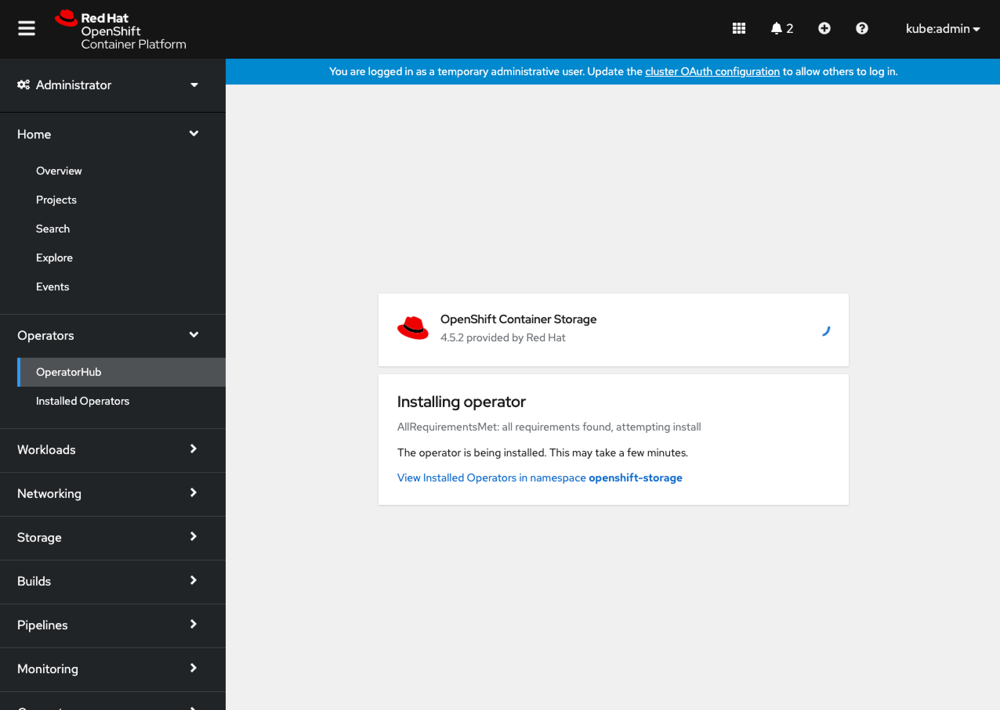
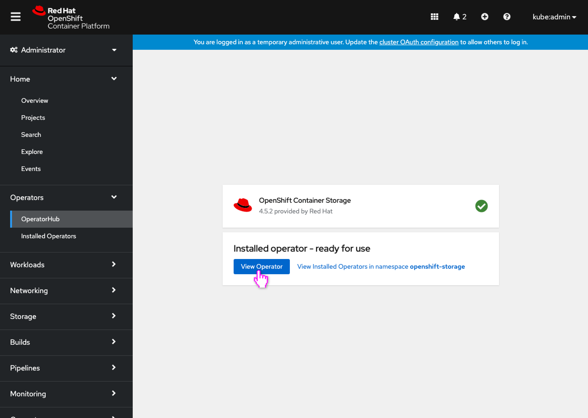
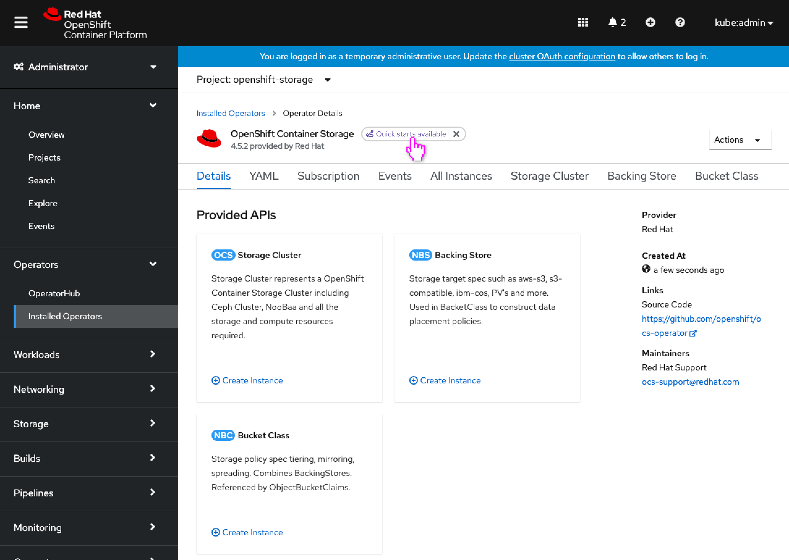
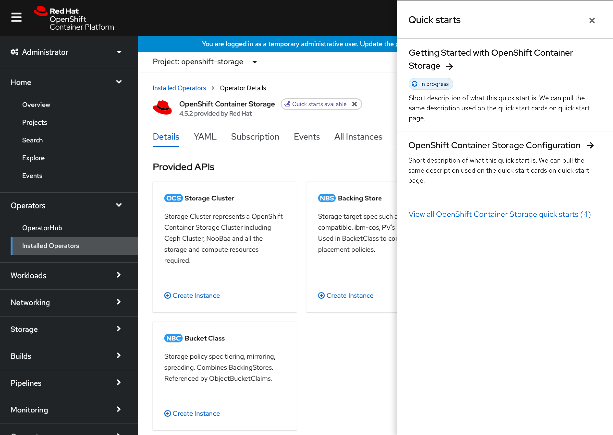

# Surfacing operator-related quick starts

Newly installed operators enable new functionality on clusters that may not always be immediately apparent how to make use of it in the console UI. Now that users are taken straight to the operator details after installing an operator (via the newer [Operator Installing screen](http://openshift.github.io/openshift-origin-design/designs/administrator/olm/convey-installing-operator/),) perhaps there can be a method of instructing the user how to make use of the functionality that the operator enables.

Quick starts are new for the openshift console as of 4.6, and allow the console and operators to include in-application guides that show users how to make use of console and operator features. Highlighting these operator-related quick starts near operators could also be one way to quickly guide users into the operators’ UIs. This design is directly based on the mostly equivilent [Surfacing resource-related quick starts](http://openshift.github.io/openshift-origin-design/designs/administrator/future-openshift/resource-related-quick-starts/) design.

## Quick starts in operator details

- The user is installing an operator that includes quick starts.

- Upon completion of the install, the screen guides the user to **View Operator** details.
- **Note:** OpenShift Container Storage is shown in this example and would have the user create the required operand at this point, but for this design is shown simplified as going straight to the operator details, as many operators would. For operators that require operands, the user is taken to the operator details once the operand is created.

- For operators that include quick starts, a dismissable label appears to the right of the operator name to make it clear that quick starts are available for this operator.
- Dismissing the label would hide **all** operator-related quick start labels for that user.

- The side panel would appear showing the quick starts specifically associated with this operator.
- All side panel interactions follow the same paradigms as conveyed in the [Surfacing resource-related quick starts](http://openshift.github.io/openshift-origin-design/designs/administrator/future-openshift/resource-related-quick-starts/) design, including styling and quick start ordering.
