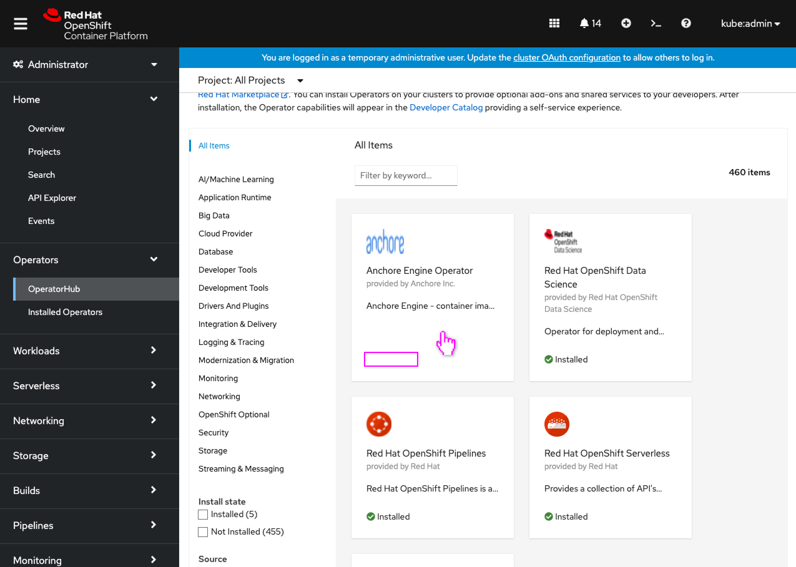
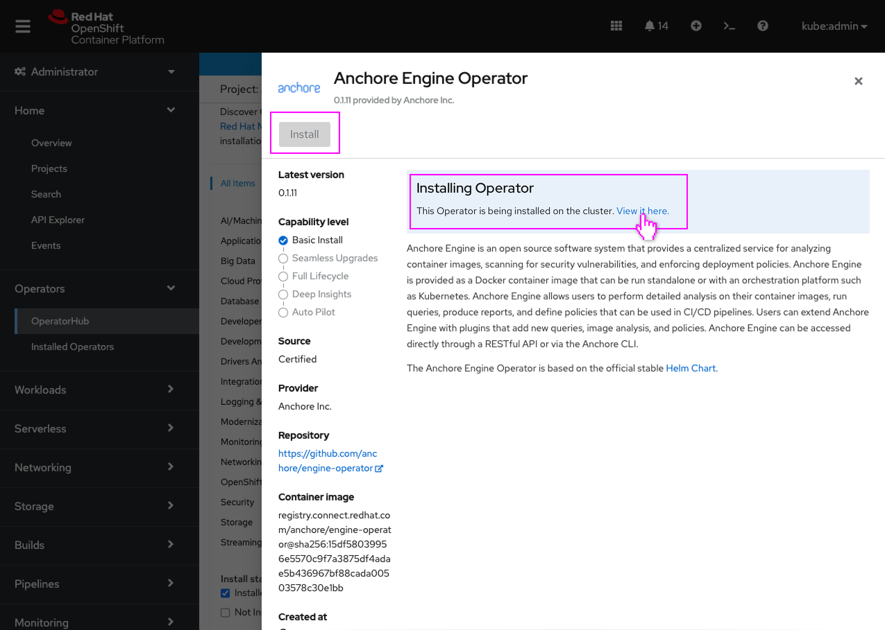
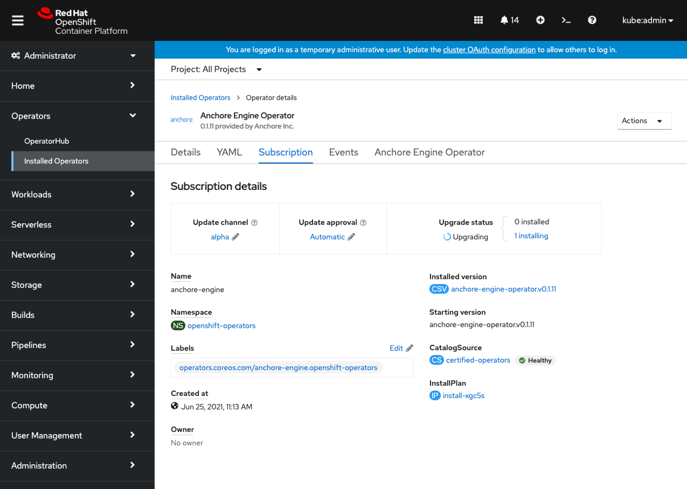

# Convey an operator is installing in OperatorHub

Today operators in OperatorHub are shown with an 'Installed' badge when the Subscription has been created (and so the user can't create another Subscription as the Install button is disabled.) Occasionally the install process can require more user input (manual approval) or may fail, and the operator isn't actually usable or installed, but can be misleading as the operator still shown with an 'Installed' badge in OperatorHub.

OperatorHub will now convey (using the same criteria the installing screen uses) that the install process is still running, and link the user to the operator details for more information.

## OperatorHub showing install in progress

For this design, the user has begun installing the Anchore Engine Operator and has returned to OperatorHub.

- The operator that is actively being installed still appears in OperatorHub, though now without an ‘Installed’ label on the tile and would appear in the **Not Installed** facet of the **Install state** filter.

- Viewing the details of the operator that is being installed, the Install button is now disabled as the installation is already in progress.
- A note (similar to the note that appears when an operator is already installed) is displayed conveying to the user that this operator has its installation underway, and links to the operator details page for more information.
- This note can include additional information about any installation errors or manual approval needed by the administrator.

- The user is linked to the operator details Subscription tab where they can see installation progress.
- In some cases only the Subscription tab will appear in the operator details, as it is the only operator resource that has been created so far in the install process.
