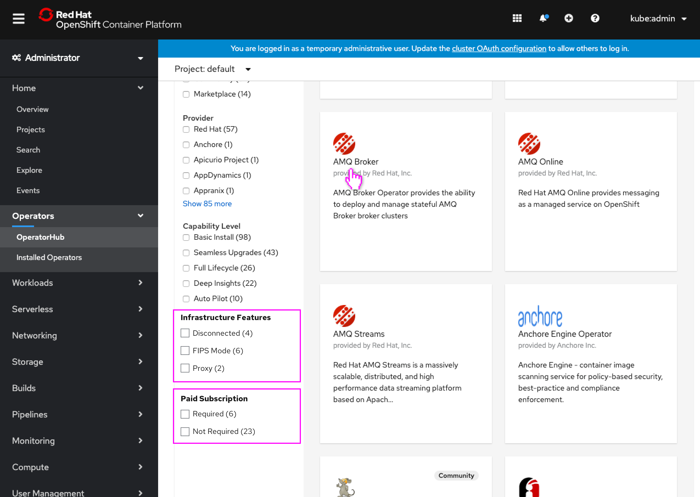
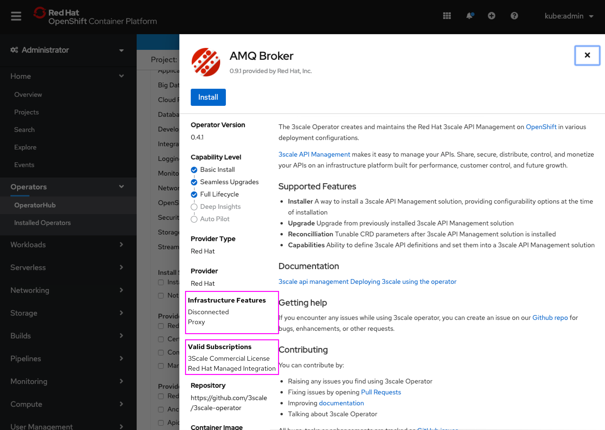

# OperatorHub 'Infrastructure Features' and 'Paid Subscription Required' Filters

OLM provides a list of attributes that the operator developer can tag their operator with (or the operator is tagged with automatically), that describe its infastructure features, for example ‘disconnected’, ‘FIPS mode’, etc. This list is dictated by OLM as far as what attributes are available. There is also an attribute that designates which subscription (if any) the operator requires.

These new attributes should be surfaced in OperatorHub so that the admin can filter by them, as well as displayed on the Operators install page, along with the existing attributes, for awareness.

## OperatorHub Filtering

- OperatorHub now has two new facet filters, **Infrastructure Features** and **Paid Subscription**
- Existing filtering functionality will be used for these new facet filters

- The list of capabilities (if any) are conveyed in the details, if no features are specified the heading does not appear
- The exact subscription that is required (if any) is conveyed in the details, if no subscription is required the heading does not appear
