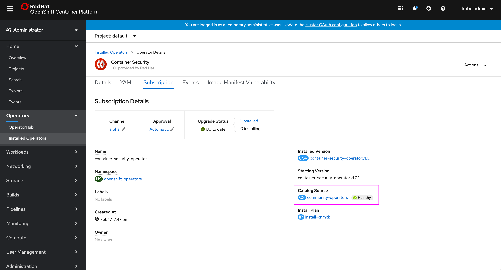
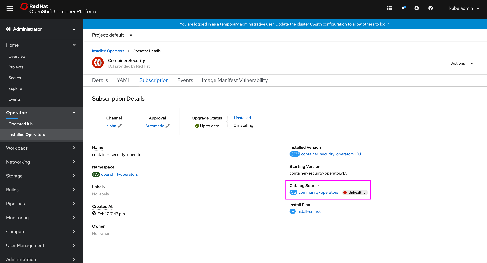
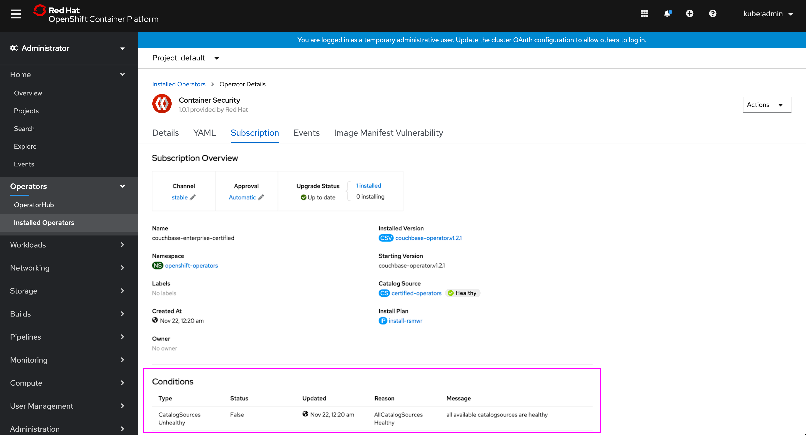

# Subscription Status - Catalog Source Health

Currently many OLM resources’ statuses are conveyed in the operator details view, however the complete set of status conditions provided from the Subscription resource are not displayed.

The only additional status condition that Subscription provides at this time is the health of the Catalog Source(s), which will now be conveyed in the Subscription tab of the operator.

## Catalog Source Health in Subscription Details

- A new badge appears next to the Catalog Source indicates health of that catalog source (the only additional status on the Subscription at this time.)

- If the Catalog Source is not healthy the badge reflects this.
- The user can click on the catalog source to see more info about the catalog health.

- There is also now a table of status Conditions from the Subscription that would appear beneath the Subscription Overview.
- Only the Catalog Source Health appears in the Subscriptions' status today, so there would only be one row for now.