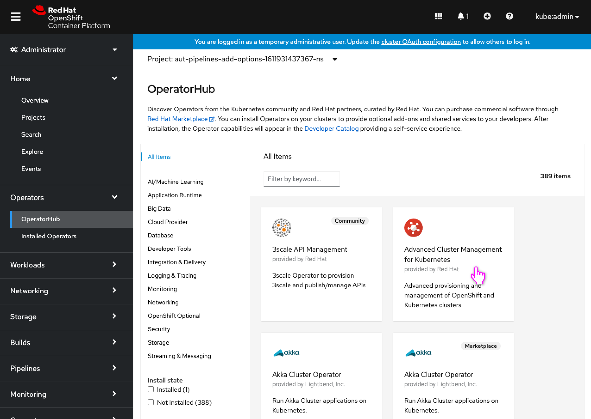
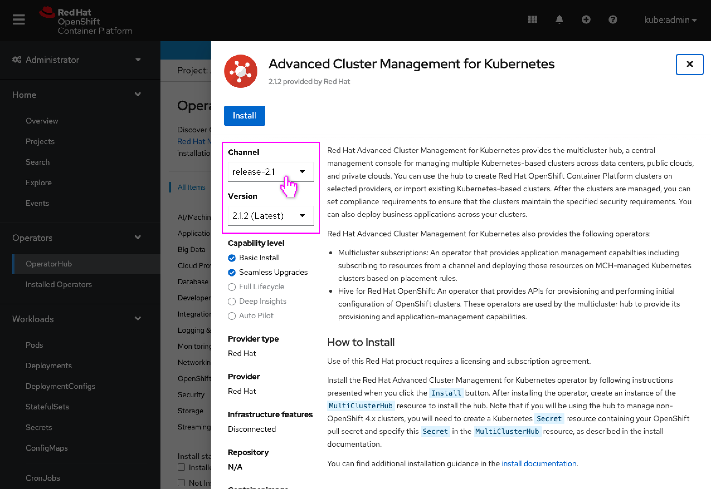
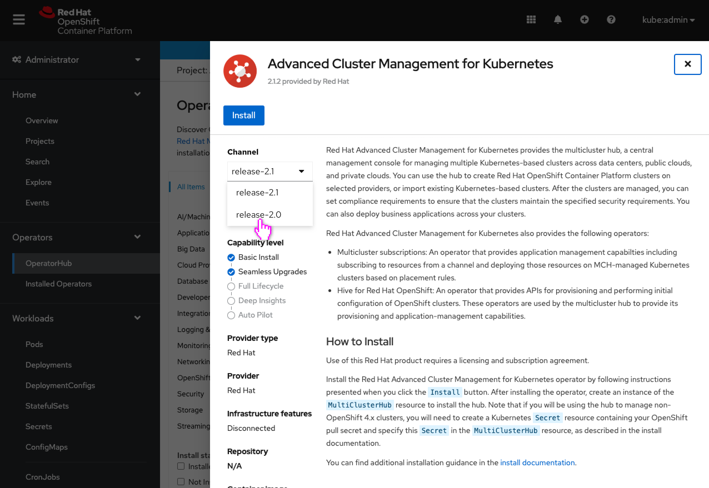
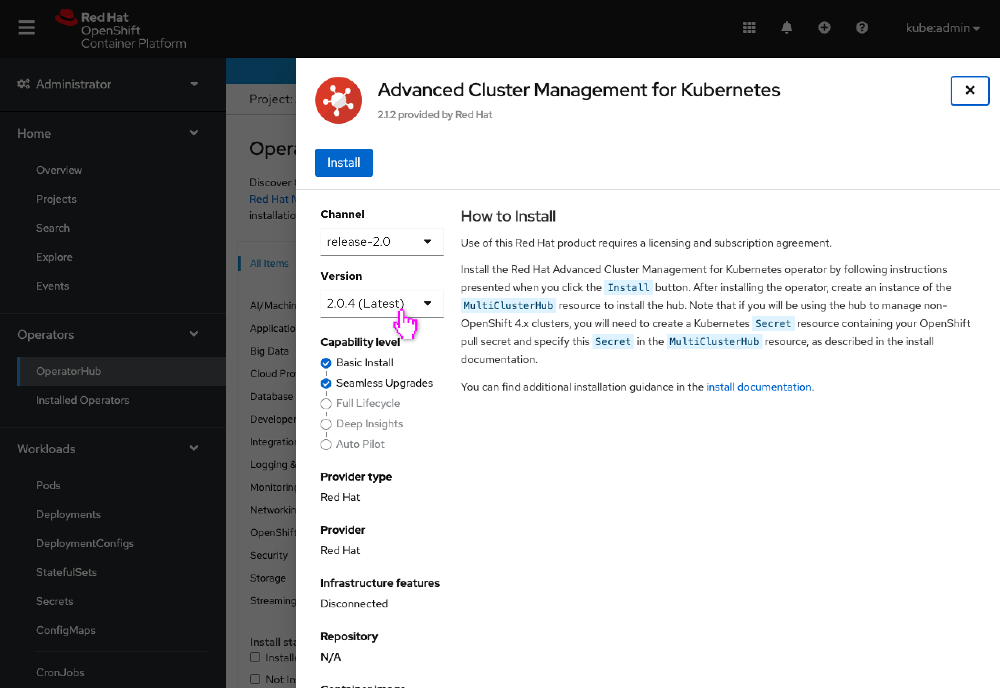
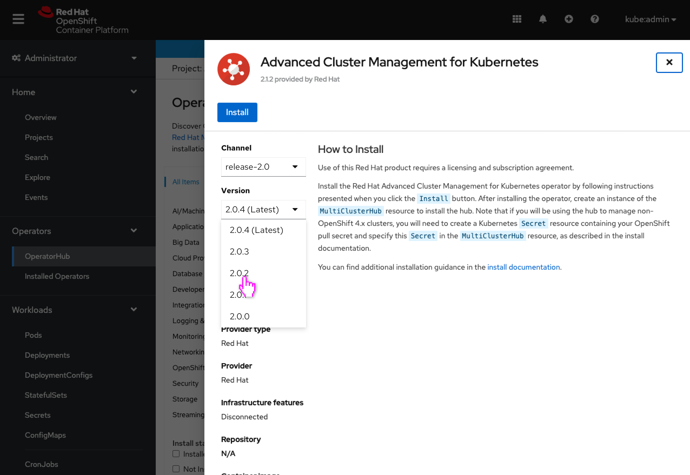
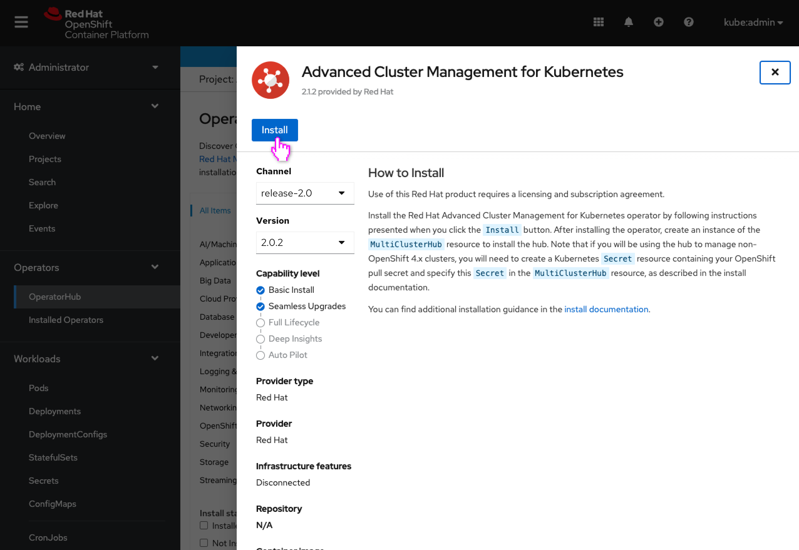
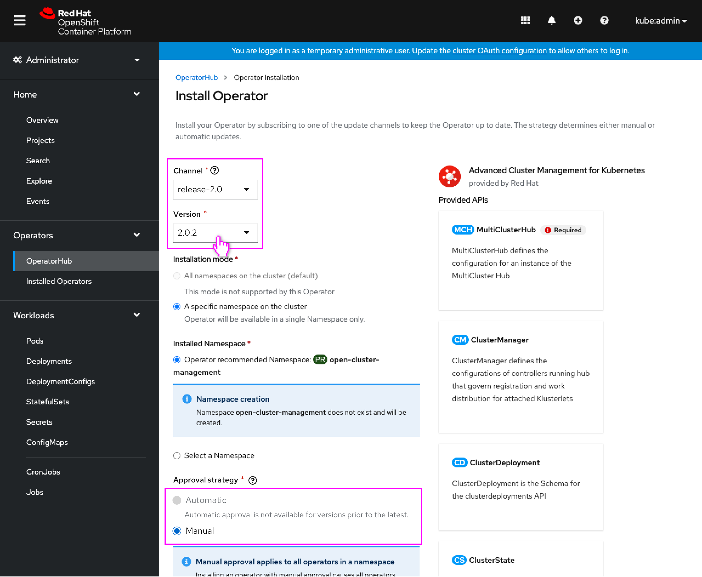
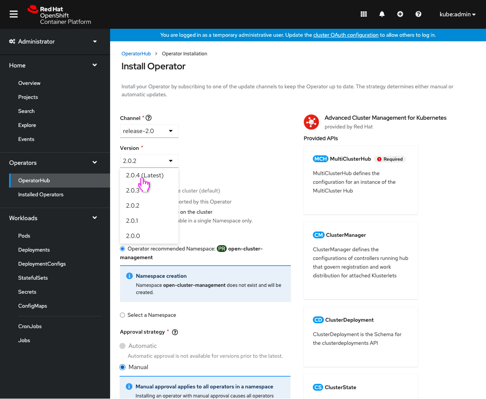
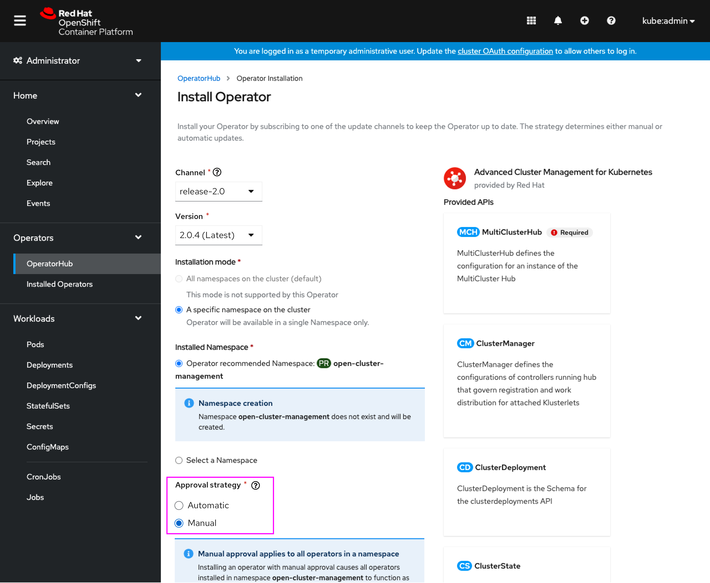
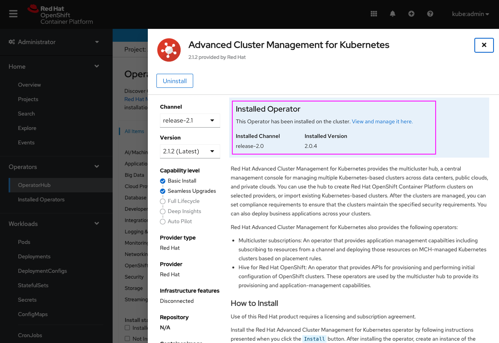

# Select operator version on install

Users may want to install an older version of an operator for various reasons, including the latest version having limited testing or known vulnerabilities. Today this is only possible if the user knows the exact CSV semantic version of the older version they’d like to install (which isn’t surfaced through any API) and needs to edit YAML to install it.

Users will now be able to use the OperatorHub UI to browse the various versions of an operator across any channels it may have, and view the metadata for that channel/version (as available), and then be able to select the exact version (including older versions) that they’d like to install. For the time being, when selecting an older version, a manual approval update strategy will be required, otherwise the operator will immediately update back to the latest version on the channel.

## Installing via OperatorHub

- The user begins installing an operator.

- The **Latest version** field has been replaced with two dropdowns, one for selecting the **Channel** and one for the **Version**.
- These dropdowns default to the latest version on the default channel.

- The user can select a different channel, for the sake of viewing a specific version’s metadata on this page.
- The channels are sorted alphabetically, like operatorhub.io.

- The metadata on the page is updated to reflect that versions content.
- **Note:** Only 1 set of metadata is stored today per channel (the head version’s) so changing the version will not change the metadata displayed. It is still allowed to be selected for the sake of viewing available versions and persisting the version to the **Install Operators** page.

- The user can change to a different version.
- The versions are sorted with the most recent at the top, like operatorhub.io.

- **Note:** The metadata does not change because only 1 set of metadata is stored today for a channel (the head version’s.)
- The user installs the operator.

## Install Operator page

- The **Update channel** field has been replaced by the **Channel** and **Version** dropdowns.
- If the user changed these values on the OperatorHub operator details page, those selected values would be reflected here.
- Metadata on this page would always reflect the selected version, namely the operands on the right would be the operands from the selected version.
- When a version is selected other than the ‘latest’ version for that channel, the **Approval strategy** is switched to **Manual** with **Automatic** disabled, and a line of text is shown displaying why Automatic is unavailable.

- The user can select other channels and versions to install.

- When the selected version is the ‘latest’ version in the channel, **Automatic** approval strategy is enabled.
- The metadata on page (operands list) is updated to reflect the selected version’s.

## Post-install OperatorHub

- When the operator is installed, the note should now indicate which channel and version are installed.
- The **Channel** and **Version** dropdowns are still available for viewing other version metadata in this catalog context.
