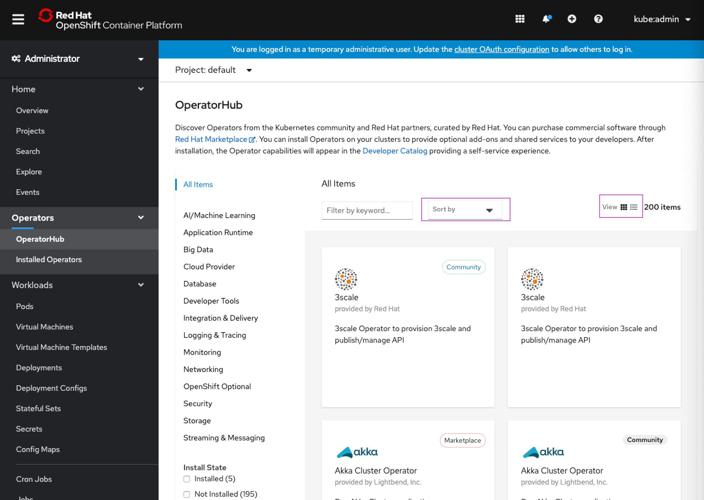

#Sort by Provider update on OperatorHub

When viewing the list of Operators available for install on OperatorHub, the users are interested in which Operators were updated most recently. OperatorHub should support sorting by the most recently updated Operator.

##Sorting on OperatorHub

The Sort by menu and View icons allow the user to now further customize their sorting experience on Operator Hub.

##User selects “Provider update” on menu

When the user selects “Provider update” from the Sort by menu, the information about when this operator was last updated appears in the bottom left of the card.

##“Updated by provider” appears on card under Operator Title and Provider

Now the Sort by dropdown has been updated with the Provider update selection, and the timestamp appears under Operator Title and Provider.

##“Updated by provider” timestamp appears on bottom left of Operator description

Once clicking into the 3Scale Operator the user can view the Updated by provider time stamp in replacement of the Created at field which should be removed.

##User selects Capability level

When the user selects Capability level, the Operators with the highest level of capability are listed first from 5 to 1 in descending order.

##List view for Sort by feature

When the user selects the list view icon in the upper right corner of the page, the PatternFly Data list component powers more compact styling so more information can be viewed at once.

Mobile List view:

