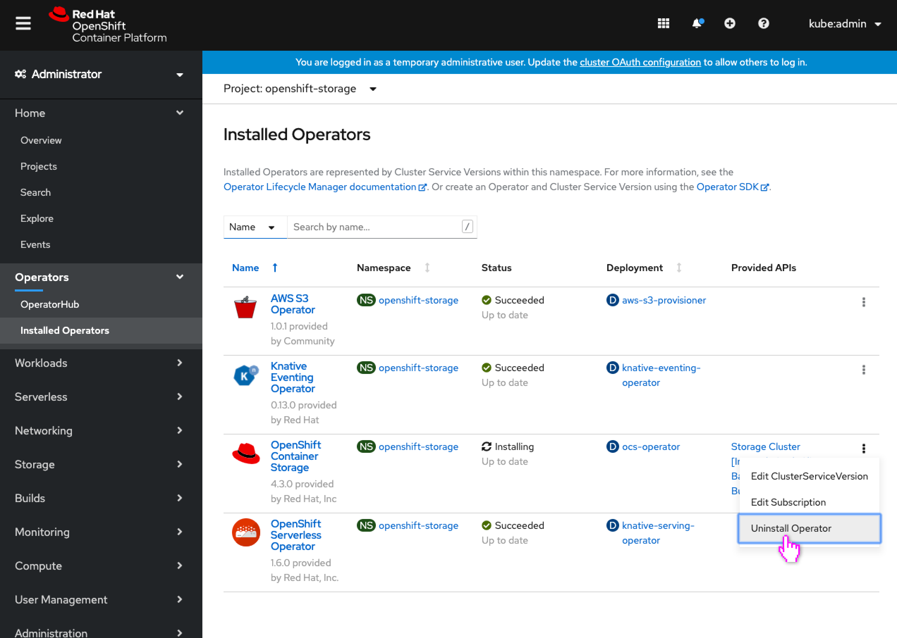
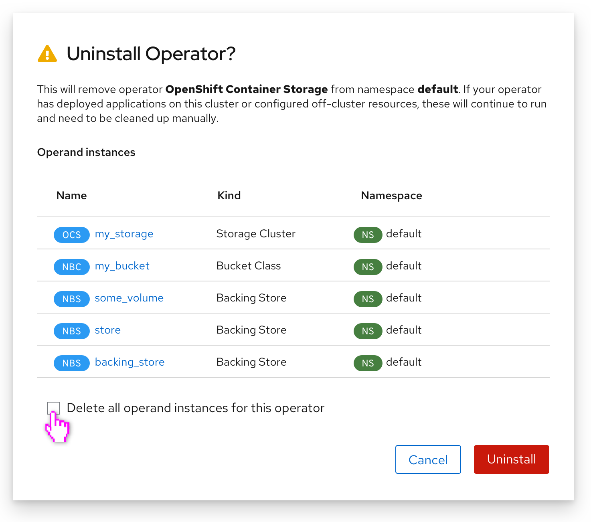
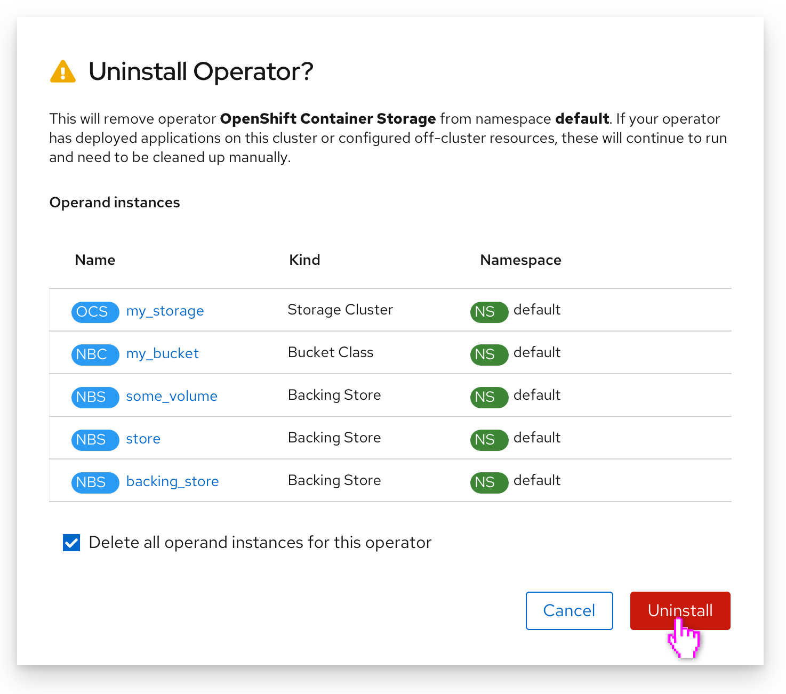
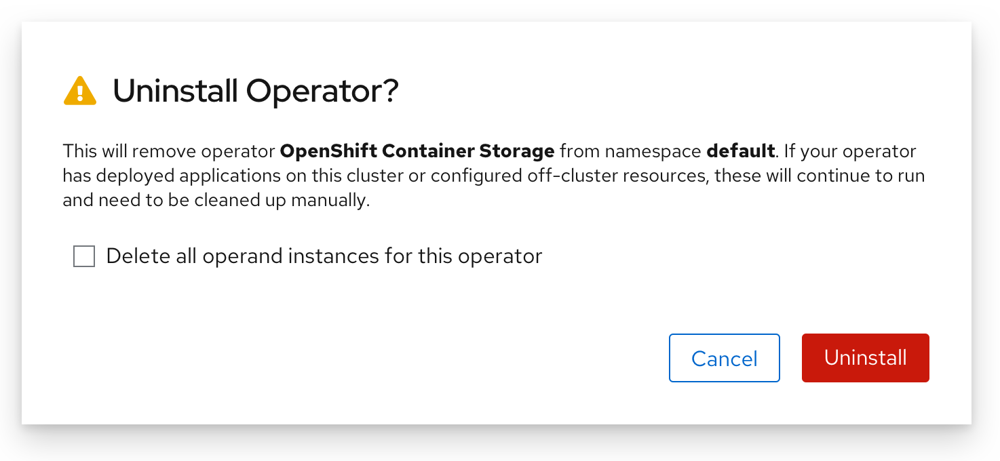

# Optional operand delete during operator uninstall

Today when uninstalling an operator, any created operands are not removed with the operator. The uninstall dialog message warns the user that they will need to clean these up manually if they want them removed.

With this design, the list of operands is shown in the uninstall operator dialog, with a checkbox to indicate that these operands should be removed with the operator's uninstall.

## User selects for all operands to be deleted

- The user begins the operator uninstall process.

- The uninstall modal now includes a checkbox that allows the user to indicate whether they’d like to also delete the operator’s operands (similar to the ‘delete dependent objects of this resource’ checkbox used on other delete modals in the console.)
- A list of the operator’s operands are shown for reference.
- The user can click the operands name to be immediately navigated to that operand’s details view. The user will still be in the context of the operator (just inside the operand) so can fairly easily return to the uninstall process.

- Checking the checkbox will now remove the resources with the operator on uninstall.

## Users without operand view permissions

- Some users might have permissions to uninstall operators, but not directly view or delete the operands of that operator, as perhaps they are in another namespace (the operands could still be deleted here because OLM is doing the delete.)
- Those users would see the same modal with the new checkbox, but with no list of operator instances.
- If the user only has permission to seem some subset of the list of operands, the list would still not appear at all to not show an incomplete list.
