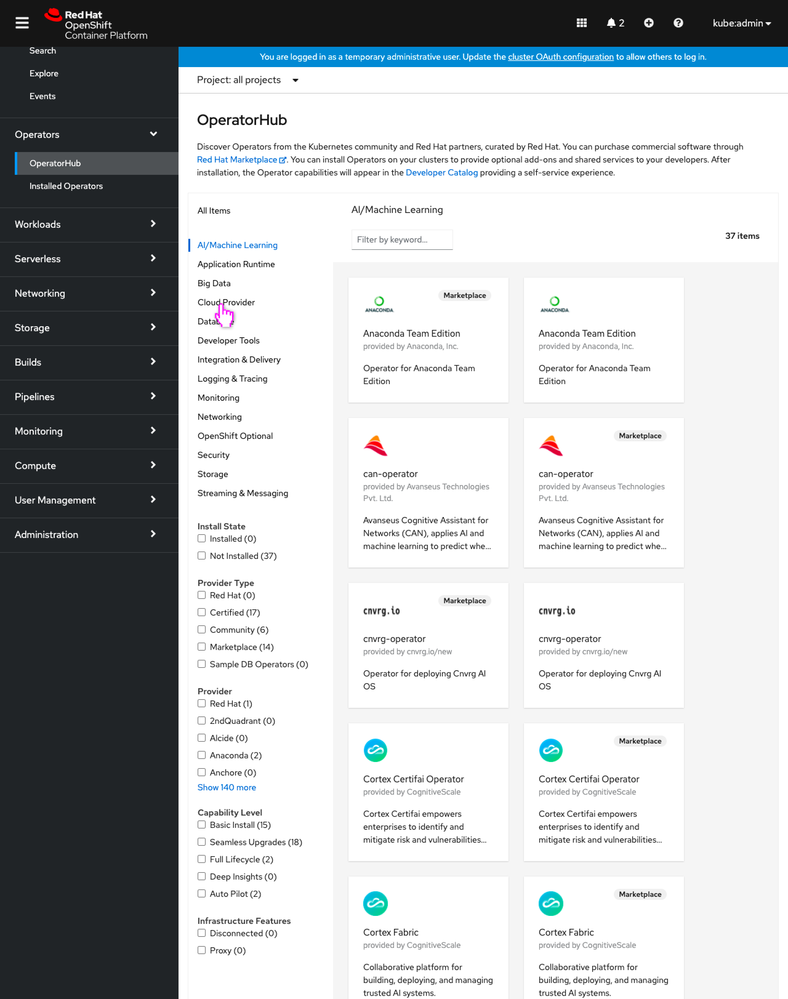
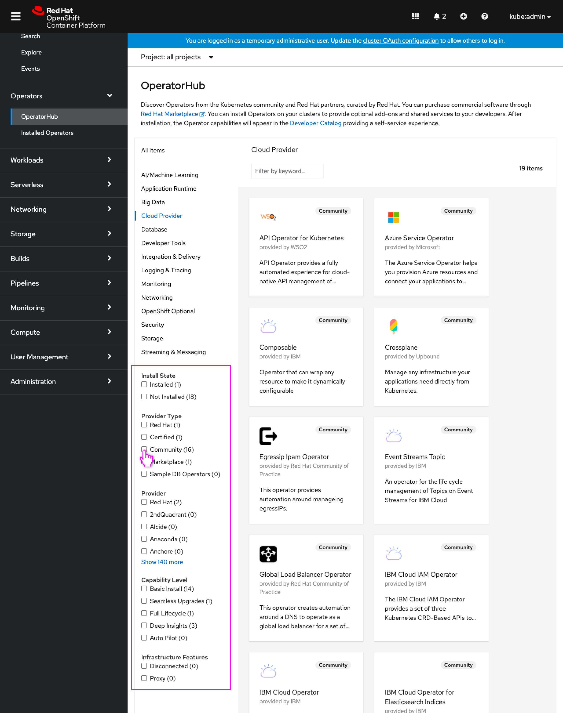
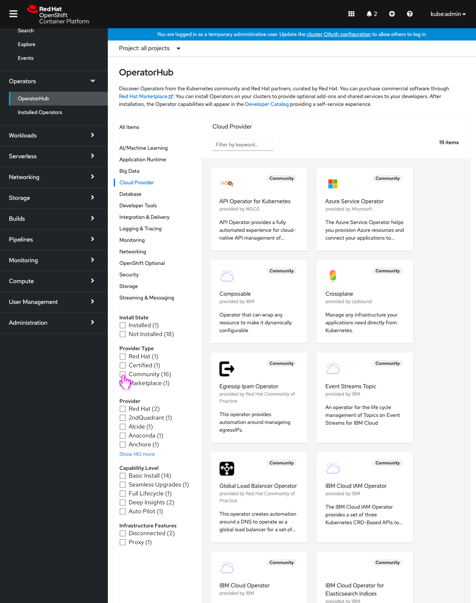
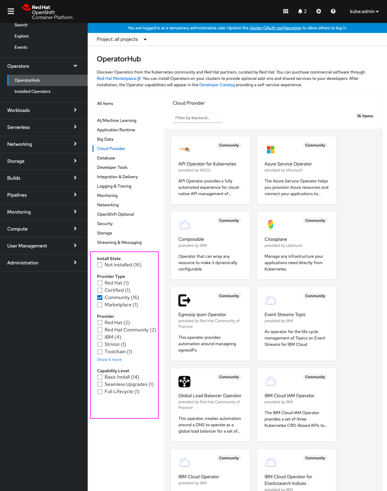

# Update OperatorHub filters' facets counts and appearance as filters are applied

When interacting with filters in OpenShift console’s embedded OperatorHub, the counts of matching items are only updated when changing categories. These counts could be updated on selection of other filters' facets as well.

Hiding facets with a count of (0) would allow the user to better see what facets still have values (since the list of facets can be very long) and improve OperatorHub's filtering usability.

## Update filters' facets counts 

- Today the user can select different categories of items to view in the catalog.

- Note the counts of the various filter facets have updated based on the catalog items that appear in this newly selected category. This is existing behavior in the console today.
- The user then selects a particular facet in one of the filter categories.

- Note that similar to when the category was selected, the counts of the filter facets have updated based on the catalog items that currently match the filters. This is new behavior, today the counts are not updated as filters are applied.
- The facet counts in the same newly selected filter type are unchanged, as facets within the same category are OR-ed whereas across categories they are AND-ed and therefore affected.

## Hide facets with count of (0)
Further expanding on updating the facets' counts, any facets that then have a count of zero could be hidden to clean up the filter list.

- The user applies a filter.

- Note that not only are the count of matching catalog items for each facet are updated, but also all facets that have no matches with this filter applied (a count of zero,) and aren't currently selected, are hidden from the list.
- Filter categories that have no matches for any of their facets would be removed (**Infrastructure Features** in this example.)
- Categories would never be hidden, as they are considered to be a more overarching filter style for OperatorHub.