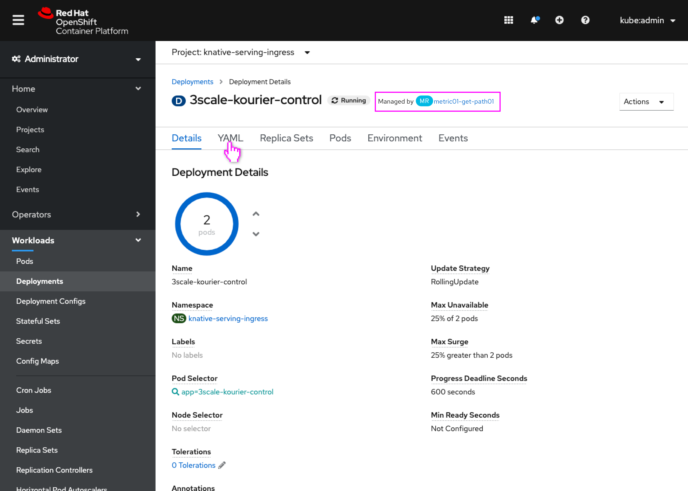
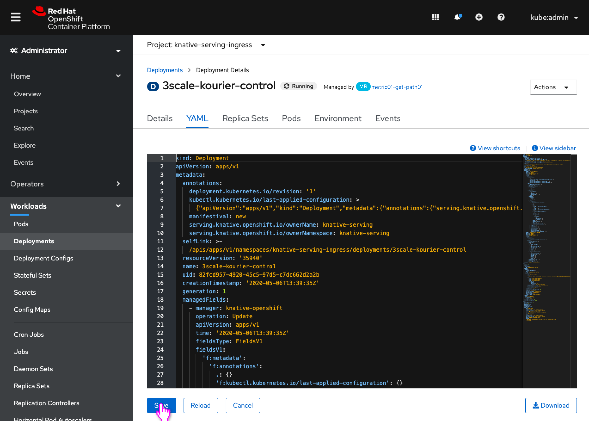
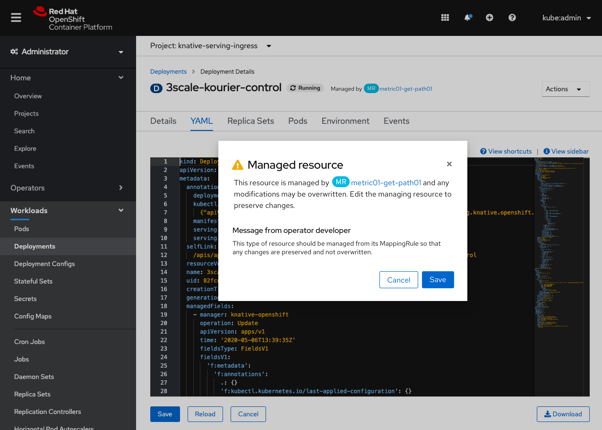
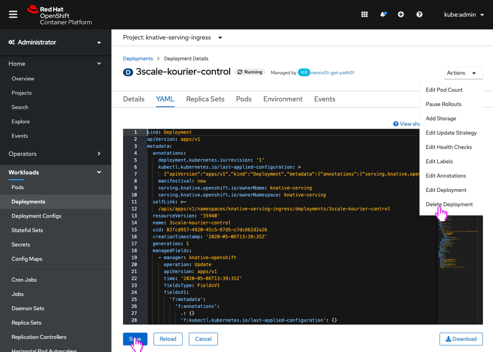
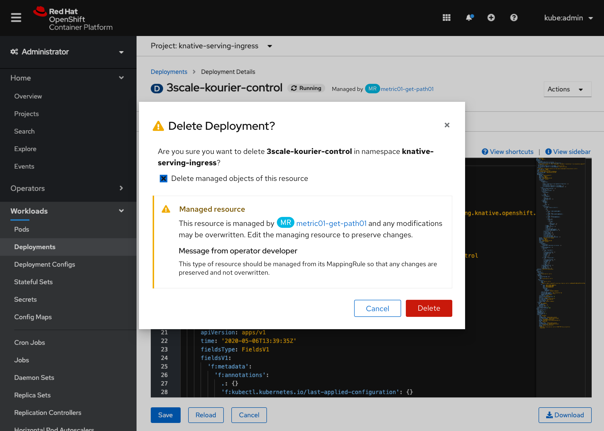

# Warn when modifying managed resources

A kubernetes cluster will contain many resources that are managed by another resource, which can be disorienting to users if they modify/delete the resource only to have their changes immediately undone. Some examples might be a ClusterServiceVersion managed by a Subscription, a Pod managed by a Deployment or ReplicaSet, or a Deployment, Route, Service, or Configmap managed by an Operator/Operand.

Admins should be made aware that any changes they make to the resource could be undone, and that they should probably be editing the resource that manages it.

This design will initially be implemented for workload-type resources that are managed by an Operand, however the design is general that if can be used for many resource relationships in the future.

## Managed Label

- A new label to the right of the resource name and badging indicates that this resource is managed by another resource.
- The label has a link to the managing resource.

## Editing Managed Resource

- The user modifies the resource in any way (either through inline editing or YAML tab) and saves.

- A warning modal appears that conveys to the user that the resource is managed by another resource and that their changes may be undone.
- The operator developer can specify custom text (through an annotation) to be included as well, to direct the user to the best way to edit this resource.
- This modal should appear whenever the managed resource is modified and saved.

## Deleting Managed Resource

- The user deletes a managed resource.

- The delete confirmation dialog appears with the same “Managed resource” information in a warning level alert.
- The operator developer can specify custom text (through an annotation) to be included as well, to direct the user to the best way to edit this resource.
- This modal should appear whenever the managed resource is deleted.

