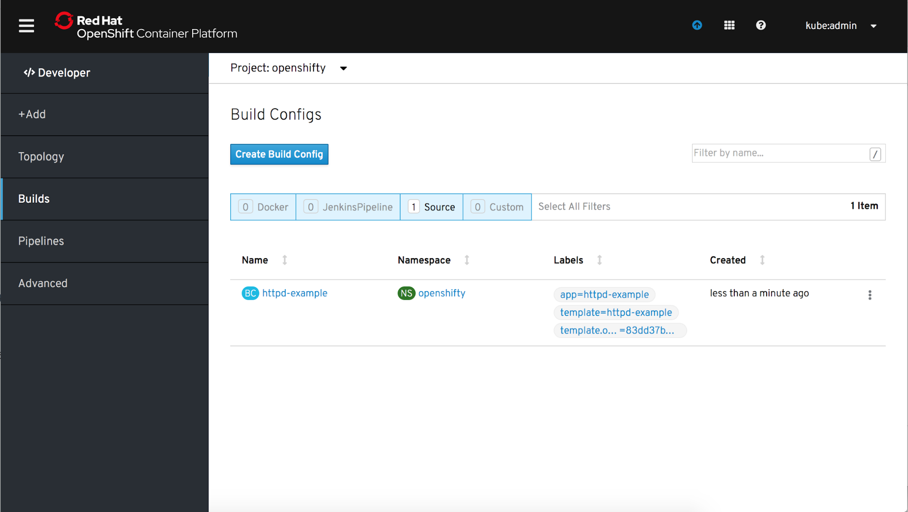
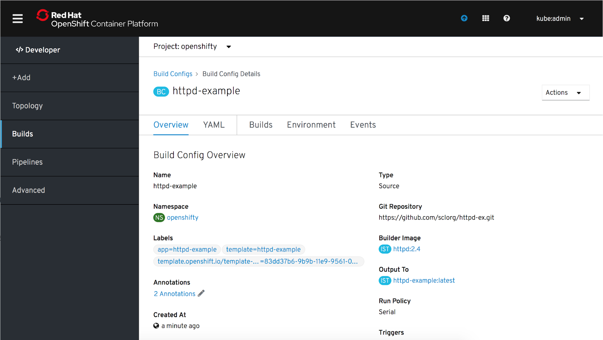
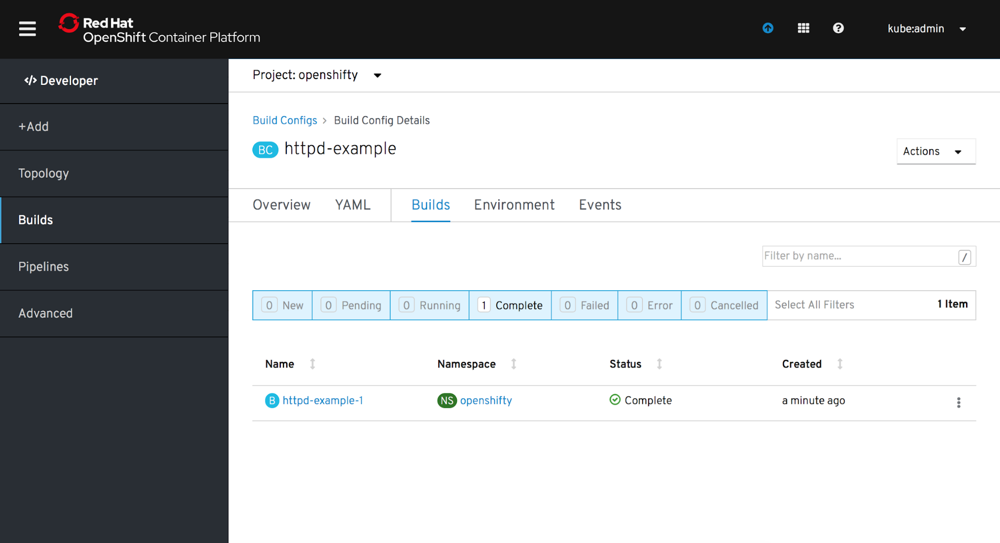

# Builds
The Builds page is a primary nav item in the OpenShift Developer perspective.

## Overview

The Builds page is different from the Administrator perspective.  Clicking on the Builds navigation item will display Build Config resources.

## Build Config Resources

## Build Config Details - Overview Tab

## Build Config Details - Builds 

## Build Details - Overview Tab

