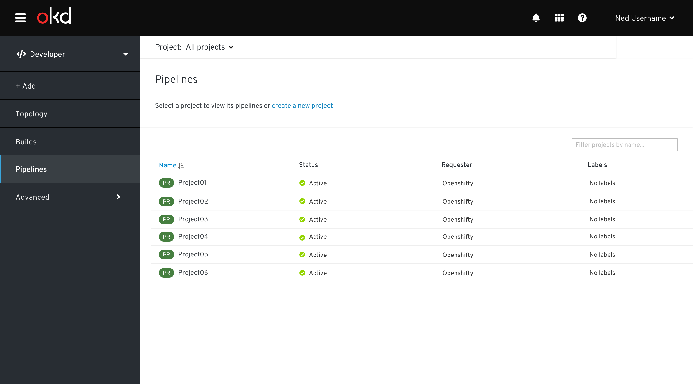
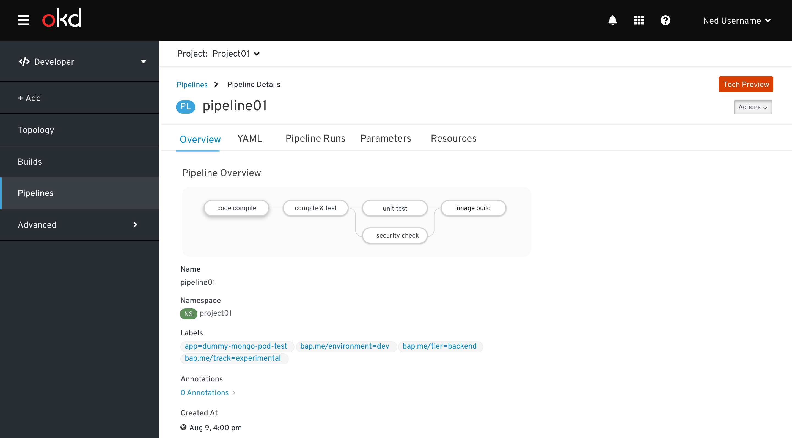
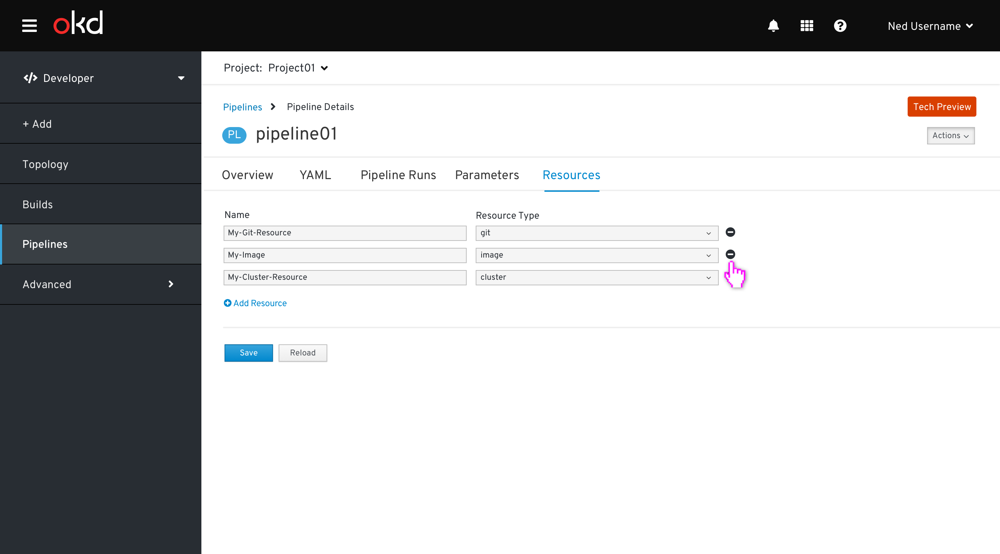
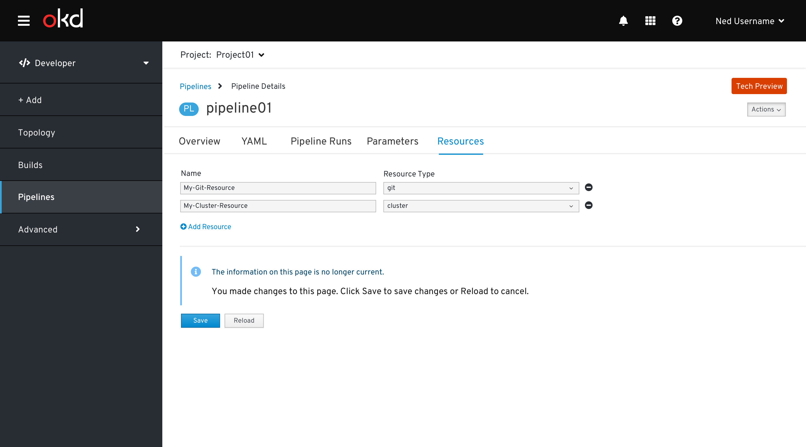
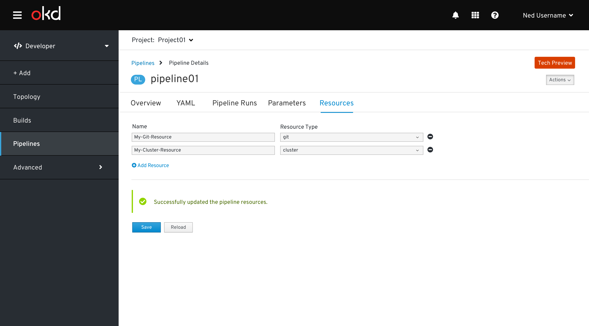
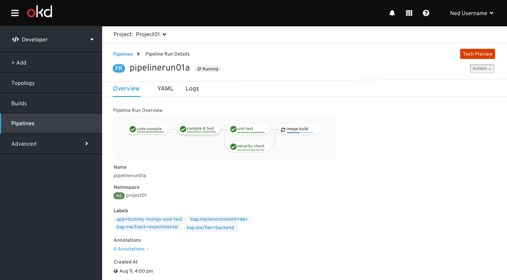
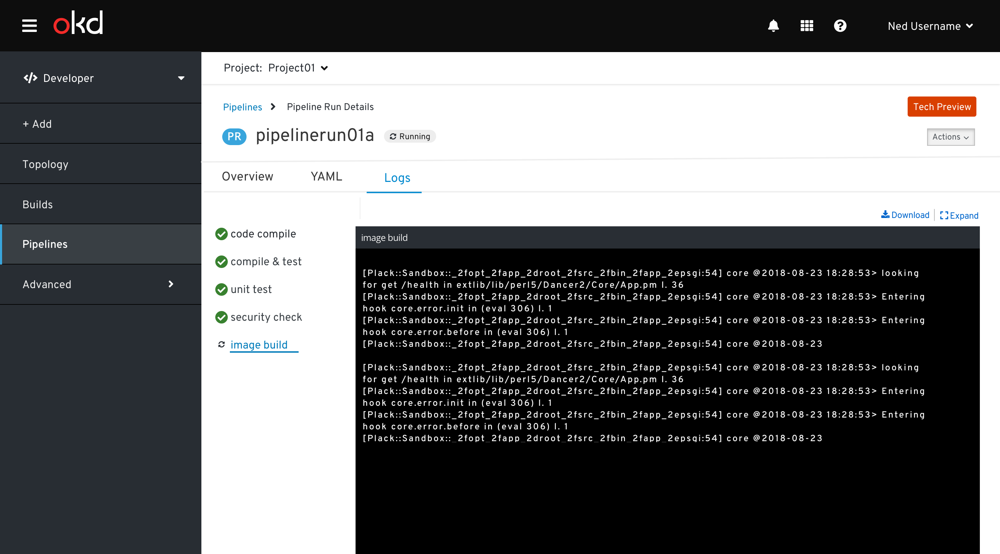
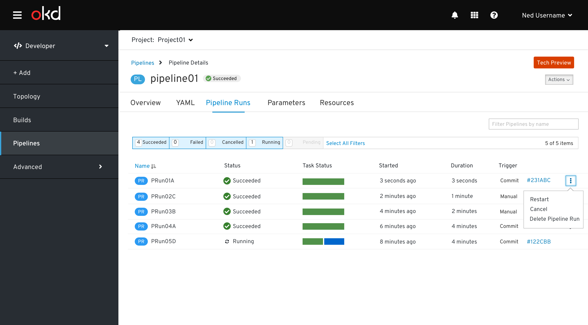
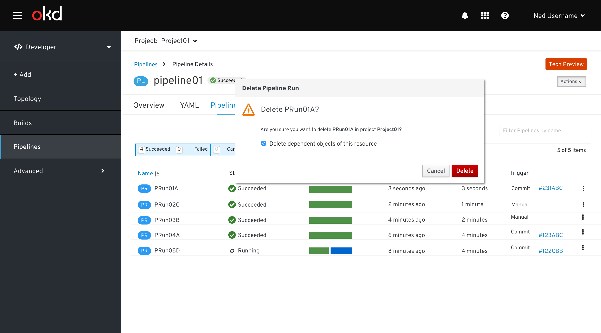
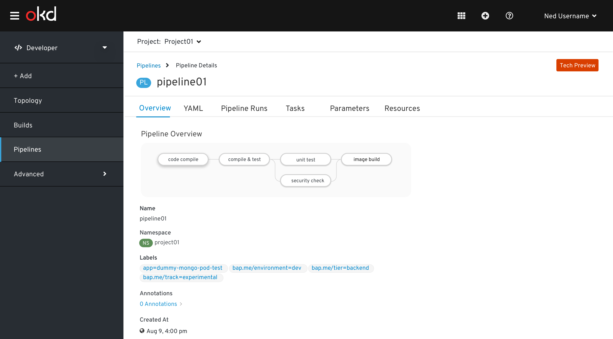

# Pipelines
- The Pipelines page is a primary navigation item in the OpenShift Developer perspective.  
- It is only available when the pipelines operator is installed.
- This is Tech Preview in 4.2, and we need to use the Tech Preview badge on associated pages.
- [Pipeline experiences are different when user has 'view only' access for a project](http://openshift.github.io/openshift-origin-design/web-console/developer/pipelines/rbac-pipelines)

## No projects exist
When no project exist, clicking Pipelines will show an empty state:

## All Projects in project selector
When a project is not in context, clicking Pipelines will prompt the user to select from a list of projects:

## Pipelines Resource Table
When a project is in context, clicking “Pipelines” will display the Pipelines Resources in that project.

- Navigation item: Pipelines  
- Secondary masthead is visible and includes the project selector
- Page title is Pipelines
- Filtering
    - OpenShift filter toggle component is present, filtering on the Last Run Status
    - OpenShift filter by name component is present
- Sorting
    - All columns are sortable.  

    Columns include:
    1. Name
    Resource badge + pipeline name are presented as a link.  Clicking on the link navigates to the Pipeline Details View
    1. Last Pipeline Run
    Resource badge + name of last pipeline run.  Clicking on the link navigates to the Pipeline Run Details View
    1. Last Run Status
    1. Last Status Check
    1. Last Run Started

## Pipelines Resource Details
### Pipelines - Overview tab

### Pipelines - YAML tab

### Pipelines - Pipeline Runs tab

### Pipelines - Parameters tab

### Pipelines - Resources tab

There are 2 columns in the Pipelines resource tab:
1. Name - resource name
1. Resource Type - a dropdown including git, image, cluster & storage

#### Adding a Resource
The general behavior of adding a resource is consistent with the Environments tab of many workloads pages.  

When the user clicks the Add Resource link, a new row is added.  Hints are shown in the input fields and an info inline notification is displayed.

The resource type can be one of the following: git, cluster, image, storage

When the user clicks Save, a success inline notification is displayed.

#### Removing a Resource
When the user hovers over the Remove Resource icon, a Remove Resource tooltip should be displayed

When the user clicks the Remove Resource icon
The row is removed
An info inline notification is shown

When the user clicks Save
An success inline notification is shown

## Pipeline Actions
Supported pipeline actions are:
1. Restart last run
1. Start
1. Delete Pipeline

Actions can be access from the kebab menu in the Pipelines Resource view

Pipeline actions can be accessed from the Actions menu on the Pipeline details view.

### Restart last run
No dialog is needed to restart the last run.

### Start
A modal is displayed for the Start action.

- The modal is built dynamically based on associated parameters & resources.  All parameter and resource fields are required.
- Modal title - Start Pipeline
- Parameters section
    - Parameters associated with the Pipeline are added to this section
    - Default values are provided
- Cluster Resources section
    - This section exists if there is at least one resource of type cluster associated with the Pipeline
    - Cluster resources associated with the Pipeline are added to this section in a two column format
- Git Resources section
    - This section exists if there is at least one resource of type git associated with the Pipeline
    - Git resources associated with the Pipeline are added to this section in a two column format
- Image Resources section
    This section exists if there is at least one resource of type image associated with the Pipeline
    - Image resources associated with the Pipeline are added to this section in a two column format
- Storage Resources section
    - This section exists if there is at least one resource of type storage associated with the Pipeline
    - Storage resources associated with the Pipeline are added to this section in a two column format

Notes:
- the name of the Pipeline Run is generated, the user does not input it
- Adding Resources on the fly (WIP, not included here)

### Delete Pipeline
A delete confirmation modal is displayed when the user deletes a pipeline

## Pipeline Run Resource Details

### Pipeline Run - Overview tab

### Pipeline Run - Logs tab

- When navigating to the logs tab, the most recently started task will be selected, and the UI will auto-update, selecting the most recently started task as the pipeline run executes.
- Clicking on a task will move to the Logs tab of the Pipeline Run with the task selected, showing the logs of all associated steps.
- A Download link is to download the step logs.

## Pipeline Run Actions
Supported pipeline run actions are:
1. Restart
1. Cancel
1. Delete Pipeline Run

Pipeline Run actions can be accessed from the kebab menu in the Pipeline Runs resources tab of the Pipeline Detail

Pipeline actions can be accessed from the Actions menu on the Pipeline details view.

### Restart
No dialog is needed to restart the pipeline run.

### Cancel
No dialog is needed to cancel the pipeline run.

### Delete Pipeline Run
A delete confirmation modal is displayed when the user deletes a pipeline

# Task Status Component
## Overview
- The task status component is  a 100% stacked bar chart (Implementation note: use PF4/Victory to remain aligned with OpenShift console strategy).
- Last status represents the tasks of the last pipeline run.
- Each segment of the chart represents the group of tasks which are the same status.
- Task segments are in the following order:
    - Succeeded
    - Failed
    - Cancelled
    - Skipped
    - Running
    - Pending
- Hovering over the widget will show a tooltip indicating the number of tasks in each of the task statuses
- The height of the task status component should remain constant and similar in height to associated text.
- Clicking on any part of the task status widget will navigate to the Log Tab of the pipeline run details view.
- Use a 3 px separator between segments

# Pipeline Visualization
## Overview
This visualizes all tasks associated with the pipeline.

# Pipeline Run Visualization
- This visualizes the status of the tasks and associated steps of the pipeline run.
- Tasks can be asynchronous and are represented by bubbles in the visualization
- Steps are synchronous and are represented as line segments inside the task bubbles
- In 4.2, only the tasks which have started will be able to be shown in the Pipeline Run visualization.

## Pipeline experiences when user has view only access of a project#

_user cannot add, edit and delete any annotations, labels, parameter, and resources & user cannot start, stop, restart, edit and delete any pipeline tasks of a project when user has view access to that project_

### Pipelines List View ###

When a user has view only access for a project then the kebab and all associated actions will be disabled. So that user cannot start or stop or delete any of the pipelines and pipeline Runs

### Pipelines Details Page / Overview ###

When a user has view only access for a project then the `action` button will be hidden. So that user cannot start, restart, modify and delete any of the pipeline runs.

### Pipelines Details Page / YAML ###

When a user has view only access for a project then the `action` and `save` buttons will be hidden to prevent YAML edit.

### Pipelines Details Page / Pipeline Runs ###

When a user has view only access for a project then user can view all the pipeline runs and their's statuses but user can not edit, delete and start any action using the `action` button (will be hidden) and kebab menu (will be disabled)

### Pipelines Details Page / Parameters tab

When a user has view only access for a project then `action`, `save` buttons, `add/remove icons & link` options of hidden and `input fields` are disabled.

### Pipelines Details Page / Resources tab  
When a user has view only access for a project then `action`, `save` buttons, `add/remove icons & link` options of hidden and `input fields` are disabled.

### Pipeline Runs Details view ###

When a user has view only access for a project then `action` will be hidden

**Note:** _No action allowed in YAML and Logs taps_

