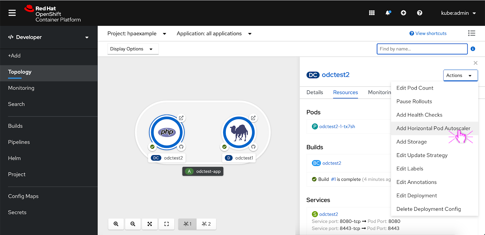
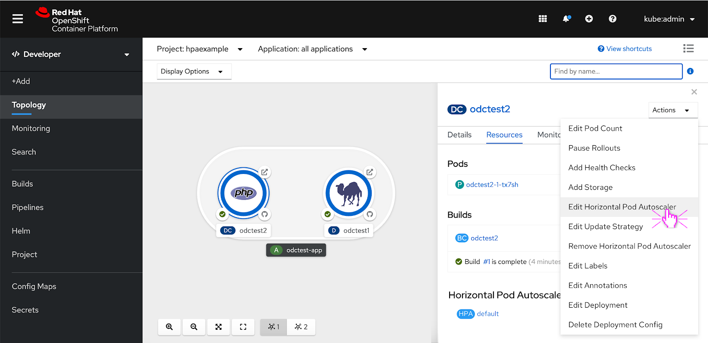

# Horizontal Pod Autoscaler

## Description

Horizontal pod autoscalers can be applied to workloads so that pods will scale up and down as needed so resources are not being wasting when waiting for peak resources. 

## Add a Horizontal Pod Autoscaler

To add a horizontal pod autoscaler from a deployment or deployment config, the user clicks the Actions dropdown and selects 'Add Horizontal Pod Autoscaler'. 

### Add Horizontal Pod Autoscaler- Form

The user can input Horizontal Pod Autoscaler attributes via a form or YAML editor. The form features limited field options so if the user wants to add custom metrics they should use the YAML editor. The info alert featured at the top of the form makes the user aware of this.

In order to add a horizontal pod autoscaler to a workload the user has to set CPU and memory resource limits beforehand. If the user has not done that yet, an alert appears above the form view letting them know that they have to set CPU and memory resource limits before they can set values for the CPU and memory utilization fields. Once the user has set those resource limits the user will be able to set values for CPU and memory utilization.

### Add Horizontal Pod Autoscaler- YAML Editor

The user can toggle between the two page views, either a form or YAML view. In the YAML view, the user can add custom metrics and inputs to the YAML editor. The schema for the horizontal pod autoscaler is featured on the right hand side.

If the user has not set CPU or memory resource limits the same alert featured on the form view is displayed in the YAML view.  

## Edit a Horizontal Pod Autoscaler

To edit a horizontal pod autoscaler that's attached to a deployment or deployment config, the user clicks the Actions dropdown and selects 'Edit Horizontal Pod Autoscaler'. 

### Edit Horizontal Pod Autoscaler- Form

The user can make edits to the fields in the edit horizontal pod autoscaler form. The fields options are the same that are available from the add horizontal pod autoscaler form. 

### Add Horizontal Pod Autoscaler- YAML Editor

The user can toggle between the two page views, either a form or YAML view. In the YAML view, the user can add custom metrics and inputs to the YAML editor. The schema for the horizontal pod autoscaler is featured on the right hand side.

## Horizontal Pod Autoscaler Section in the Side Panel 

If a horizontal pod autoscaler is added to a workload, a horizontal pod autoscaler section is added to the resources tab. The user can click on it to look at the horizontal pod autoscaler details.

### Horizontal Pod Autoscaler Details
The user can view details about the horizontal pod autoscaler. The user can also access horizontal pod autoscaler actions from this page. 

## Remove Horizontal Pod Autoscaler

To remove the horizontal pod autoscaler from the workload, the user can select ‘Remove Horizontal Pod Autoscaler’ from the actions dropdown menu.

A ‘Remove Horizontal Pod Autoscaler’ confirmation modal appears. The user can click ‘Remove’ to remove the Horizontal Pod Autoscaler from the workload.

## Pod Donut Autoscaling

If a horizontal pod autoscaler is added to a workload, autoscaling becomes enabled so the user can no longer manually scale pods up or down. The scaling actions from the pod donut are disabled if the user has autoscaling enabled.  

In this scenario, the pod is autoscaling to 5. Depending on the range of minimum and maximum pods that the user set for the horizontal pod autoscaler, the pods will autoscale within that range. 

