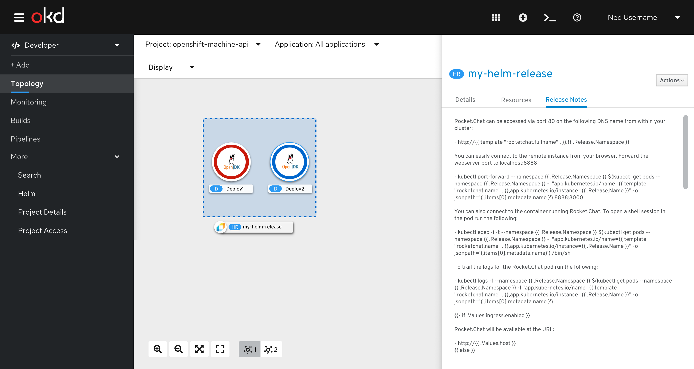
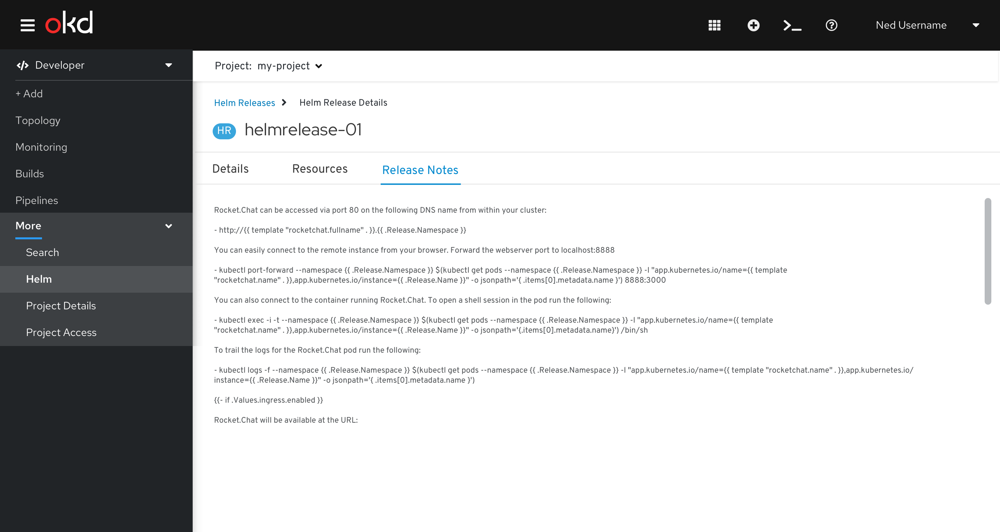

# Helm Release Notes
After successful installation of a helm chart, users are directed to the topology view where they can see the associated Helm Release Notes for the respective helm chart.

Users can access the notes for a given helm chart after installation through the side-panel or the details page, under the Release Notes tab.

