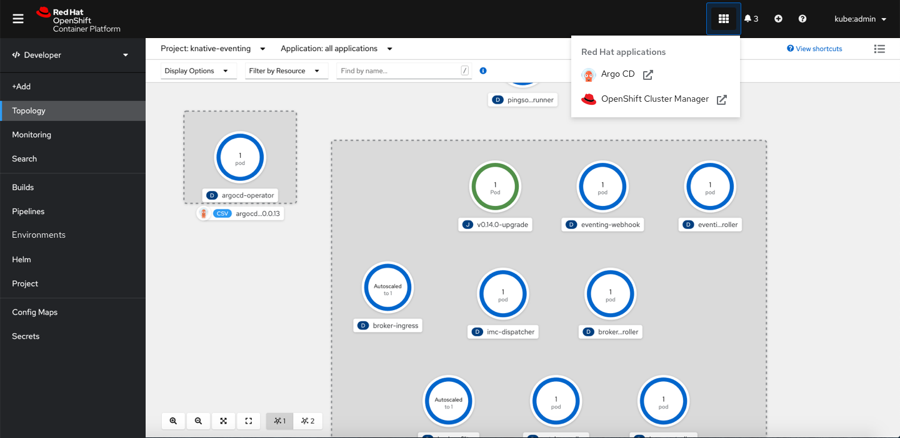
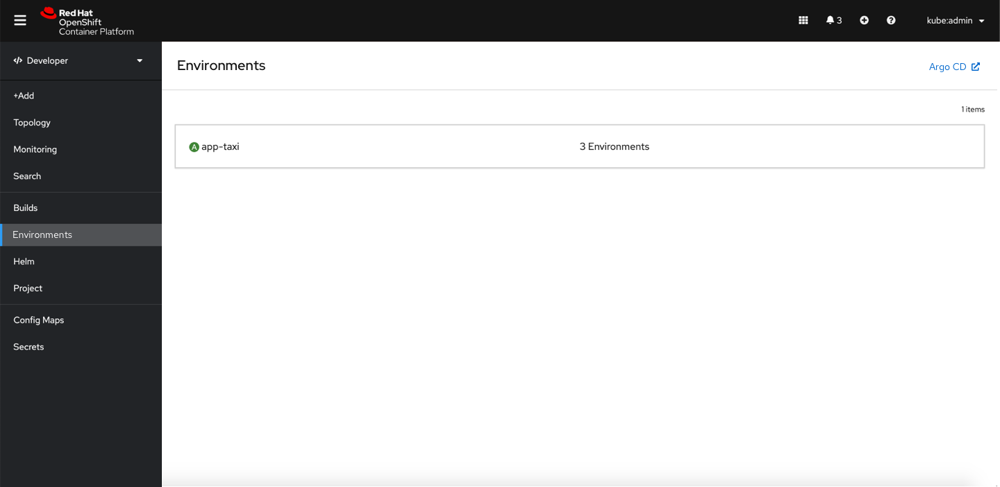
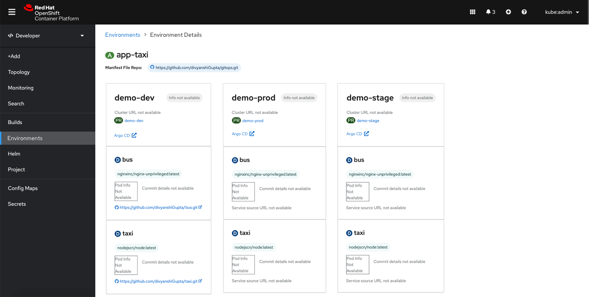

parent: Developer
version: 4.7
---

# Argo CD link

## At the Cluster level
### From the Application Launcher

If the GitOps operator is installed at the Cluster level or if the ConsoleLink CR is installed, an external link to the ArgoCD dashboard would appear in the Application Launcher.

## Environments
### Overview

If the ArgoCD operator is installed at the cluster level, an ArgoCD link would appear in the upper right corner of the Application Stages page.

The ArgoCD link that is featured here would send the user to the same ArgoCD dashboard that is linked in the Application Launcher.

### Environment Details

An ArgoCD link should be linked underneath the Cluster URL and project URL. There should be one ArgoCD link per environment.
