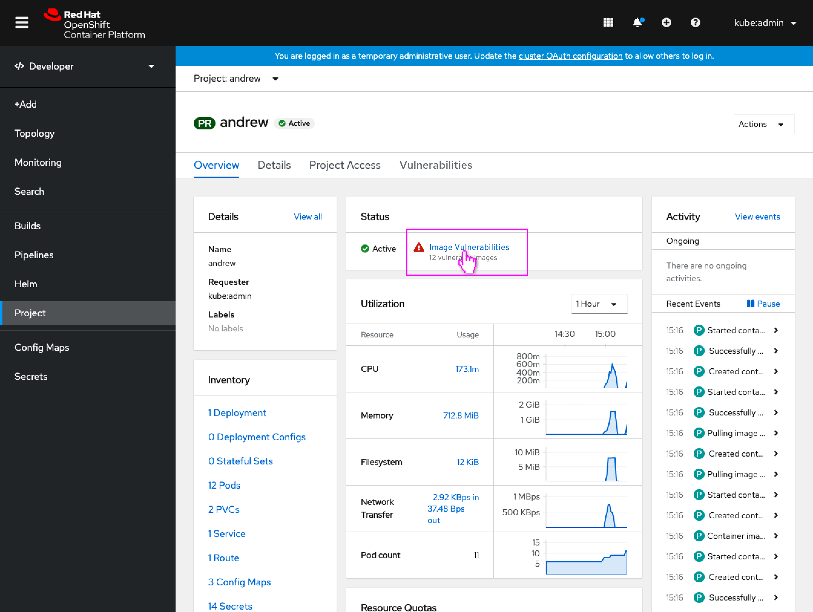
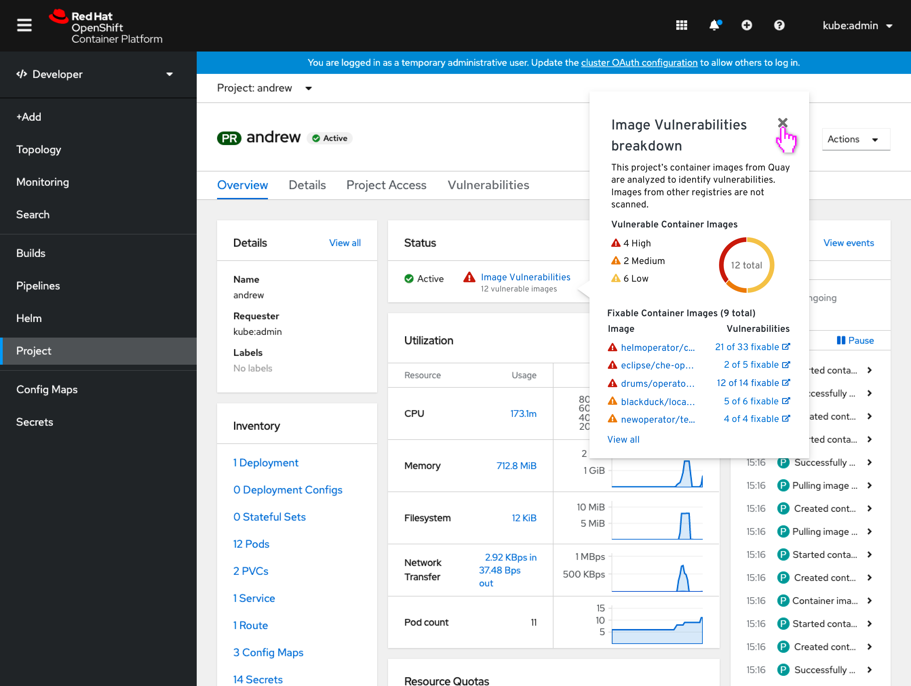
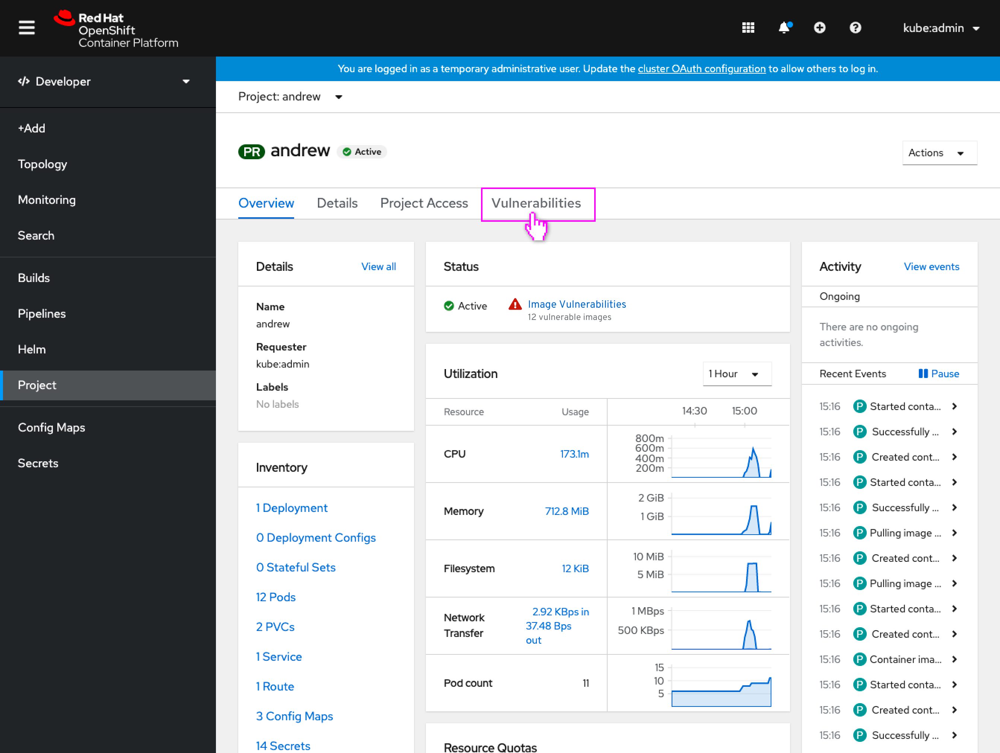
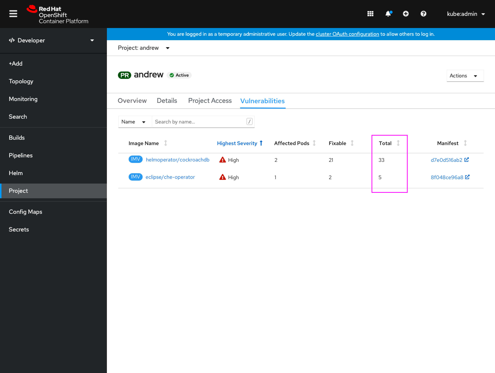
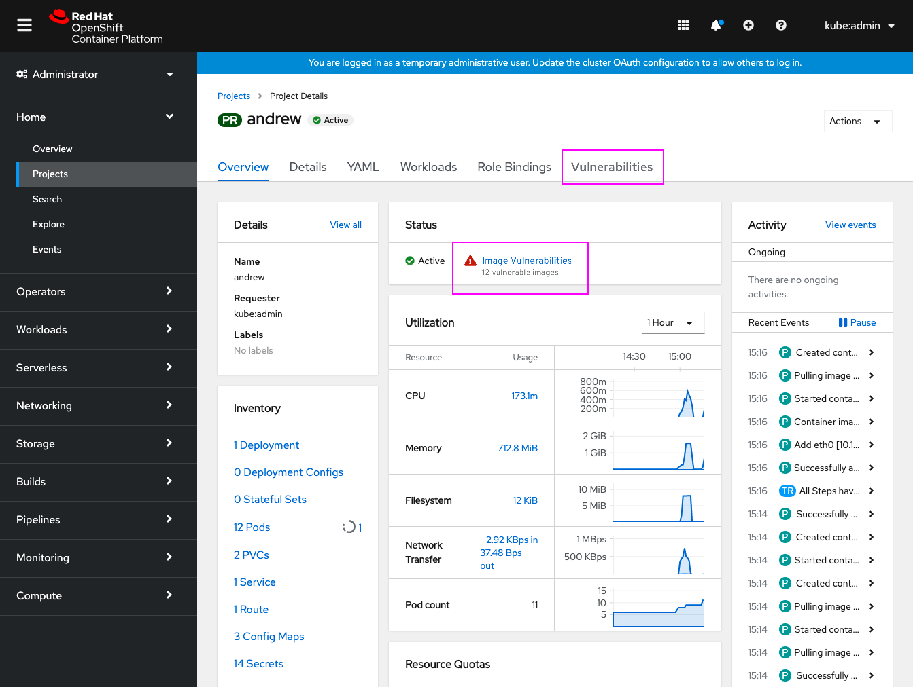

# View image vulnerabilities on the project dashboard

Today the Quay Container Security operator (CSO) allows admins to see base image vulnerabilities across their cluster. Future changes to the Container Security Operator will allow surfacing of app dependency vulnerabilities to developers and admins as provided by CodeReady Dependency Analytics which is powered by Snyk, in addition to the existing Clair-discovered base image vulnerabilities.

In anticipation of those future changes, and because base image vulnerabilites are also useful to developers, the project dashboard should be updated to now also reflect the image vulnerabilities that occur in that project, likely as a status similar to that seen on the cluster dashboard.

## Image vulnerabilities on the project dashboard

- With the Container Security operator installed, a new status on the Project dashboard conveys any vulnerable images.

- The popover (based on the existing cluster dashboard popover) conveys a breakdown of the image vulnerabilities.
- Clicking the image name would open that particular ImageManifestVuln resource.
- Clicking the fixable count would open that image in quay.io (or the repo it is from.)
- Clicking **View all** would take the user to the Vulnerabilities tab.

- The user opens the full project vulnerabilities list (tab is present when CSO is installed.)

## Image vulnerabilities list in project

- Image Manifest Vulnerabilities resources for the project are shown.
- The filter would allow for filtering by Name or Label.
- Each of these IMV represents an image scan.
- The columns include the fixable and a new total count of vulnerabilities.

## Administrator perspective view

- The same functionality would be accessible from the Administrator perspective on the project dashboard as well.