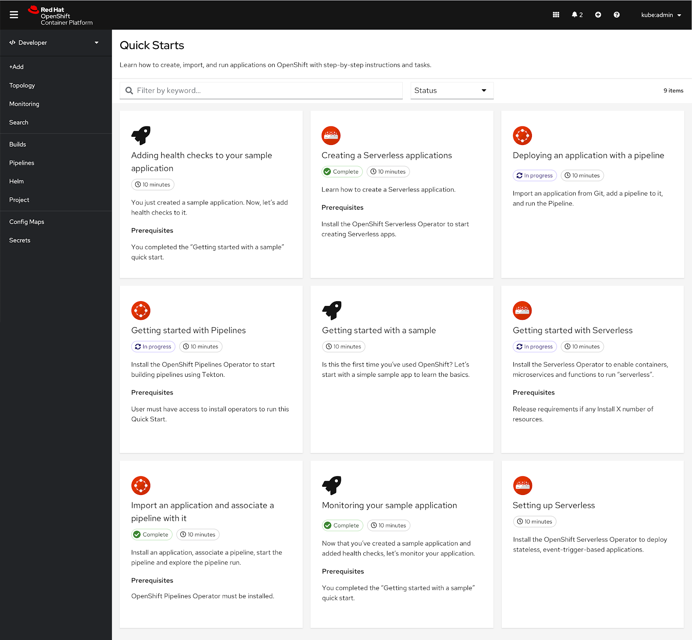
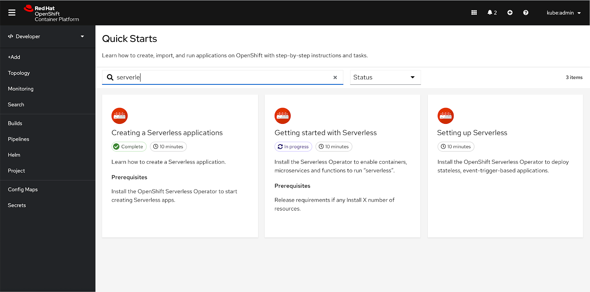
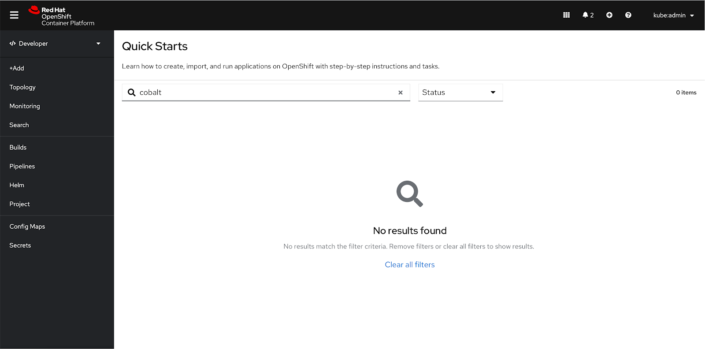
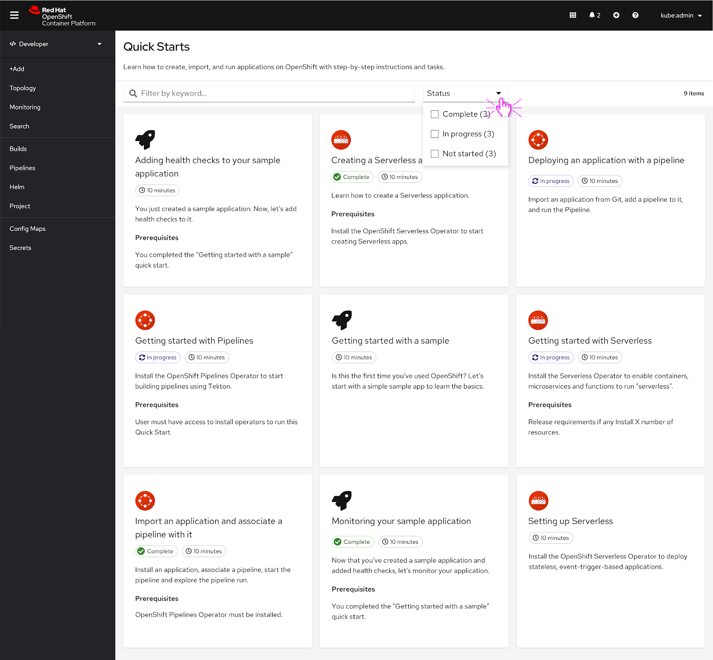
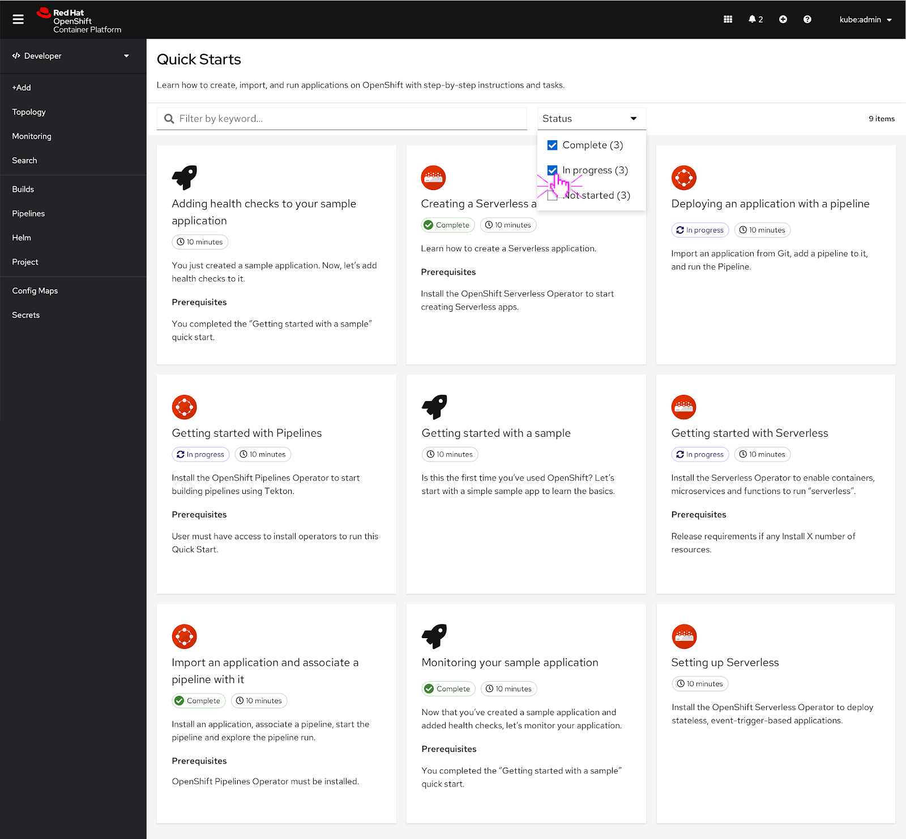
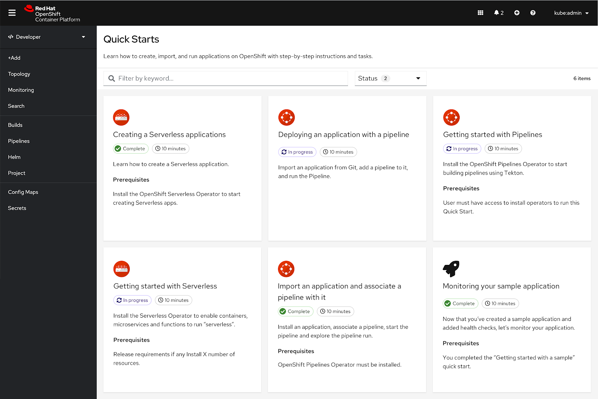

parent: Developer
version: 4.7
---

# Quick Starts Catalog Page

## Overview

For the MVP version of the Quick Starts catalog, a toolbar has been added to the page to allow users to filter the quick starts by status or keyword.

By default the quick starts should be ordered by alphabetical order.    

All of the quick start cards should load all at once so it matches the behavior of OperatorHub and the Developer Catalog.

## Search
### Immediate filtering

The search and filtering behavior for the quick starts catalog should be the same that’s currently implemented in OperatorHub and the Developer Catalog.

The user enters a search term into the search input. As soon as they start entering a term, the contents of the quick starts catalog begins to filter. The number of results is reflected in the label on the right side of the toolbar, in this scenario there are ‘3 items’ available.

If the user wants to get rid of the filtered search results, they can delete the search term or click the ‘X’ in the search box.

In this scenario, the search bar is in an active state.

The user finishes typing their search term and the quick starts that feature the search term are listed.

The search bar returns to its default state.

## Empty state
### Misspelling

If the search term is misspelled, an empty state will appear.

### Search term does not have any matches

If no search results are found, the same empty state appears.  

## Filtering
### Status

The user can filter quick starts by status. The user clicks the dropdown to reveal ‘Complete’, ‘In progress’, and ‘Not started’ as status filter options. The user can click one or more of the filter options.

In this scenario the user selects ‘Complete’ and ‘In progress’ filters.

The quick starts that match the filter criteria are still present and the total number of items listed in the toolbar is now ‘6 items’.
