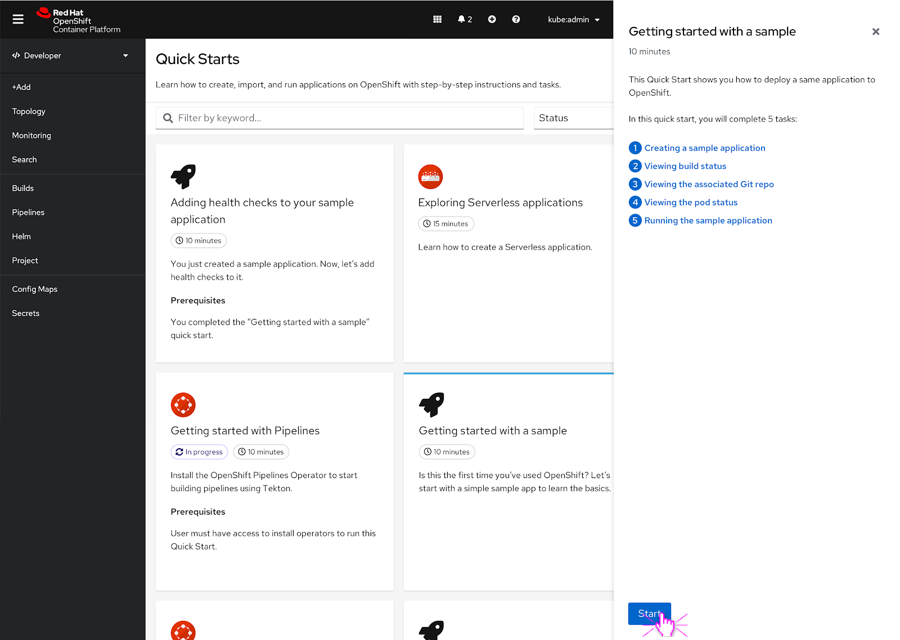
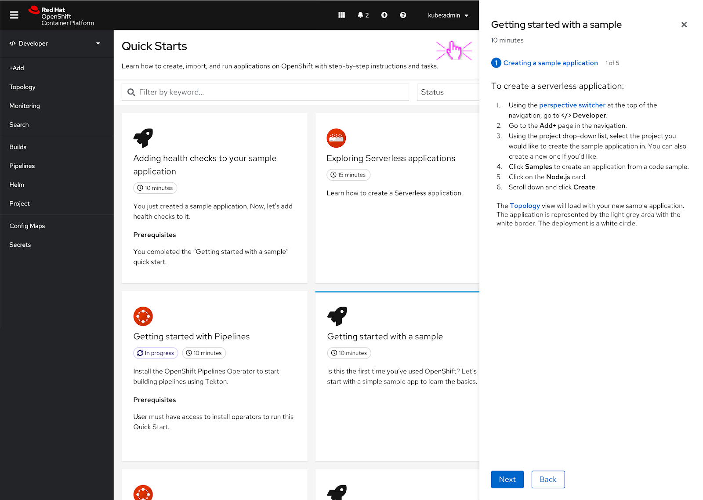
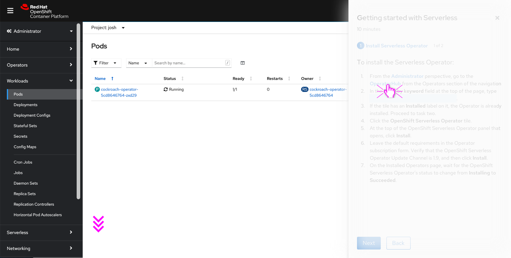
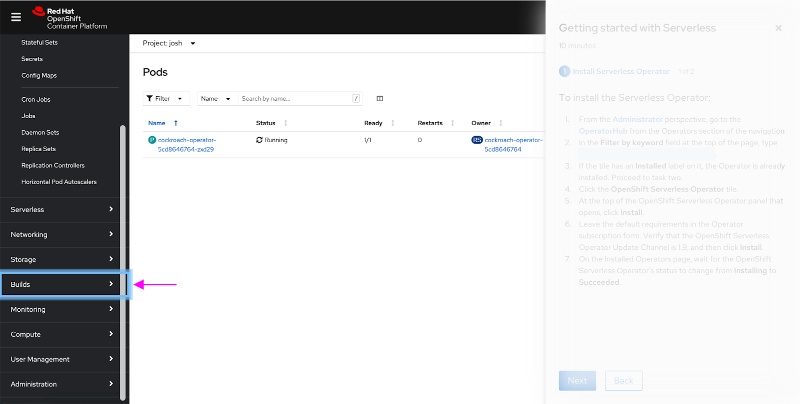
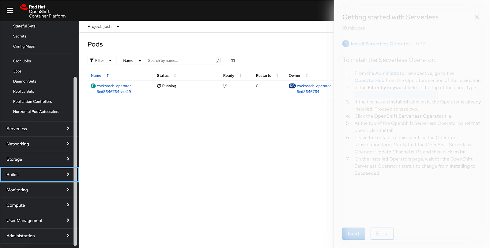
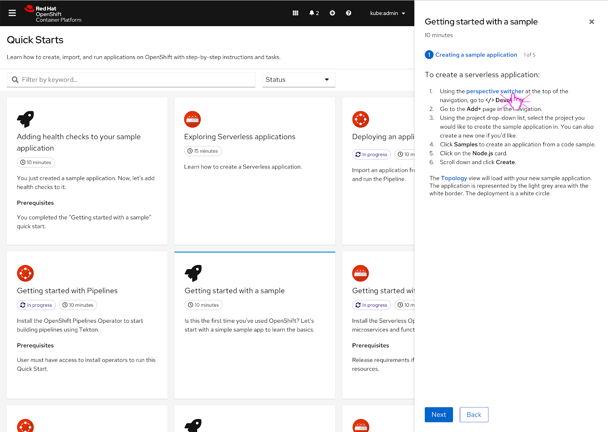
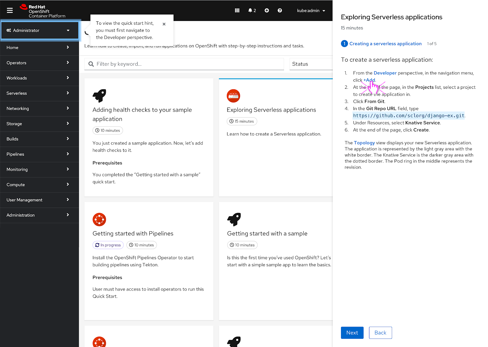
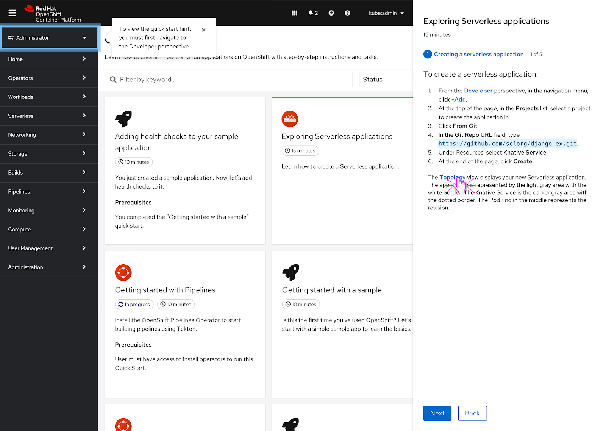
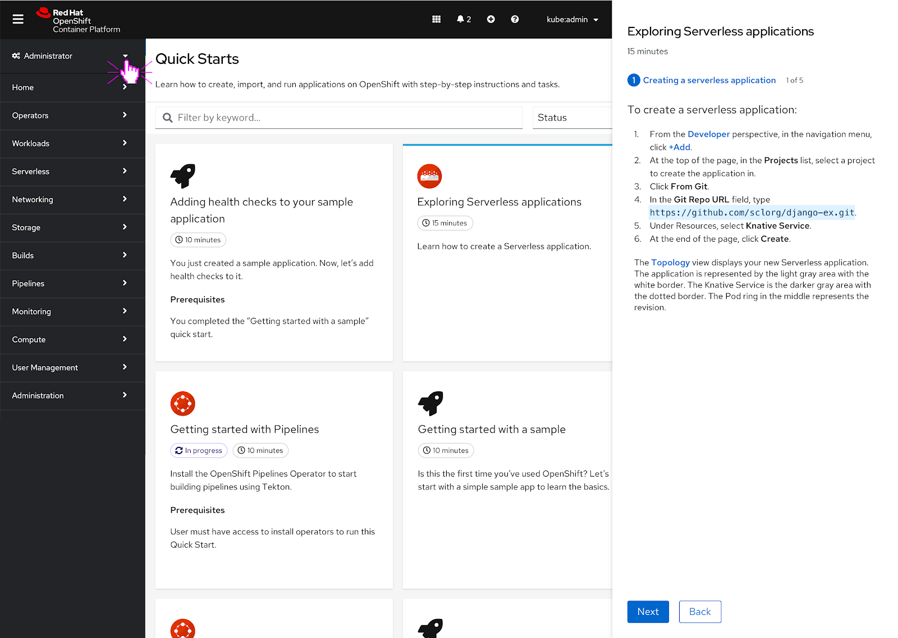

parent: Developer
version: 4.7
---

# Navigation hints in Quick Starts

## Basic Flow

To start, the user selects a Quick Start and hits the ‘Start’ button.

Navigation elements within the quick start appear as links and the user can click on them to reveal a navigation hint.

In this scenario, the perspective switcher is mentioned in the quick start and the user clicks on it. As soon as the user clicks the link, the hint appears around the perspective switcher and goes through one animation cycle to bring attention to the perspective switcher.  

Only one hint can be present at a time.

After the hint goes through one animation cycle, a solid rectangle remains around the perspective switcher for 10 seconds. After 10 seconds, the rectangle fades away.

The user can also click on another navigation hint within the quick start to make the previous hint disappear.

In this scenario, the user clicks on the Topology link in the quick start and prompts a new hint. The hint goes through the same animation cycle.

The solid rectangle hint persists until the user clicks somewhere else on the UI or waits the 10 seconds until it fades away.

In this scenario, the user has clicked somewhere else in the UI to dismiss the hint.

## Edge Cases
### If the hint is out of frame

If a user clicks on a navigation point in the quick start that’s outside of the frame, the vertical navigation should slowly autoscroll to show the navigation point with the hint in frame.

The hint is now in view and the animation goes for one cycle once the hinted at navigation item is in frame.  

Following the same pattern as the other hints, after one animation cycle is complete a solid rectangle appears around the navigation point. It will disappear after 10 seconds.

### If the vertical navigation is collapsed

Even if the vertical navigation is collapsed, the user can still click on the navigation points mentioned in the quick start.

In this case, the vertical navigation should expand and there should be a brief hint square that quickly highlights the hamburger menu.

This animation should just go through one cycle and then proceed to hint at the navigation point in the vertical navigation and go through a normal animation cycle.

The perspective switcher gets hinted at next and goes through one animation cycle.

After the animation cycle is complete, the solid hint rectangle appears around the perspective switcher and persists for 10 seconds or until the user clicks on another part of the UI.

The user clicks another part of the UI and the hint is dismissed.

### If the user is in the wrong perspective

If the user is in the wrong perspective when they start to click on quick start hints, a popover with a message pointing out the perspective switcher and a hint should highlight it.

The intention is that the user must navigate to the proper perspective before they can access any of the other hints in the quick start since they are not in the right perspective that the quick start mentions.

Even if the user clicks on another hint linked in the quick start, they will get the same hint and popover message until they switch over to the proper perspective.

The user makes the decision to go over to the other perspective that’s stated in the quick start.

Since the user is now in the ‘Developer’ perspective, they can click on any of the hints mentioned in the quick start. The hint will go through its usual animation cycle now.  
