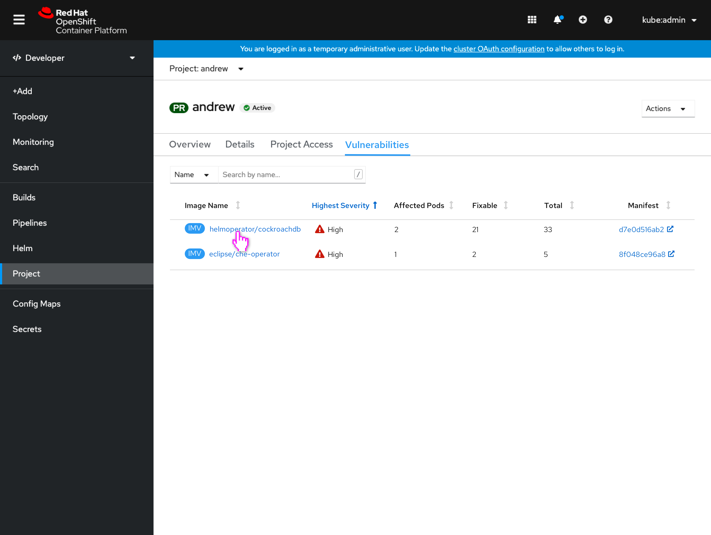
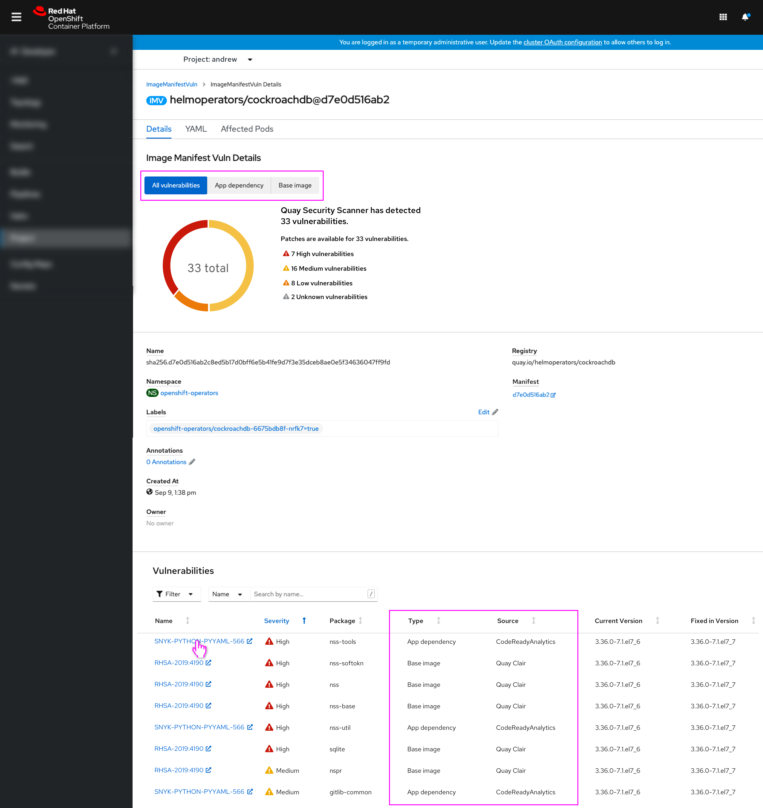
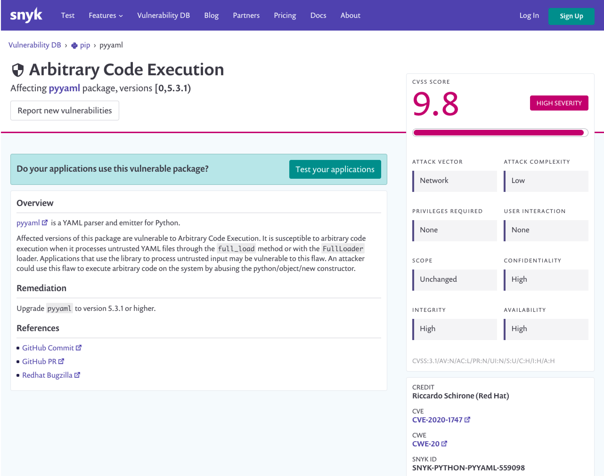
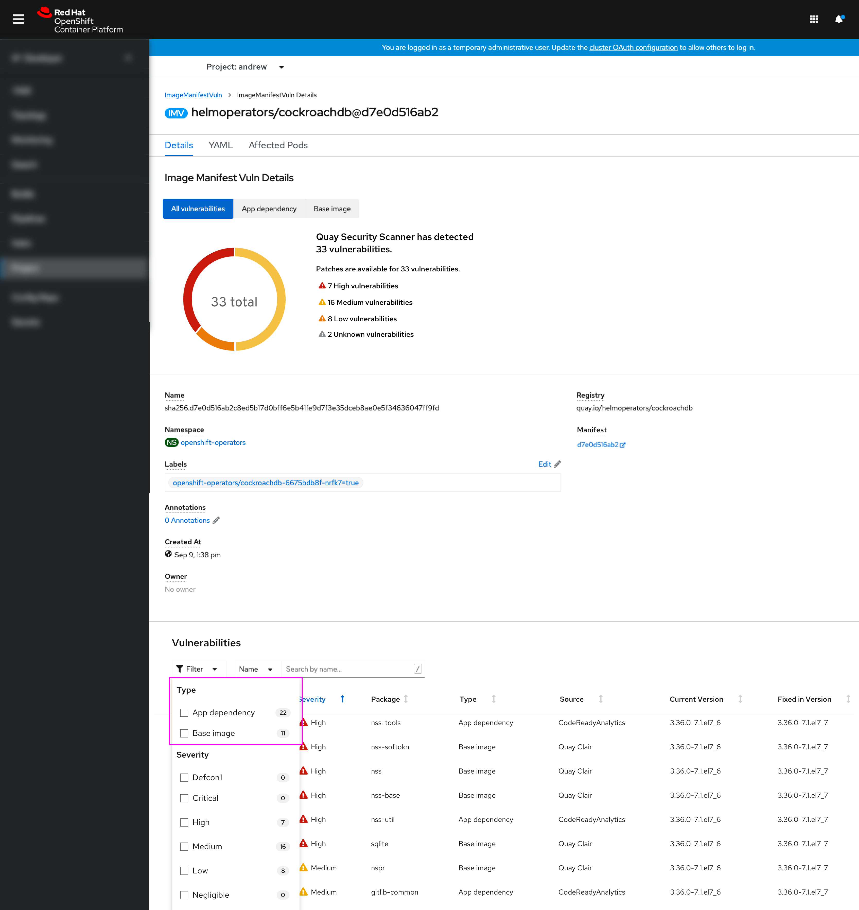
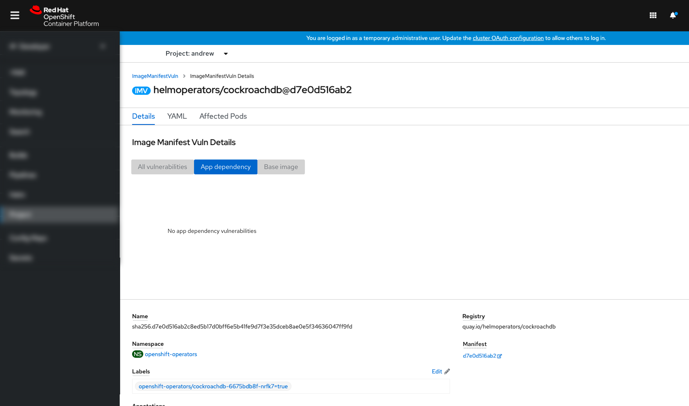

# App dependency vulnerabilities included with image vulnerabilities

As of 4.7, developers and admins can see a project's image vulnerabilities on the project dashboard. For 4.8, application dependency vulnerabilities, provided by CodeReady Dependency Analytics which is powered by Snyk, will now also be surfaced, in addition to the existing Clair-discovered base image vulnerabilities that appeared in 4.7.

These app dependency vulnerabilities will give developers and admins a more complete view of the state of the security of their images on the cluster. 

## App dependency vulnerabilities

- Any time counts of vulnerabilities for Image Manifest Vulnerabilities resources are shown, they will now also include app dependency vulnerabilities. This would include list views and dashboard statuses, for both the developer and administrator perspectives.

- The Image Manifest Vulnerabilities resource details view now includes app dependency vulnerabilities information in addition to base image vulnerabilities.
- The top summary information includes a ToggleGroup component that allows the user to view the counts and graph for all vulnerabilites, or just app or base image vulnerabilities.
- The Vulnerabilities table includes a Type column that conveys what type of vulnerability it is, and also a Source column that conveys how it was found.

- Clicking a vulnerability's name will still open an external link to the details of that vulnerability, which can be from Snyk for app dependency vulnerabilities.

## Filtering

- The Vulnerabilities table in the Image Manifest Vulnerabilities resource details view now includes a filter for Type.

## Empty state

- If the user interacts with the top summary's ToggleGroup and there are no vulnerabilities of the selected type, an empty state is shown.