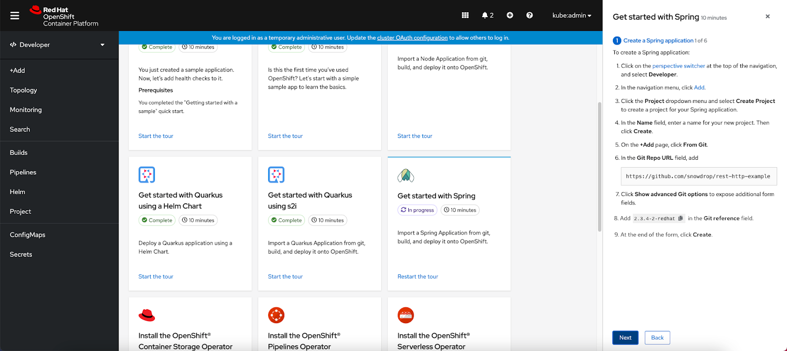
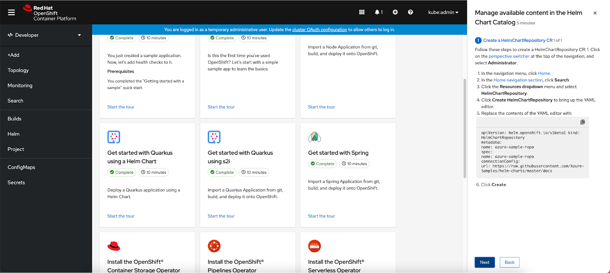
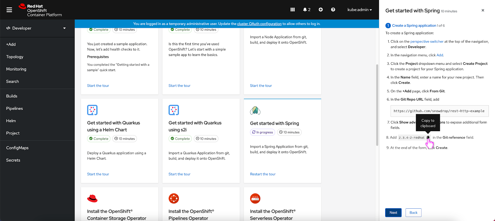
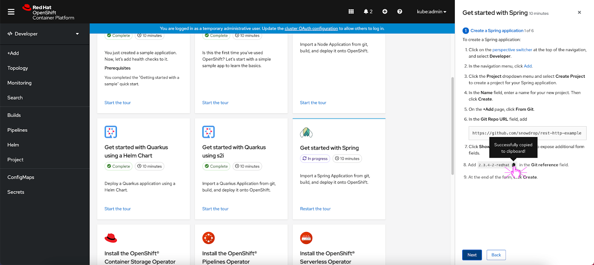
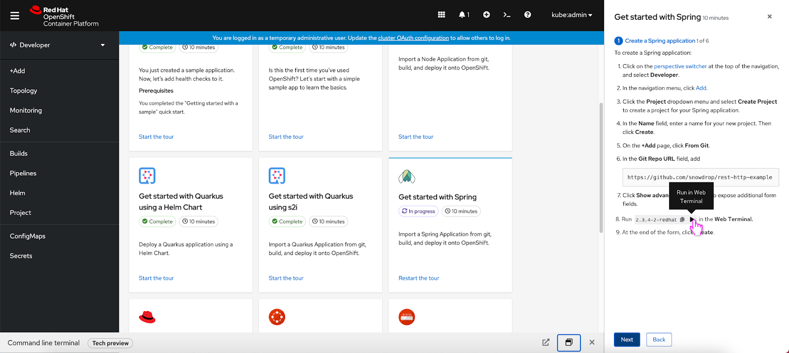
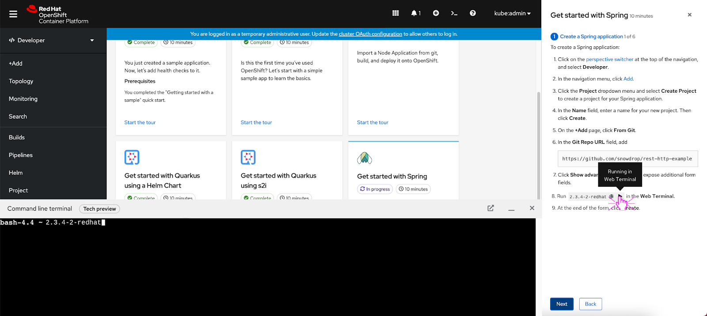
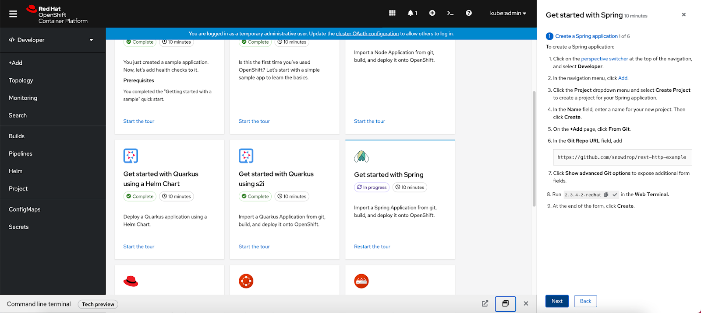
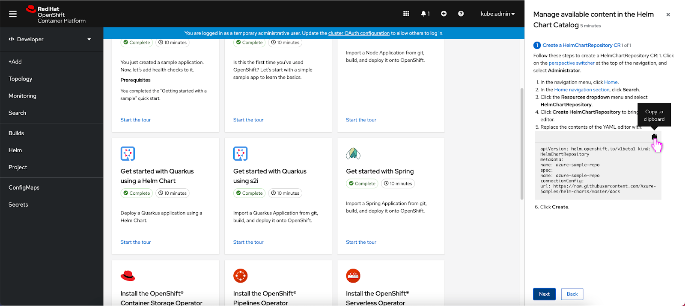
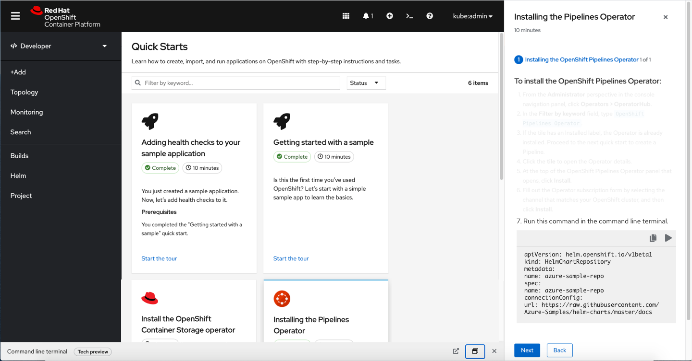

# Code snippets in Quick Starts

## Overview

In the 4.8 release, code snippets will be added to quick starts. Inline and block code snippets will be supported. The inline and block code snippets will live inside of the quick start and support inline actions. By default, the user will be able to click a clipboard icon to copy the code snippet to their clipboard. Depending on if the user has the Web Terminal operator installed, the user will also be able to click a play button to run the code snippet in the Web Terminal.

## Inline
### Single action

If the user hovers over the copy to clipboard icon, a ‘Copy to clipboard’ tooltip appears.

If the user clicks the copy to clipboard icon, a ‘Successfully copied to clipboard!’ tooltip appears.

### Two actions

The inline code snippet can feature two actions. In this scenario, copy to clipboard and run in the Web Terminal are the two available actions.

If the user hovers over the play button icon, a ‘Run in Web Terminal’ tooltip appears.

If the user clicks the play button icon, a ‘Running in Web Terminal’ tooltip appears and the Web Terminal immediately opens and the user can see the code snippet running in the Web Terminal.  

After the ‘Run in Web Terminal’ action has been run once, the play button icon turns to a checkmark to indicate that the action has been run already.

## Block
### Single action

The block snippet follows the same interaction pattern as the inline code snippet, if the user hovers over the copy to clipboard icon, a ‘Copy to clipboard’ tooltip appears. A horizontal divider separates the clipboard icon from the code snippet.

### Two actions

Same as the inline code snippet, the block code snippet can feature two actions and they appear in the upper right hand corner of the code snippet. A horizontal divider separates the actions from the code snippet.
