# Form based edit for Deployments and DeploymentConfigs
The ability to edit Deployments and DeploymentConfigs via a form was available in 3.x and is being added to 4.8.

## Design

### Edit forms for Deployments

The Edit Deployment form will be surfaced in a full page view when the **Edit Deployment** action is invoked from the actions menu. The form will be the default view, but users can switch to the YAML view using the form / YAML switcher at the top of the page. There are two strategy types for Deployments:
1. Recreate
2. RollingUpdate

#### Recreate
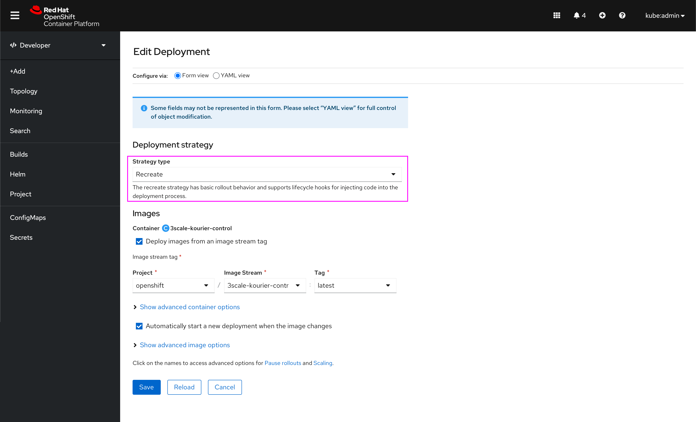

#### RollingUpdate
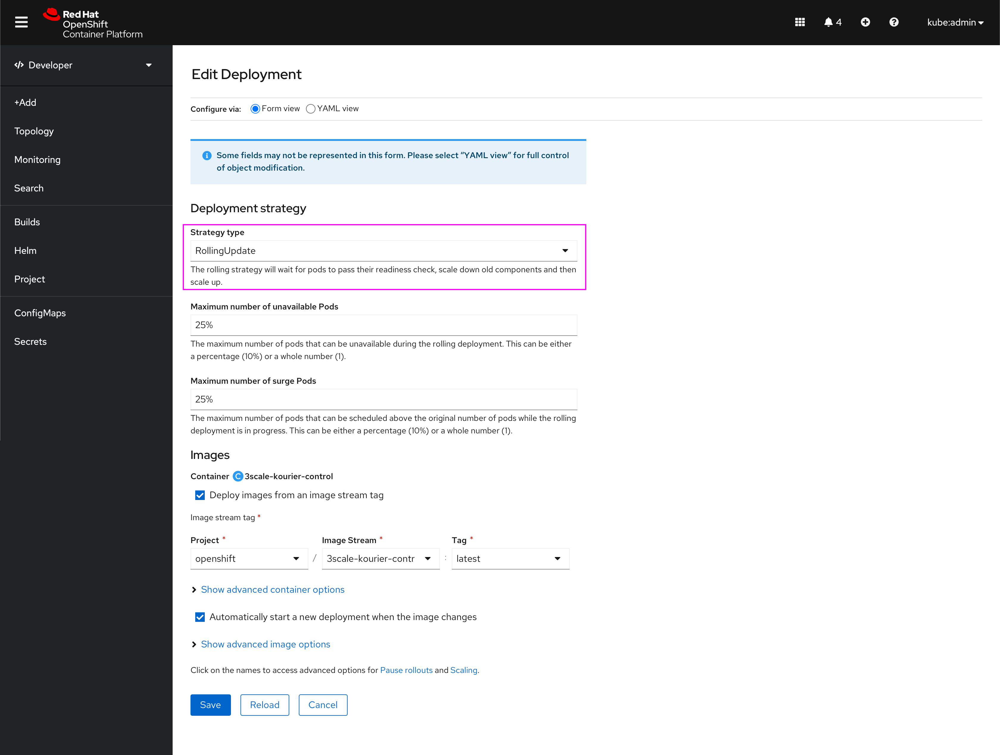

### Edit forms for DeploymentConfigs

The Edit DeploymentConfig form will be surfaced in a full page view when the **Edit DeploymentConfig** action is invoked from the actions menu. The form will be the default view, but users can switch to the YAML view using the form / YAML switcher at the top of the page. There are three strategy types for DeploymentConfigs:
1. Recreate
2. RollingUpdate
3. Custom

#### Recreate

Pre, Mid, and Post Lifecycle Hooks

#### RollingUpdate
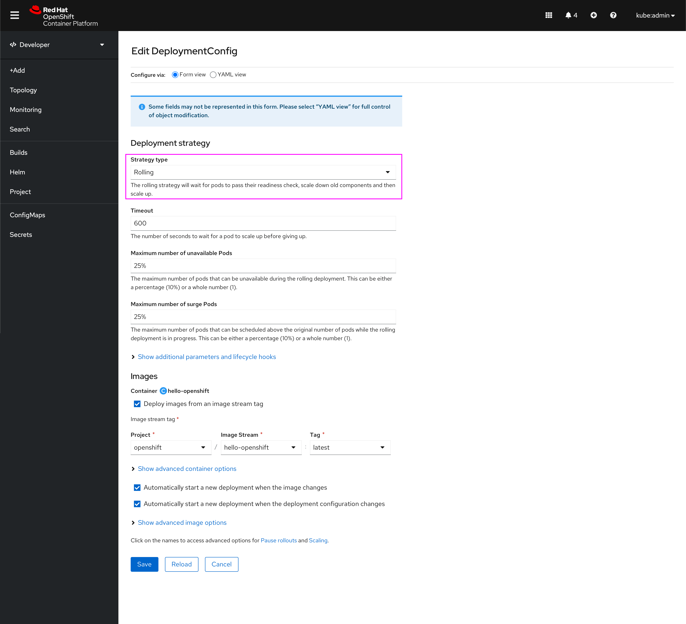
Pre and Post Lifecycle Hooks

#### Custom
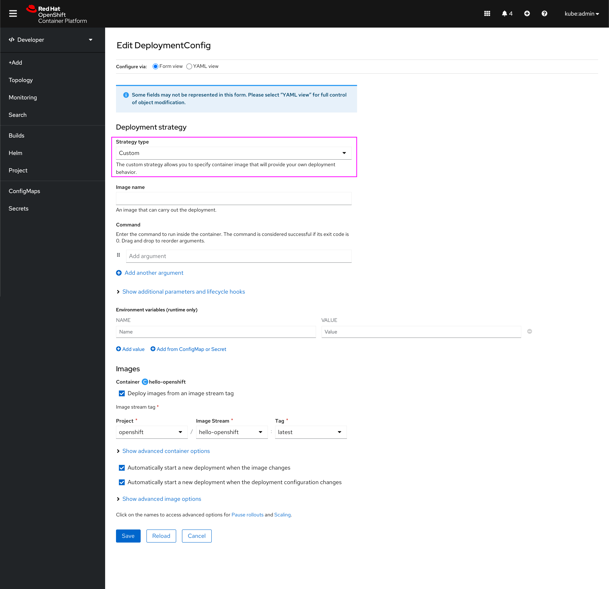
No Lifecycle Hooks

### Additional form variations / advanced sections

#### Image stream tag
If the user unchecks the image stream tag checkbox:
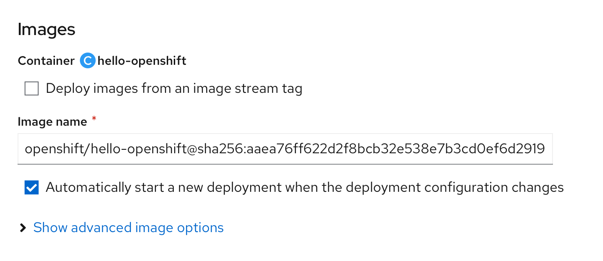

#### Additional parameters and lifecycle hooks (DC only)
When the user first expands the section, they will see the options to add a number of lifecycle hooks:
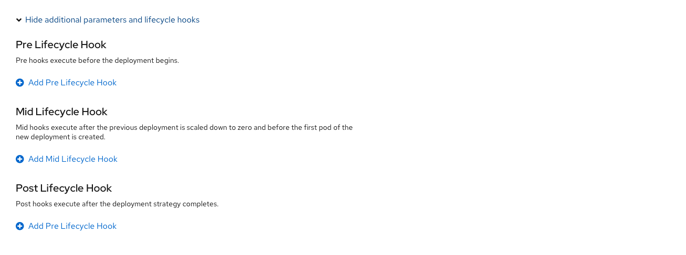

When they add one, the form will appear in this form section:
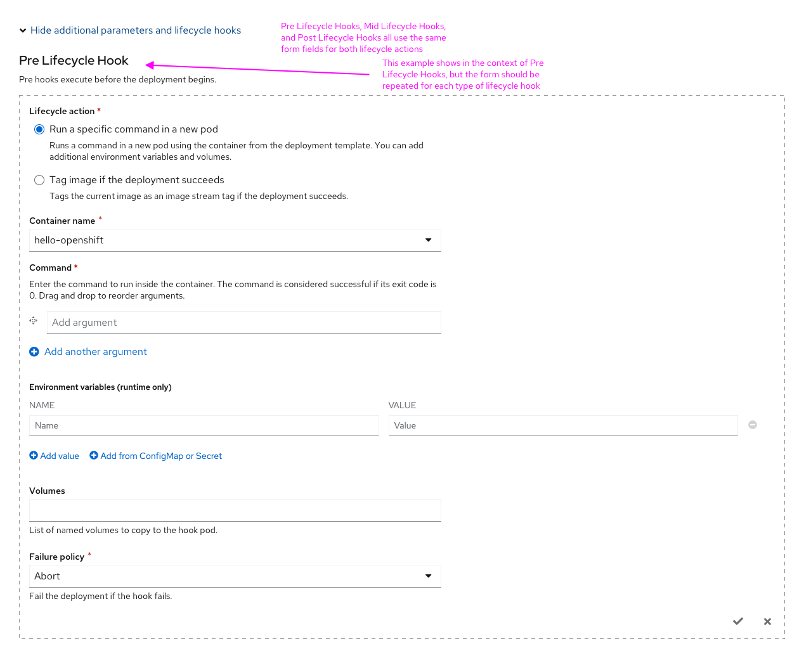

The above form is for when the lifecycle action is **Run a specific command in a new pod**. Below is the form for when the lifecycle action is **Tag image if the deployment succeeds**.
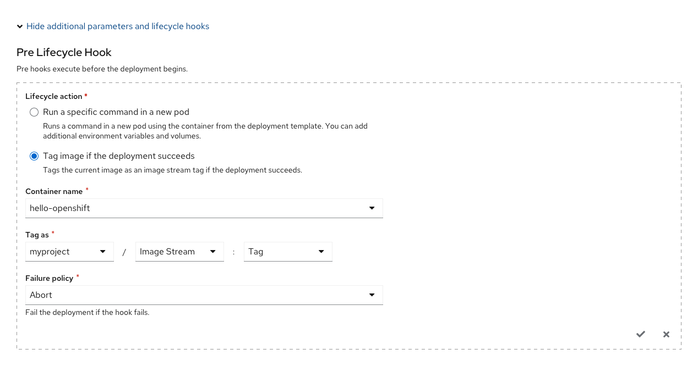

These forms are the same for Pre, Mid, and Post Lifecycle Hooks.

#### Advanced container options
If the user expands the Advanced container options section:
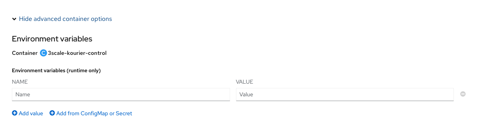

#### Advanced image options
If the user expands the Advanced image options section:
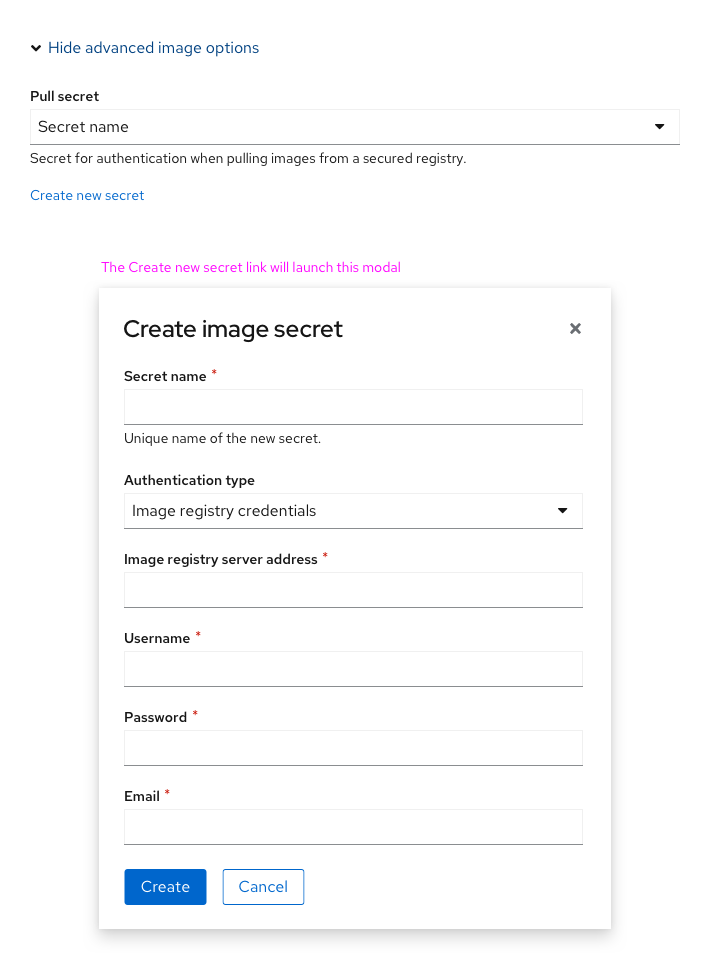

#### Additional advanced sections (at the end of form)
If the user clicks the advanced options for Pause rollouts and Scaling:
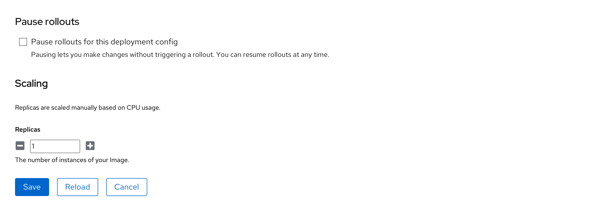

### Navigation behavior
If the user clicks the **Edit [Resource]** action from the dropdown (either from list view, details view, or Topology), show the form in a full page view. Show the form / YAML switcher at the top of the page, so that users can see both views. Regardless of which view the user is on, the **Save** and **Cancel** buttons will redirect the user back to the view from which they invoked the **Edit** action.
