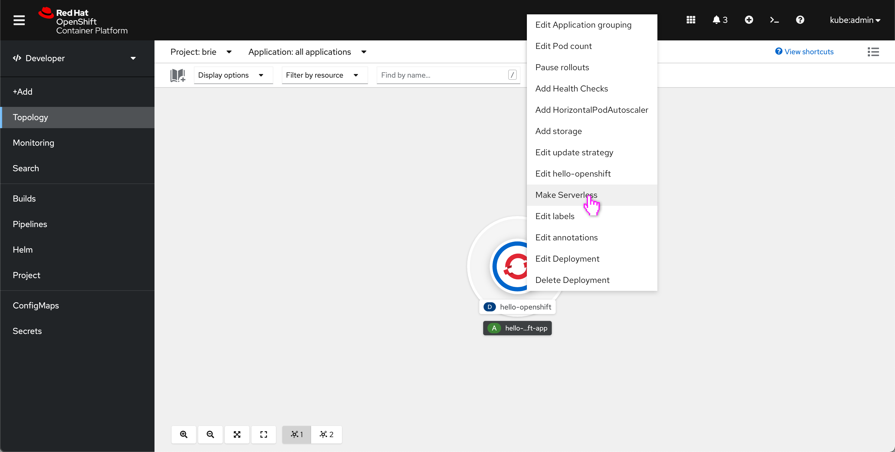
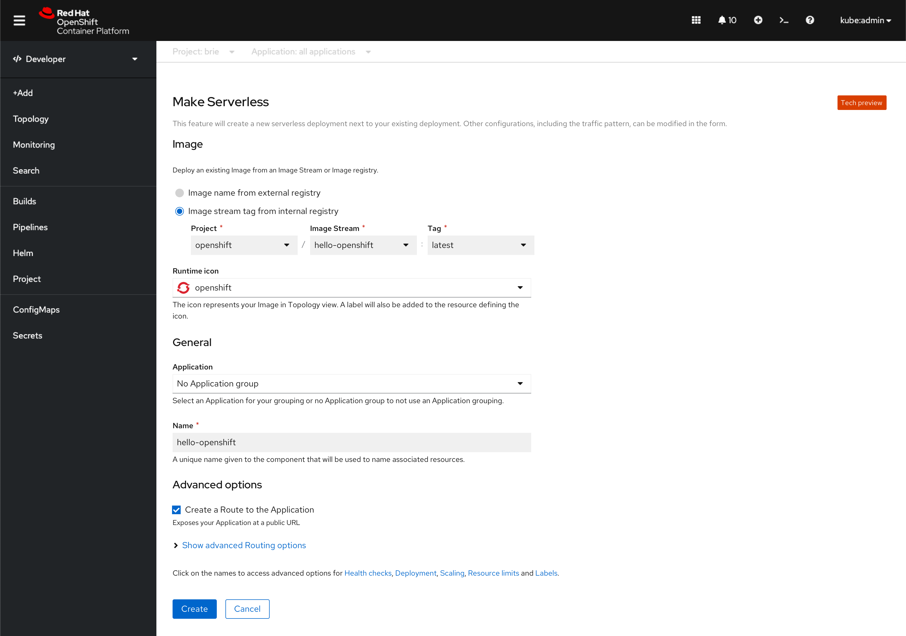
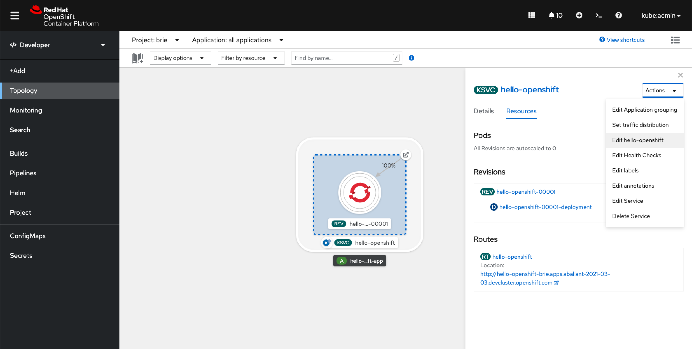

# Make Deployments and DeploymentConfigs Serverless
This design adds a new action to the actions menu of Deployments and DeploymentConfigs to allow them to create a Knative service from the existing workload. This action will only apply to standalone Deployments and DeploymentConfigs. It will not be an option for Deployments and DeploymentConfigs that have owner references.

## Design

**Action**

The action to perform this operation will be called **Make Serverless** and will be available from the resource dropdown.

**Form**

Upon clicking the action, the user will be redirected to the Make Serverless form. A short form description informs users that they will be creating a new serverless deployment next to the existing deployment. (In the future, this feature will replace the existing deployment.) A tech preview badge is shown in the top right corner of the form.

By default, imageStream will be shown in the internal image section. It will be disabled so users cannot change the selection.

If a resource doesn't define a route, when it is made Serverless, the route will be public by default.

**Edit flow**

When the user clicks **Edit {service_name}**, they will be redirected to the original import flow with the original source image shown (not the internal one). For example, if the Deployment origin was the Git import flow, and the user creates a KSVC and tries to edit with **Edit {service_name}**, they will be taken to the Git import flow. The following example uses the Deploy Image flow.

