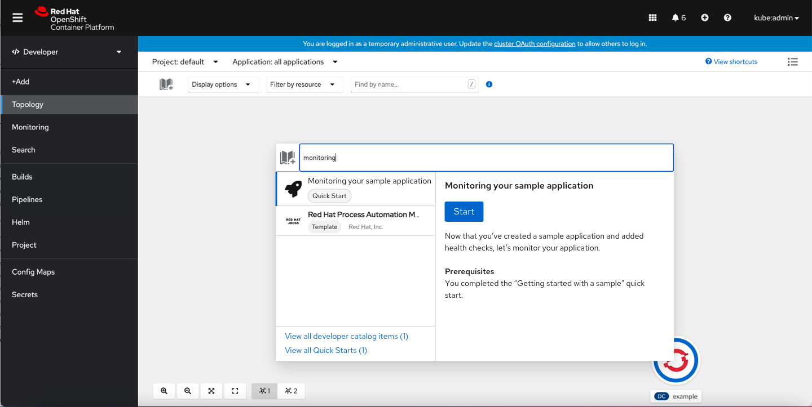
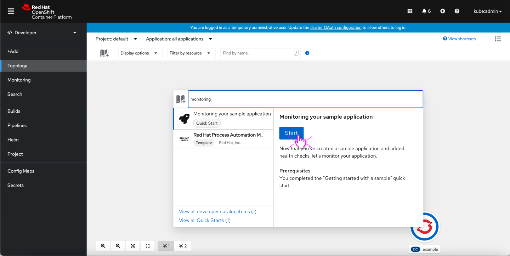
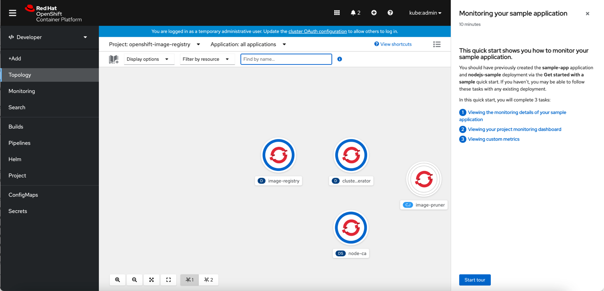
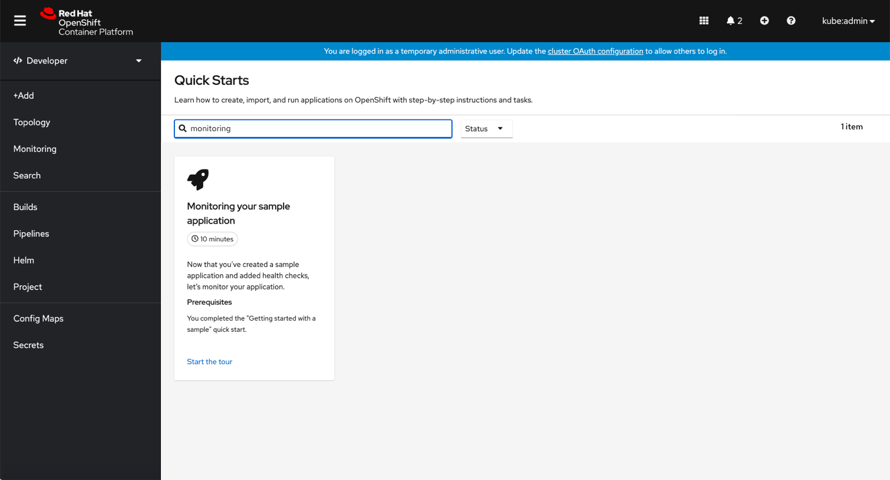
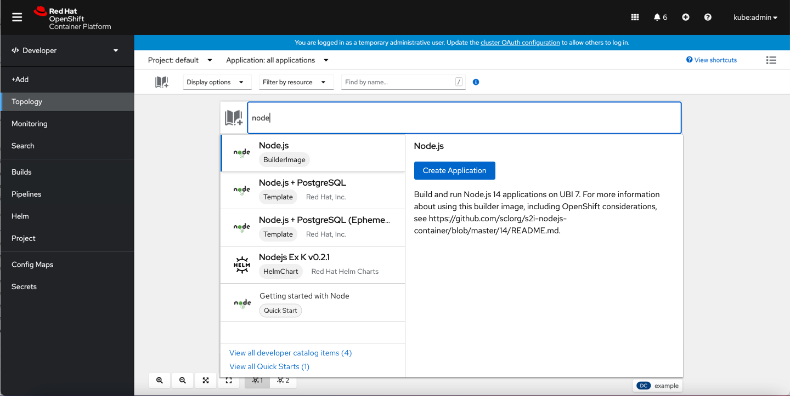

# Quick Starts from the Quick Add menu

## General search

 If the user searches by a specific term and there are quick starts available for that term, the Quick Start appears as an option. Quick Starts now appear along side the Developer Catalog items if it matches the search term.

The user can start the quick start by clicking the ‘Start’ button.

The selected quick start starts in context of the Topology.

The user can also click on the view all results in the Quick Starts catalog to see their search results there.

The user is taken to the search results in context of the Quick Starts Catalog.

## Larger queue of search results

If the search term has 5+ results, the size of the card should extend vertically to include both view all results links.
