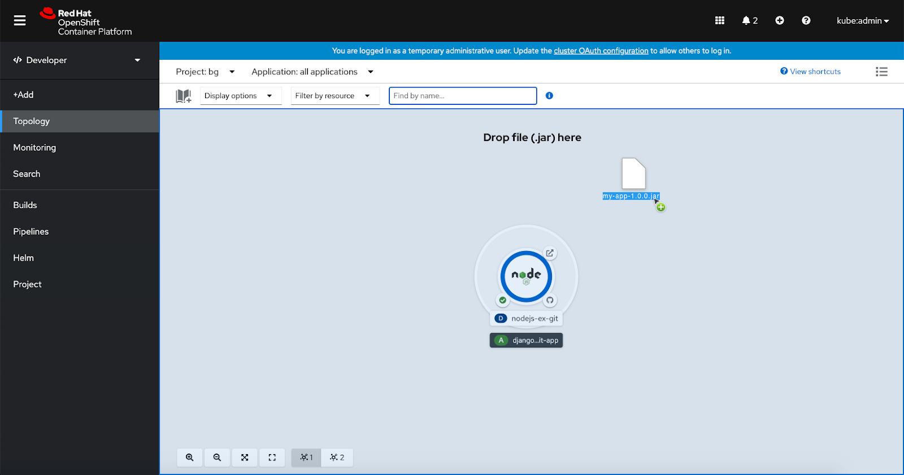
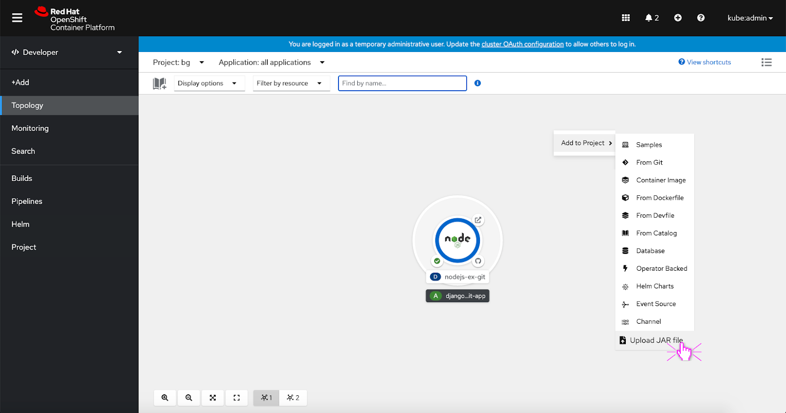
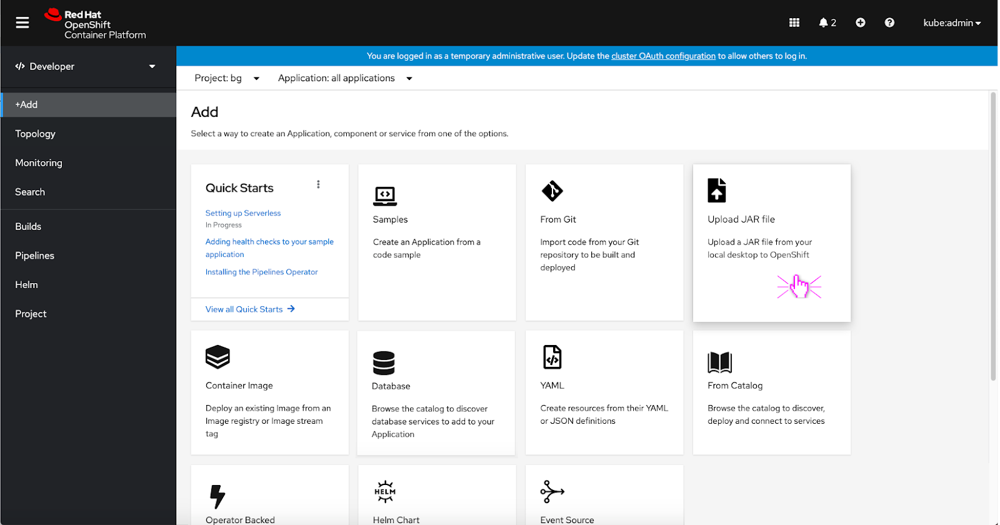
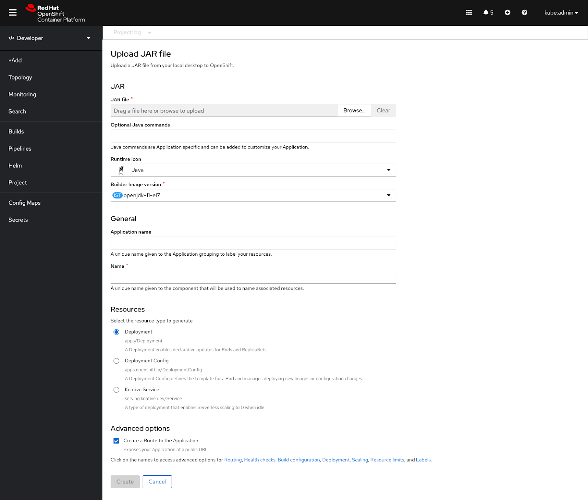
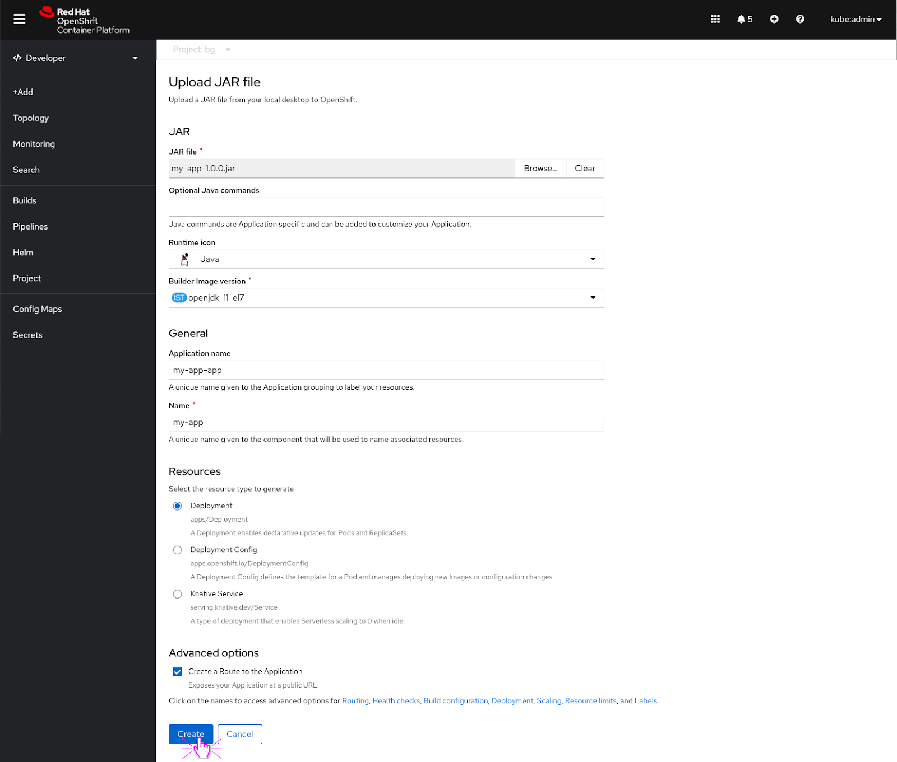
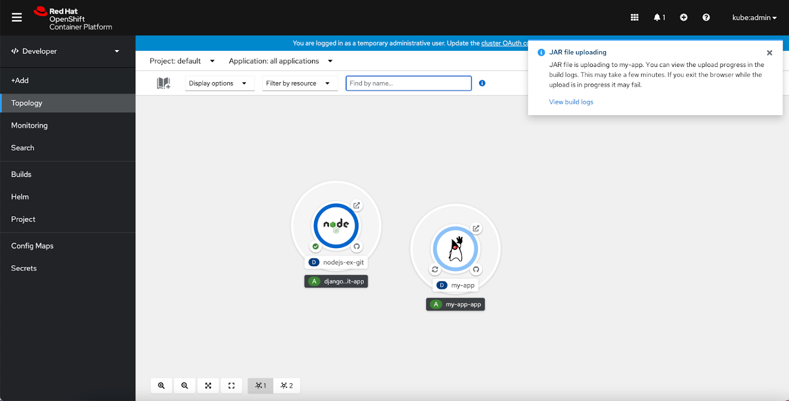
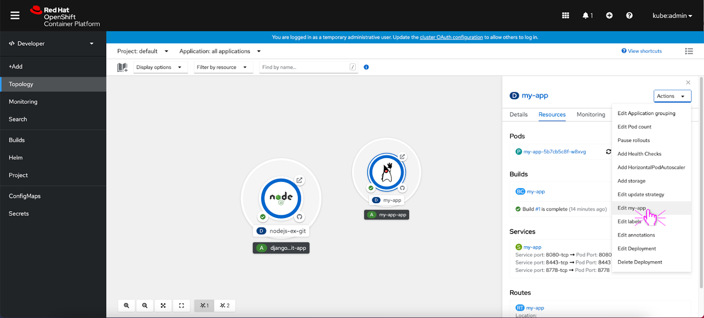
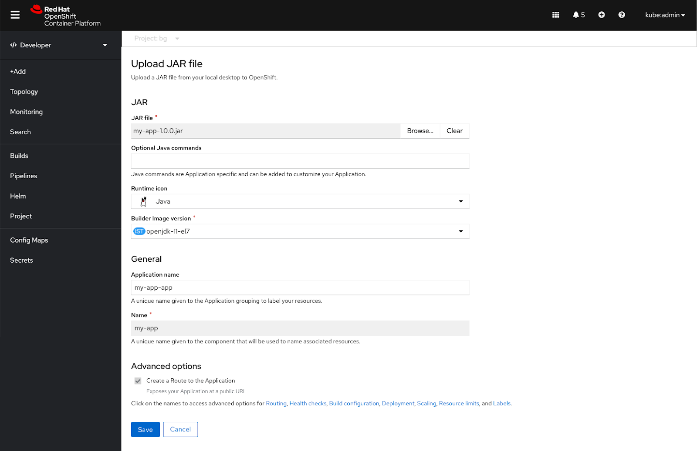
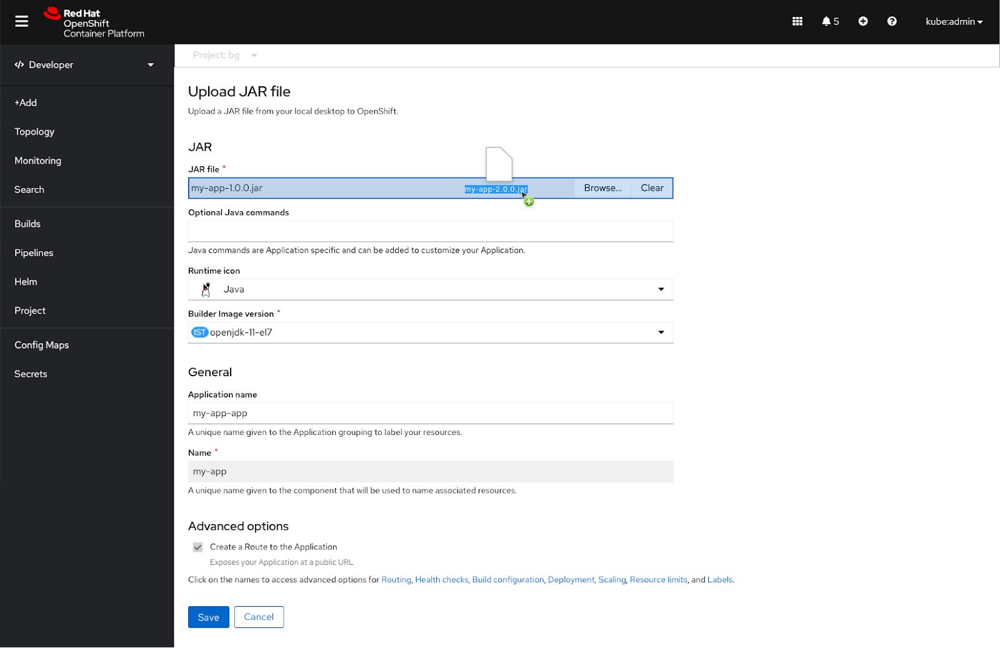
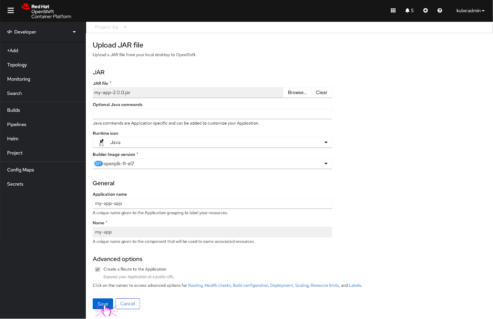

# Uploading a JAR file

## Overview

In 4.8, the ability to upload a JAR file to create a Spring Boot application was added to the Developer Console. There are couple different ways a user can upload a JAR file. They can drag and drop their JAR file directly onto the Topology, go to the +Add page to select the 'Upload JAR file' option, or right click in the Topology to access the Add to Project menu and select "Upload JAR file".  

## Entry points

### Drag and drop on Topology

The user drags and drops a JAR file from their desktop into the graph view. A blue highlighted area appears where the user can drop the file. After the user drops their JAR file into Topology, the upload form opens immediately.

The user can drag and drop a JAR file from their desktop onto the list view too. A blue highlighted area appears where the user can drop the file. After the user drops their JAR file into Topology, the upload form opens immediately.

### From the Add to Project menu

The user can also upload a JAR file from the ‘Add to Project’ menu in Topology. The user clicks the ‘Upload JAR file’ option to open the upload JAR file form.

### From the +Add page

From the +Add page, the user can click the ‘Upload JAR file’ card to open the upload JAR file form.

## Upload form

If the user enters from the Add to Project menu or +Add page, a blank upload form appears. Since the user has not selected a JAR file yet to upload, the ‘Create’ button is disabled. Once the user has selected a JAR file to upload and fills out all of the required fields, the ‘Create’ button becomes active.

If the user drags and drops a JAR file into Topology or selects a JAR file to upload, a populated upload form immediately appears. Once the user has filled out all of the required fields the ‘Create’ button becomes active.

After the user clicks the 'Create' button, the JAR file begins to upload and the deployment build is in progress. The user receives a toast notification saying that the JAR file is uploading and it might take a while. The toast notification also includes a link to view the build logs.

## Edit form

If a user wants to make edits to the JAR file they uploaded to a deployment, the user can select ‘Edit my-app’ from the Actions dropdown.

The upload a JAR file form appears and the user can make edits to the fields that are available. The user can re-upload their original JAR file, upload an updated JAR file with the original file name, or upload a new JAR file.

If the user wants to make edits to the existing .Jar file, they would need to edit it locally and then re-upload it to the form. The user can re-upload the JAR file by either dragging and dropping it or browsing and selecting the JAR file from their desktop.

The user clicks the ‘Save’ button to save their edits.

Each time the user makes an edit to their JAR file, the JAR file must be uploaded again. This will cause the in progress toast notification to appear again.
