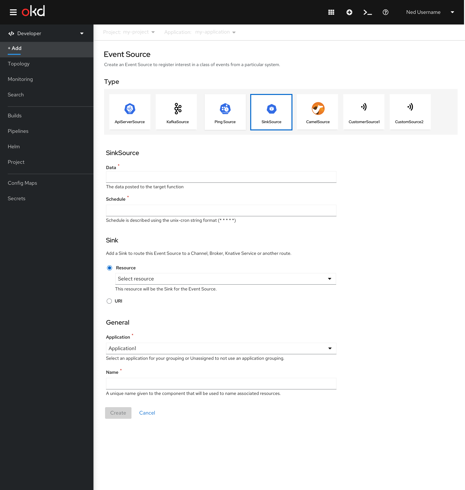
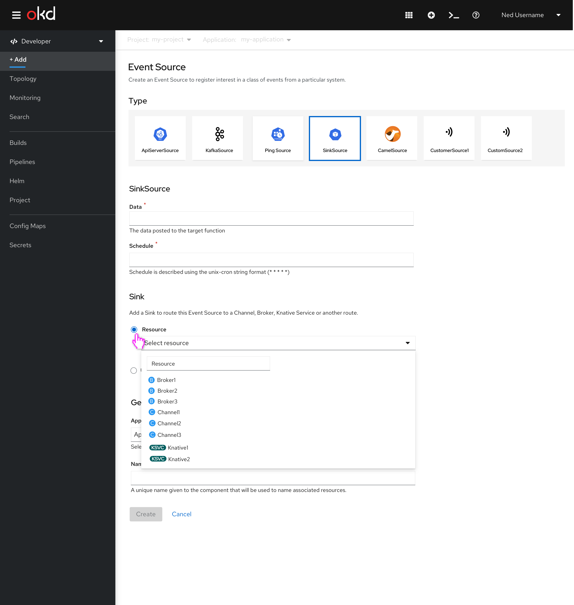
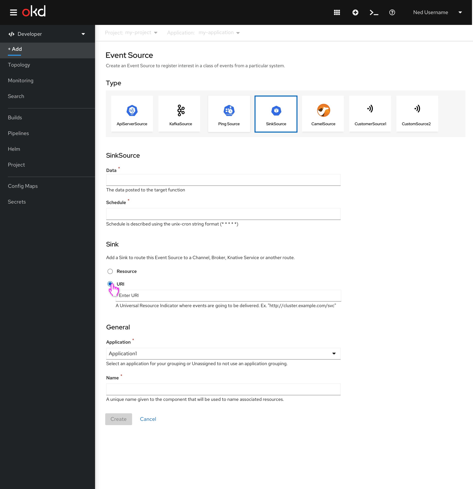
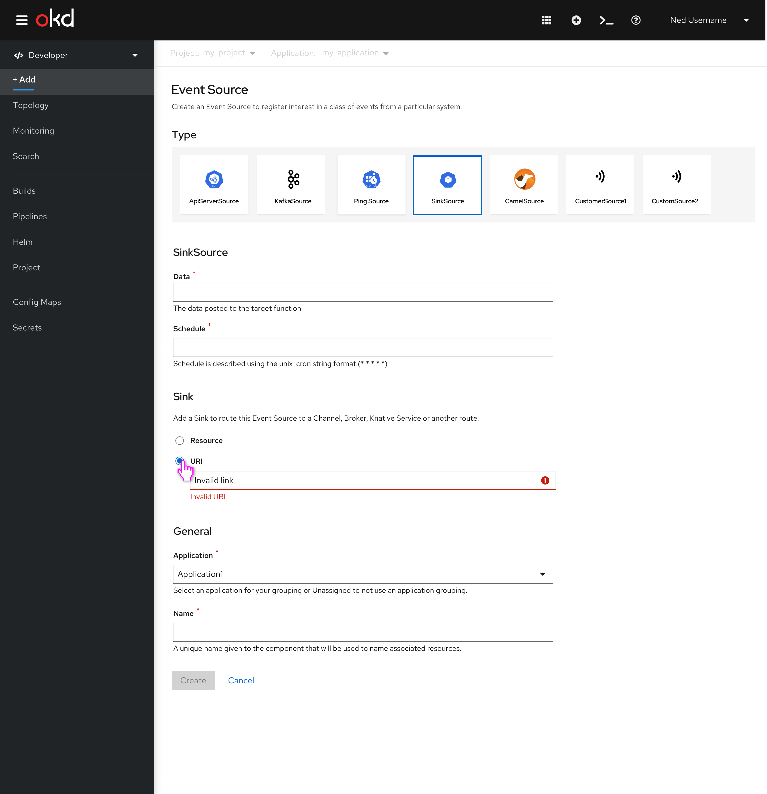
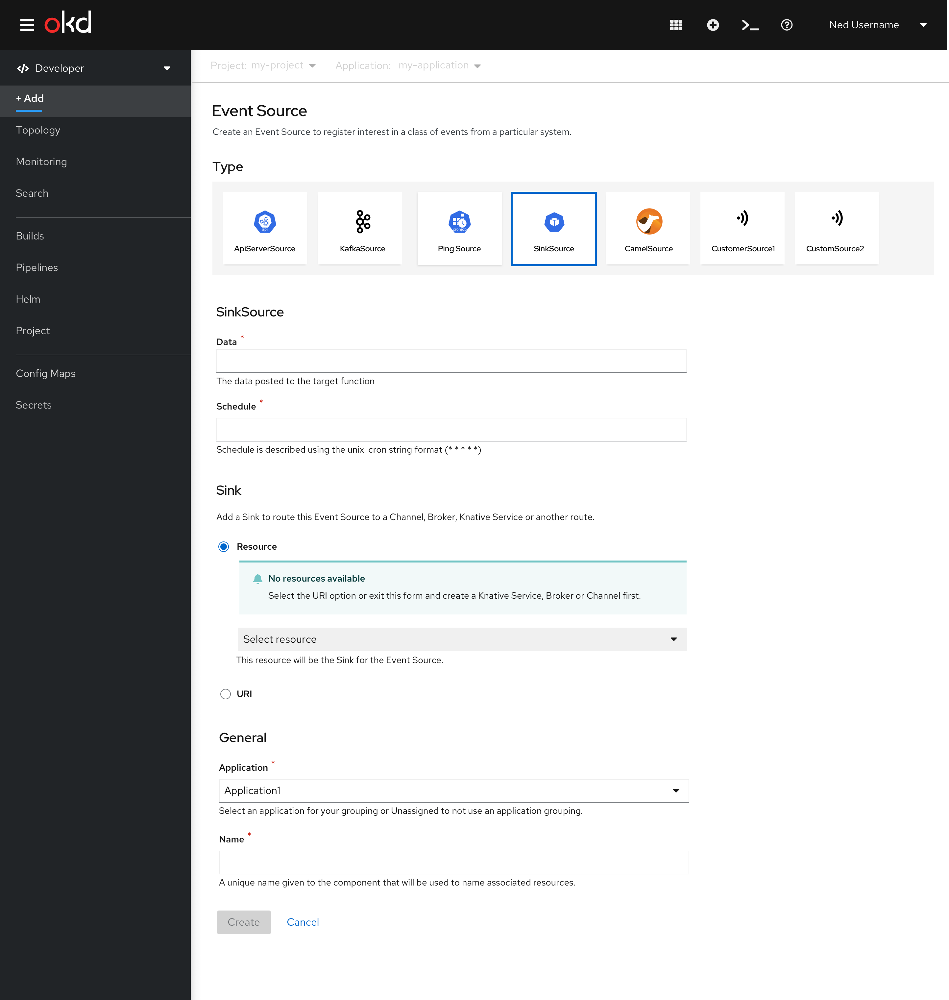

# Adding sink with channels, brokers, and URI (4.6)
In this story developers  create an event source and add a sink that is a broker channel, Knative service or URI.

## Add sink with resource or URI - one resource
When the user only has one resource to choose from, the resource field auto populates with that resource.

## Add sink with resource or URI - multiple resources
The user must select a sink because a sink is required today. In this view, the user has multiple resources they can choose from.

## Resource dropdown - user has more than one resource
When the user selects the dropdown, they can see the brokers, channels and Knative services that have been previously created and are available to them. The dropdown form supports type-ahead and is grouped by Resource type: broker, channel, or Knative service.

## Select URI
There will be no in-field validation for 4.6, but we should look to include this in the future. The URI could be a route of channel, broker, or Knative service or any other route (in/off cluster).

## Error state for the URI field
When the user enters an invalid URI.

## No resource available
If there are no resources available (brokers, channels, and Knative services) the form should default to the URI field.

If the user manually selects a resource the field should appear as disabled. An inline alert should appear with a message that describes for the user that they should try the URI field instead.

