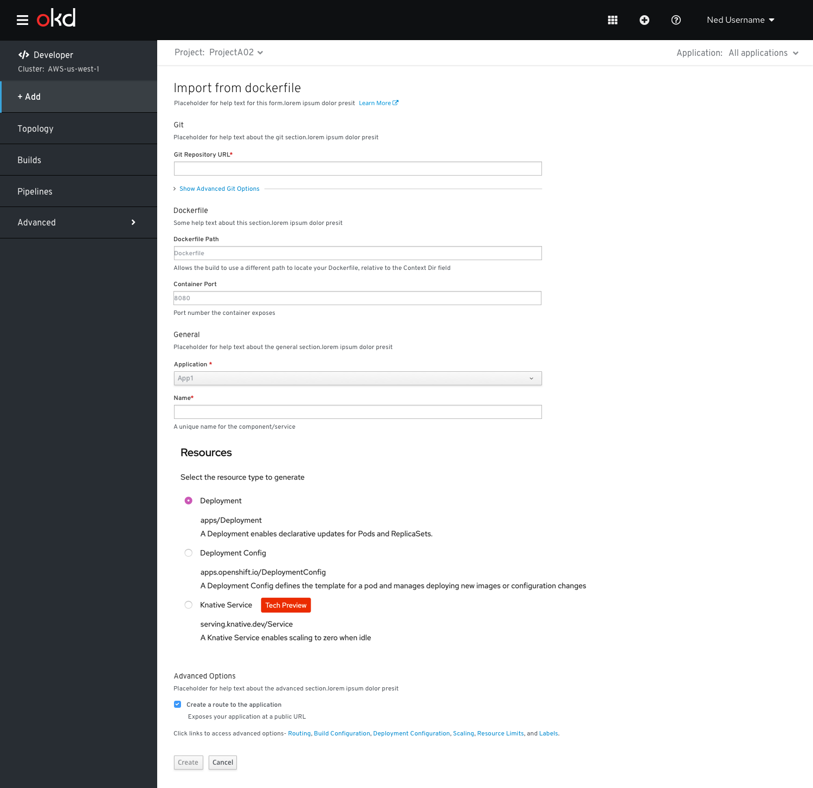

# Import from Dockerfile (Enhancements in 4.3)
The user lands on the **Import from Dockerfile** form by selecting the **From Dockerfile** card from the **Add** page.

The **Import from Dockerfile** form has the following sub sections:
## Git
This section is where the users enter the Git repository URL for the codebase they want to use to create an application. It also has an advanced options section associated with the **Git repository URL** field.

User can click **Show Advanced Git Options** to add details such as:
* **Git Reference** to point to code in a specific branch, tag, or commit to be used to build the application.
* **Context Dir** to specify the subdirectory for the application source code you want to use to build the application.
* **Source Secret** to create a Secret Name with credentials for pulling your source code from a private repository.
  
## Dockerfile

The **Dockerfile** sub sections has Dockerfile Path and Container Port fields.
* **DockerFile Path**-This field has the helptext- Allows the build to use a different path to locate your Dockerfile, relative to the Context Dir field
* **Container Port**-This field has the helptext-Port number the container exposes

## General 
The General section has ‘Application’ and Name’ fields.

This is a common section available in all the add flows.You can find the detailed documentation of General section  [here](https://openshift.github.io/openshift-origin-design/designs/developer/add/Container-Image/Deploy-Image)

## Resources
In the Resources section, user can select:
* Deployment, to create an application in plain Kubernetes style.
* Deployment Config, to create an OpenShift style application.
* Knative Service, to create a microservice.
  Note: The Knative Service option is displayed in the Import from git form only if the Serverless Operator is installed in your cluster. 
  For further details refer to documentation on Resources section  [here](https://openshift.github.io/openshift-origin-design/designs/developer/add-43/sections/resources/resources)

## Advanced Options 
The Advanced section has the‘Create Route’ checkbox checked by default.

This is a common section available in all the add flows.Basen on the form some of the options available under Advanced section varies.You can find the detailed documentation about Advanced section **here**
