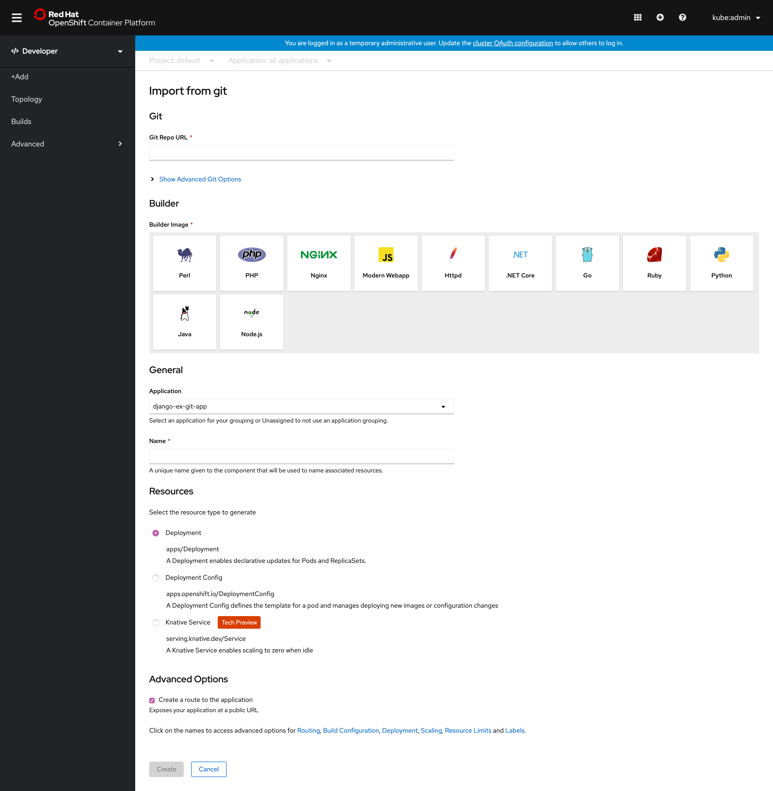
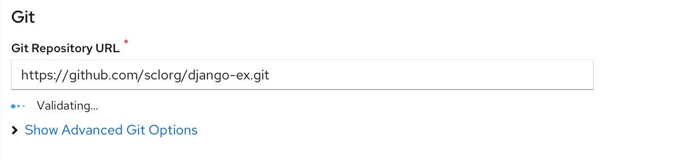
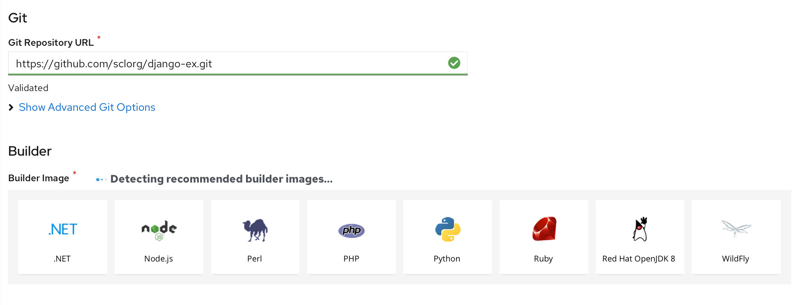
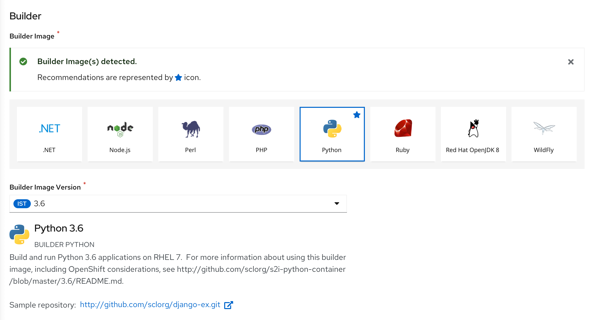
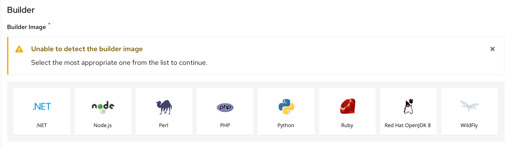
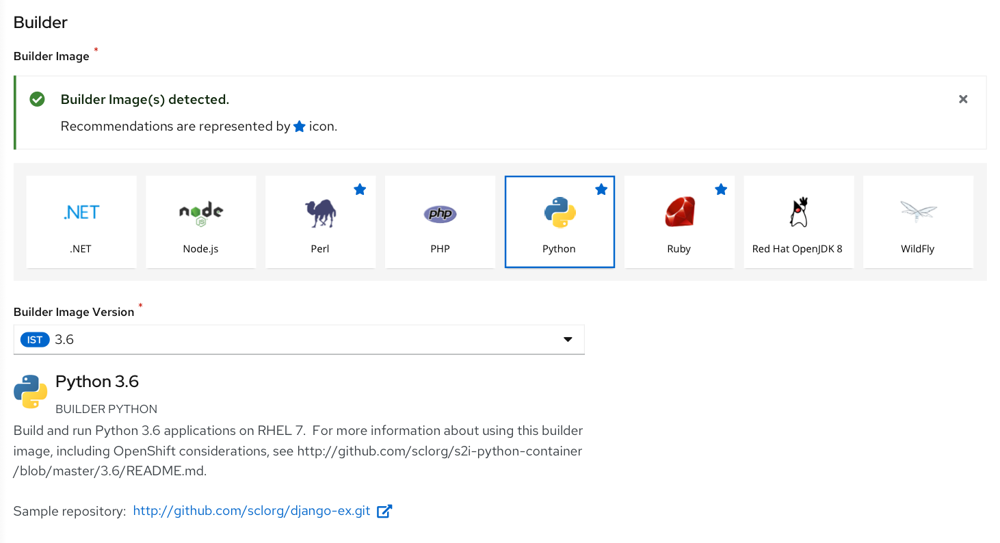

# Import from Git (Enhancements in 4.3)
The user lands on the **Import from Git** form by selecting the **From Git** card from the **Add** page.

#### Enhancements in 4.3

* The **Import from Git** form has been enhanced to help users easily create applications by auto-filling in the details, making the process more automated. 
* Introduction of auto-detection of the builder image(s), providing assistance in determining the right build strategy.
* Also the Resources is a new subsection in the Add forms.

The **Import from git** form has the following sub sections:

## Git 
This section is where the Git repository URL for the codebase you want to use to create an application is entered by the user. It also has an advanced options section associated with the **Git repository URL** field.

#### Git Repository URL Validation

Once the user enters the Git URL in the **Git Repository URL** field, the URL starts getting validated...
It is indicated to the user with a message ‘Validating…’ under the form field.

#### Git Repository URL Validated

  The ‘Git Repository URL’ successfully validated is indicated with a green tick mark and highlight to the field and text beneath it saying ‘Validated’.
  
  Once the URL is validated:

* The ‘Name’ field in the **General** section is auto populated based on the Git Repository URL.

* The detection of builder image has started-Indicated near the ‘Builder image’ subheading 

#### Show Advanced Git Options
User can click **Show Advanced Git Options** to add details such as:
* **Git Reference** to point to code in a specific branch, tag, or commit to be used to build the application.
* **Context Dir** to specify the subdirectory for the application source code you want to use to build the application.
* **Source Secret** to create a Secret Name with credentials for pulling your source code from a private repository.
  
## Builder 
This section is where the list of builder images are shown.Automatic detection of Builder Images is an enhancement introduced in 4.3 release.
#### Detection of builder image -successful scenario

If the detection of builder image is successful,an inline notification is shown to the user as shown.
Also the recommended builder image is indicated with a 'star' icon and is selected.

#### Detection of builder image -failed scenario

If the builder image detection has failed,an inline notification is shown to the user.
To proceed the user will have to select a builder image from the list.
#### Builder Image successful-multiple builder images recommended

If multiple builder images are found as part of recommendation,all of the recommended builder images are highlighted with 'star' icon.
* The most appropriate builder image among the recommendations is autoselected, if the user has not already selected anything else from the list of builder images.

**_Note :_** Before and after the successful detection of recommended builder image,the user can select another builder image.

 Once the user selects a builder image,the details of the selected builder image is shown.The user can change the version if required.

## General 
The General section has ‘Application’ and Name’ fields as shown below.

This is a common section available in all the add flows.You can find the detailed documentation of General section  [here](https://openshift.github.io/openshift-origin-design/designs/developer/add/Container-Image/Deploy-Image)

## Resources
In the Resources section, user can select:
* Deployment, to create an application in plain Kubernetes style.
* Deployment Config, to create an OpenShift style application.
* Knative Service, to create a microservice.
  Note: The Knative Service option is displayed in the Import from git form only if the Serverless Operator is installed in your cluster. 
  For further details refer to documentation on Resources section  [here](https://openshift.github.io/openshift-origin-design/designs/developer/add-43/sections/resources/resources)

## Advanced Options 
The Advanced section has the‘Create Route’ checkbox checked by default.

This is a common section available in all the add flows.Basen on the form some of the options available under Advanced section varies.You can find the detailed documentation about Advanced section **here**