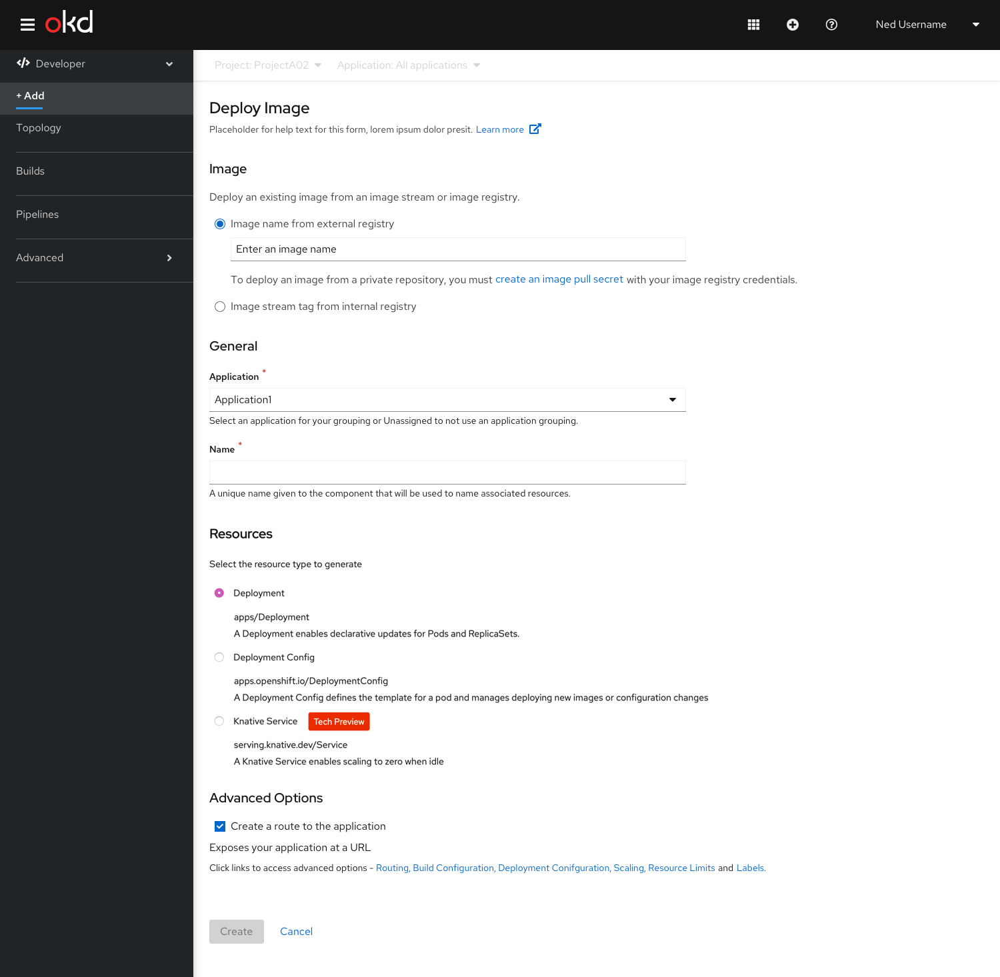
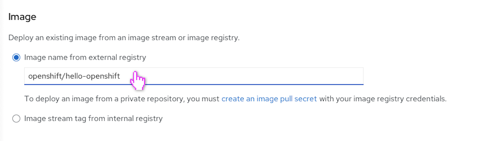
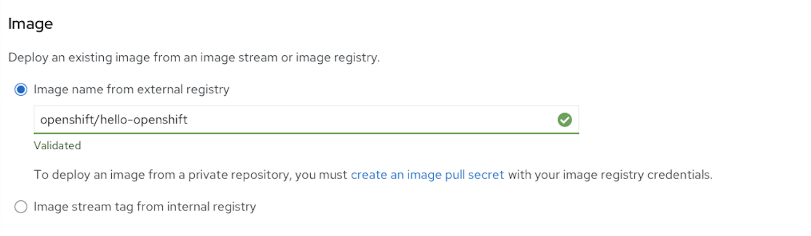
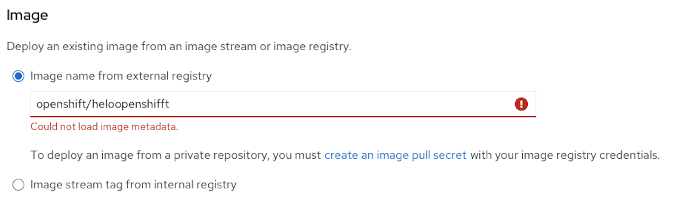
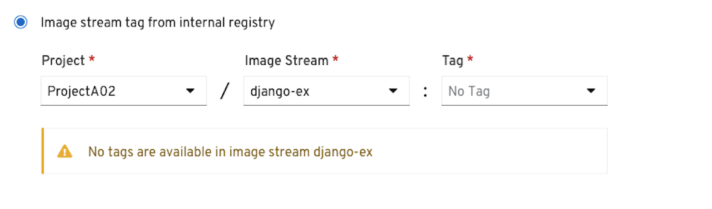

# Deploy Image (Usability Enhancements added in 4.4)

The user lands on the **Deploy Image** form by selecting the **Container Image** card from the **Add** page.

The **Deploy Image** form has the following sub sections:
## Image
* Under the Image sub section the user can select one of the two options using the radio buttons- **Image name from external registry** OR **Image stream tag from internal registry**.
* This radio button pattern uses progressive disclosure to hide and show fields based on a particular selection. 
* By default **Image name from external registry** is selected and the field associated is shown upfront to the user.

 Once the ‘Image Name’ is validated,the ‘Name’ under General section is auto populated.If the user wants to create an image pull secret user clicks on the link to ‘Create an image pull secret’

### Usability Enhancements in 4.4
* Removed the ‘search icon’ from the form field of ‘Image name from external registry’.
* Removed the section with the message ‘Enter an image name OR select an image stream tag.
* Placeholder text ‘Enter an image name’ is shown in the form field of ‘Image name from external registry’.

#### User is entering the Image name

The input field is in focus in the above screen.
The user has to enter the correct name of the ‘Image name’ fully and leave the field to load the desired image.
#### The Image name field is validated successfully

  
The Image name field is validated successfully.

* If the ‘Image name from external registry’ field is successfully validated,it is indicated with a green tick mark and highlight to the field and text beneath it saying ‘Validated’.
* Also the ‘Name’ field gets auto populated based on the ‘Image Name’ entered.

#### Error Scenario

If the user has entered a wrong image name,the field would be highlighted and the error message will be shown under the form field.

**_Note :_** We will show a detailed error message specifying why we couldn’t load the image.

Once the ‘Image Name’ is validated,the ‘Name’ under General section is auto populated.If the user wants to create an image pull secret user clicks on the link to ‘Create an image pull secret’

### **Image stream tag from internal registry** is selected

* Once the user has selected the **Project** and  the **Image Stream** the **Tag** field is populated-The newest semantic version is selected by default. 
(The tags will be sorted by semantic version, with the newest version first in the list and also the default.)
* Now,since all the required fields (Project/Image stream:Tag)are populated,the image stream is referenced.
* Also the ‘Name’ field gets auto populated based on the ‘Image Stream:Tag’ selected.
  
User can proceed by clicking the ‘Create’ button.

#### Scenario-Image stream not present in the selected project.

* If no ‘Image Streams’ are available in the selected project an inline alert notification is shown to the user with the following message “No image streams are available in project _Project Name_”

* Also the ‘Image stream’ dropdown shows ‘No Image Stream’ and is disabled.The ‘Tag’ dropdown is also diabled.

#### Scenario-No Tag present 

* If no tag is present once the ‘Image stream’ is selected,an inline alert message is displayed to the user with the message “No tags are available in image stream _Image stream Name_”
* The tag dropdown shows ‘No Tag’ and is disabled.

#### Scenario - When the user selects another project from the ‘Project’ dropdown.

* Once the user selects a project-in this eg:Project001 we show the auto selected checkbox with the following message ’Grant service account default authority to pull images from Project001’

**_Note :_** 
Specifically on the RBAC check, we need to make sure that the user has authority to create role bindings in the other namespace, "Project001" before showing the check box.

#### Scenario-Service Account doesn't have the authority to pull the images

* In a scenario where the service account does not have the authority to pull images from the selected project,an inline alert is shown with the following message “Service account default doesn't have authority to pull images from project _Project Name_. Select another project to continue.”

## General 
The General section has ‘Application’ and Name’ fields.

This is a common section available in all the add flows.You can find the detailed documentation of General section  [here](https://openshift.github.io/openshift-origin-design/designs/developer/add/Container-Image/Deploy-Image)

## Resources
In the Resources section, user can select:
* Deployment, to create an application in plain Kubernetes style.
* Deployment Config, to create an OpenShift style application.
* Knative Service, to create a microservice.
  Note: The Knative Service option is displayed in the Import from git form only if the Serverless Operator is installed in your cluster. 
  For further details refer to documentation on Resources section  [here](https://openshift.github.io/openshift-origin-design/designs/developer/add-43/sections/resources/resources)

## Advanced Options 
The Advanced section has the ‘Create Route’ checkbox checked by default.There is no **Build Configuration** option available for **Deploy Image** form.

This is a common section available in all the add flows.Based on the form some of the options available under Advanced section varies.You can find the detailed documentation about Advanced section **here**
