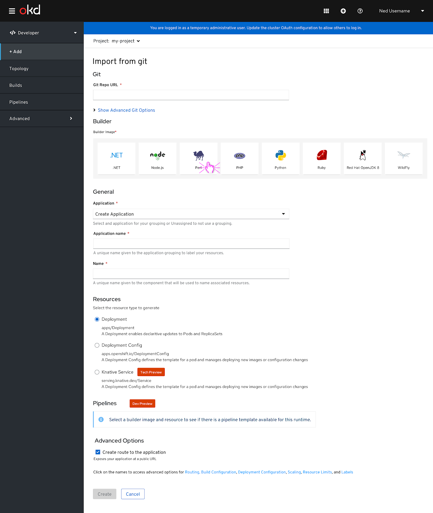

# Add page- Updates

Updates to the Add page include switching the order of the resources and pipelines section so resources come before pipelines.
One more subtle update to the Add page is that the ‘Show pipeline visualization’ will stay open even if the user selects a new builder image or resource during their session.

## Upload from Git- Updates

A builder image is selected. When a builder image has not been selected yet, the ‘Pipelines’ section will display an info alert that says “Select a builder image and resource to see if there is a pipeline template available for this runtime.”

**Note:** ‘Resources’ has been moved to the section before ‘Pipelines’.

A builder image has been selected and the pipelines section of the Add page reacts and displays a checkbox to add a pipeline. The checkbox can be selected if the user wants to add a pipeline to their project.

To show the pipeline visualization, the caret or label can be clicked to expand it. 

To view more information about each of the individual pipeline sections, the user can hover over each section to get more details about it. The pipeline visualization label changes to ‘Hide pipeline visualization’ if the pipeline visualization is expanded.

**Note:** This is exactly like what is currently implemented.

A different builder image can be selected at any time. If the pipeline visualization is left open and a new builder image is selected, the pipeline visualization will stay open. 

A different builder image is selected and the pipeline visualization displays the new pipeline. To collapse the pipeline visualization, the user has to click the ‘Hide pipeline visualization’ label.  

## Pipeline Info Alert Variations

### Empty state

The initial empty state for the pipeline section has been updated to say,”Select a builder image and resource to see if there is a pipeline template available for this runtime.”. This is the first message that would appear in the pipelines section before the user selects any builder images or resources.  

### Populated state

If a builder image and resource have been selected by the user but the combination does not support a pipeline this info alert would appear in the pipelines section. This message specifies the builder image and resource type that the user selected.
