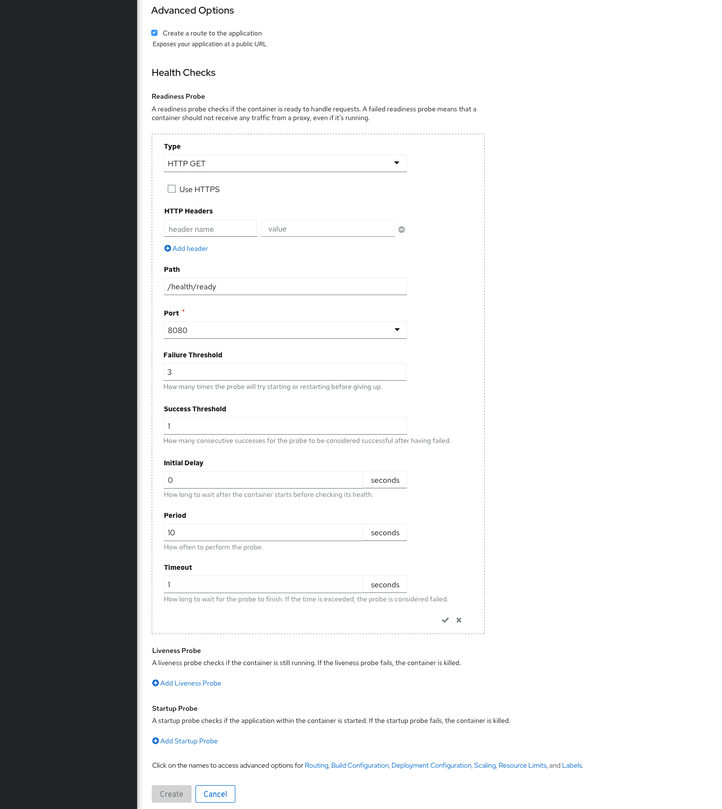
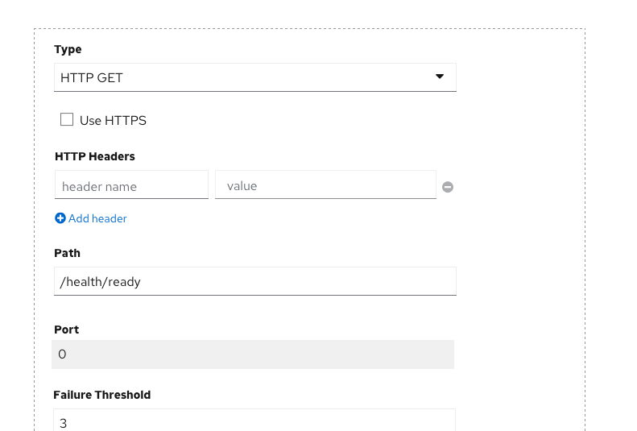
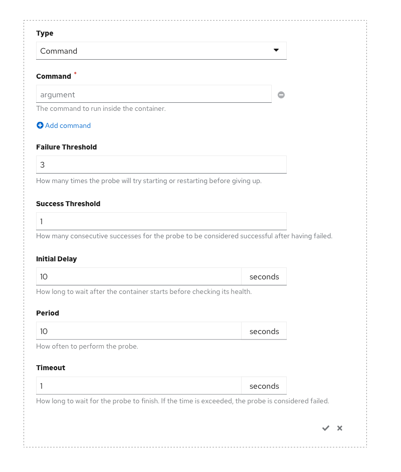
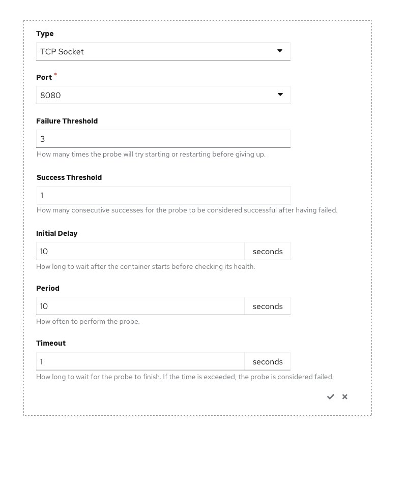
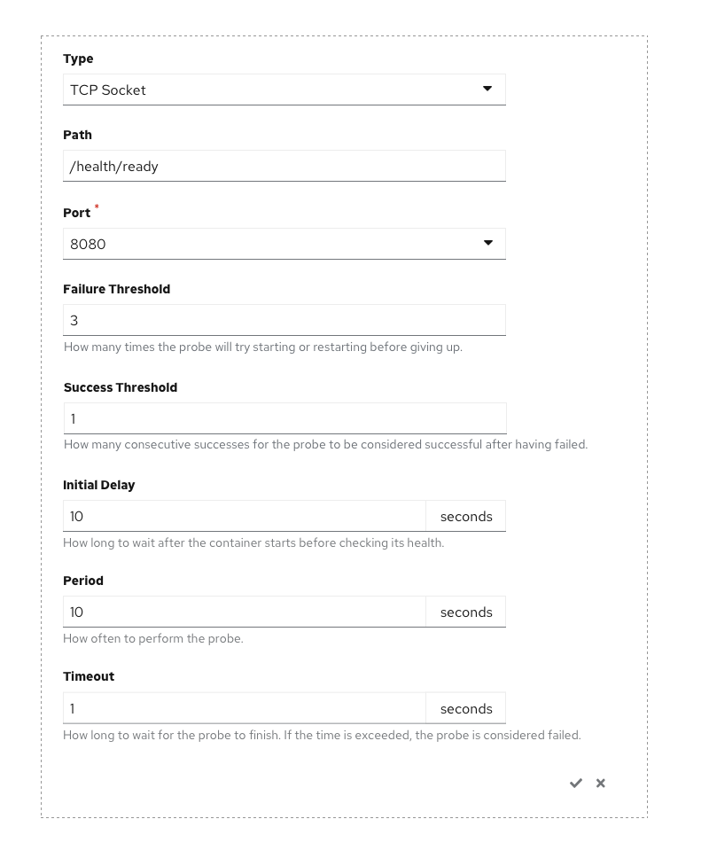

# Add Flows - Advanced Options - Health Checks

Health Checks is a link within the Advanced Options section for the Import from Git and Deploy Image +Add flows. The Health Checks link goes after the Routing link and before the Build Configuration link in the list of Advanced Options links.

When a user clicks on the Health Checks link, the Health Checks section is expanded within the Advanced Options section.

<<<<<<< HEAD
When the Health Checks section is expanded there are 3 probes listed (Readiness, Liveness, and Startup). Each probe type has a + Add \[probe name\] link.
=======
When the Health Checks section is expanded there are 3 probes listed (Readiness, Liveness, and Startup) with an Add <probe name> link associated with each probe.
>>>>>>> 75b94e57f71759d223aa33e0db18c3b18f171677

When a + Add [probe name] link is clicked, the probe form expands exposing all of the fields associated with the probe.  The user can confirm or cancel the adding of the Health Check using the check or x.  There are 3 variations on the Health Checks form which are based on the Type that is selected. The default probe type is HTTP GET. See the Health Checks In-Line form section below for these variations.

After the in-line form has been validated and the probe has been added, the form contracts and displays checkmark \[probe name\] Probe. The added probe can be removed after it has been added by clicking on the minus sign. An Edit Probe link can be used to review the entered values.

* Required fields shall have a required field indicator. Any required field that is not filled in or any field that has incorrect data shall have a client side error message displayed under the field. Client side field validation shall occur when the field loses focus.

* The probes are created when the Create button is clicked.

* Server side error messages shall appear at the bottom of the form with the same design as other fields in the form. If a server side error message occurs, the in-line form shall be expanded so that the field with the error is visible.

## Health Check In-Line Forms
There are three variations on the Health Checks form.

### HTTP GET
* HTTP Get is the default value in the Type dropdown
* HTTP Headers, Path, and Port are dynamic fields displayed for HTTP GET. If the Type is changed after data has been entered in these form fields, the data must persist until the form is submitted.
* Failure Threshold, Success Threshold, Initial Delay, Period, and Timeout fields are always displayed.

### HTTP Get - Knative Services
When the Knative Services Resource Type is selected, the port value is 0

### Command
When the Type is changed to Command, a Command field is displayed. If the Type is changed after data has been entered in these form fields, the data in the fields that are hidden shall persist until the form is submitted.
Failure Threshold, Success Threshold, Initial Delay, Period, and Timeout fields are always displayed.

### TCP Socket
When the Type is changed to TCP Socket, a Path and Port field is displayed. If the Type is changed after data has been entered in these form fields, the data in the fields that are hidden shall persist until the form is submitted.
Failure Threshold, Success Threshold, Initial Delay, Period, and Timeout fields are always displayed.

### TCP Socket - Knative Services
When the Knative Services Resource Type is selected, the port value is 0

