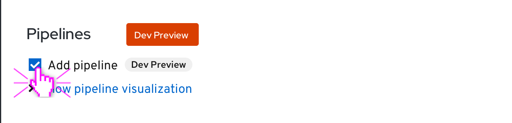
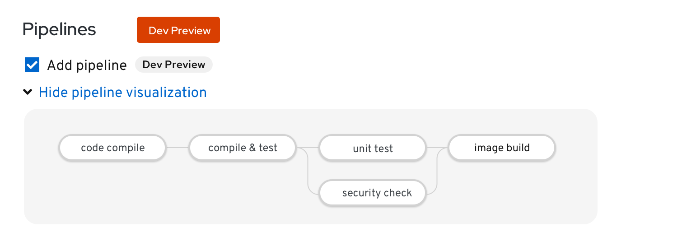
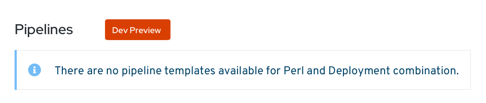

# Pipelines section in Add Flows (updated in 4.5)
* Updates to the Pipelines section of the 'Add' page include moving the Pipelines section below the Resources section. In addition, the ‘Show pipeline visualization’ component will remain open even if the user selects a new builder image or resource during their session.

* The Pipelines section allows the user to enable a pipeline template for their application, component or service.

* A Pipelines section appears in +Add flows (for Import from Git, Developer Catalog, and From Dockerfile) when the Pipelines operator is installed.

* When the Pipelines operator is not installed, this section is not displayed.

## Import from Git
### No Builder Image Selected
* When no builder image or resource has been selected yet, the Pipelines section will display an info alert that says “Select a builder image and resource to see if there is a pipeline template available for this runtime.”

### Builder Image Selected and Pipeline Template Exists
* When a builder image has been selected, if a pipeline template is available, the Pipeline section shall be updated to display an “Add pipeline”  checkbox option.
* The default state of the Add pipeline checkbox is OFF.
* An expandable control with text “Show pipeline visualization” is displayed below the Add pipeline checkbox and is collapsed by default.
* A 'Dev Preview' label is featured next to 'Add pipeline' label.

* After the user clicks the caret or 'Show pipeline visualization' label, the visualization is expanded and the user can hover over the different sections of the pipeline to see more details.  
* The pipeline visualization label changes to ‘Hide pipeline visualization’ if the pipeline visualization is expanded.

### Builder Image Selected and No Pipeline Template Exists
* If a selected combination of a builder image and resource does not support a pipeline an info alert would appear alerting the user of this.
* This message specifies the builder image and resource type that the user selected.

### Developer Catalog

#### Pipeline Template Exists
* When an app, service, or source-to-image builder is added, if a pipeline template is available, the Pipeline section is updated to display an “Add pipeline”  checkbox option
* The default state of the Add pipeline checkbox is OFF
* An expandable control with text “Show pipeline visualization” is displayed below the Add pipeline checkbox and is collapsed by default

#### No Pipeline Template Exists
* When no pipeline template is available (which will be determined after the app, service, or source-to-image builder is added), an Info inline alert shall be displayed within the Pipeline section
* The alert shall say “There are no pipeline templates available for this runtime.”

## Dockerfile
### Pipeline Template Installed
* When a pipeline template for Dockerfiles is installed, the Pipeline section shall display an “Add pipeline”  checkbox option
* The default state of the Add pipeline checkbox is OFF
* An expandable control with text “Show pipeline visualization” is displayed below the Add pipeline checkbox and is collapsed by default

### No Pipeline Template Installed
* When no pipeline template is available and Info alert shall be displayed within the Pipeline section
* The alert shall say “The pipeline template for Dockerfiles is not available at this time.”

## All + Add flows

### Enabling a pipeline
* To enable the pipeline, the user checks the “Add pipeline” checkbox

### Showing/Hiding the pipeline visualization
* To show a pipeline visualization, the user clicks on the “Show pipeline visualization” Expandable component link

* The pipeline visualization is displayed within the Expandable component and the link changes to Hide pipeline visualization
* To hide the visualization once it has been displayed, the user clicks on the “Hide pipeline visualization” Expandable link

