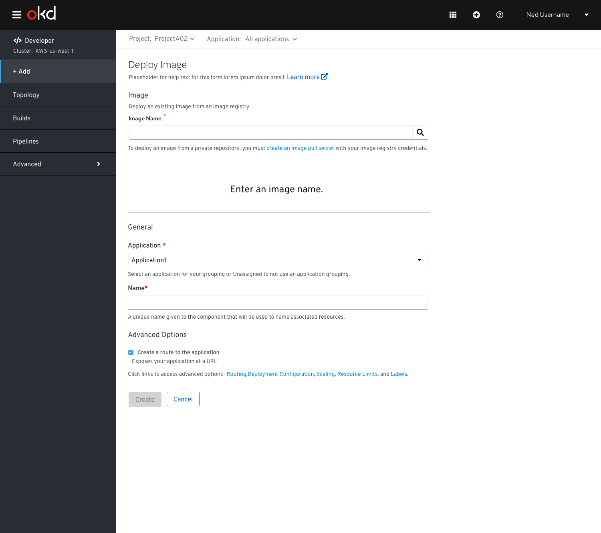
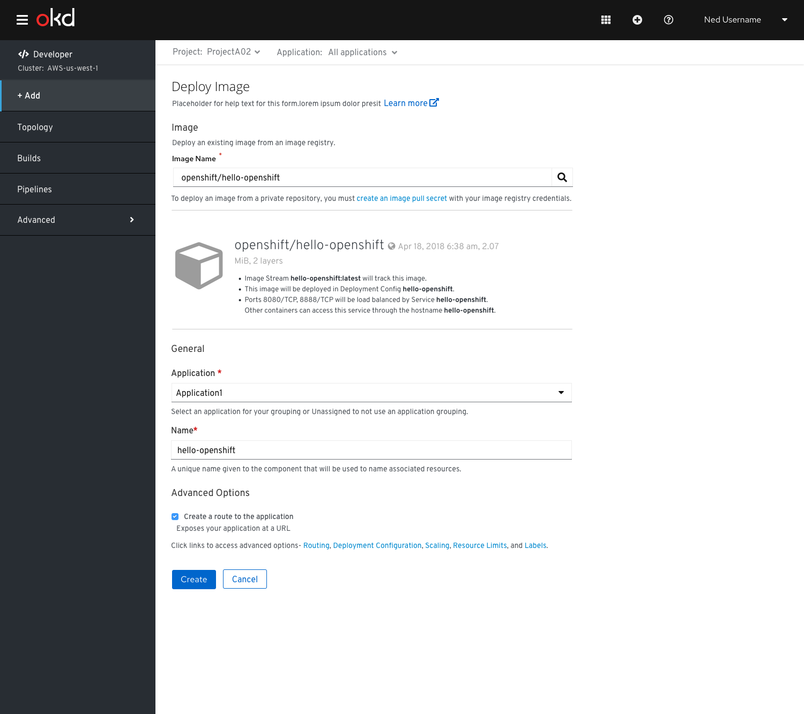

# Deploy Image
The user lands on the **Deploy Image** form by selecting the **Container Image** card from the **Add** page.

It has the following sub sections:
## Image
This section has the **Image Name** field.
When the user clicks on the ‘search icon’ after entering the required Image name,it gets shown in the UI.

If user wants to create an image pull secret, he/she has to click on the link to ‘Create an image pull secret’ link.

The above figure shows the **Deploy Image** form once the **Image** is present in the UI and the **Name** is auto populated in the General section.

## General 
The General section has ‘Application’ and Name’ fields.

This is a common section available in all the add flows.You can find the detailed documentation of General section  [here](https://openshift.github.io/openshift-origin-design/designs/developer/add/Container-Image/Deploy-Image)

## Advanced Options 
The Advanced section has the ‘Create Route’ checkbox checked by default.There is no **Build Configuration** option available for **Deploy Image** form.

This is a common section available in all the add flows.Based on the form some of the options available under Advanced section varies.You can find the detailed documentation about Advanced section **here**