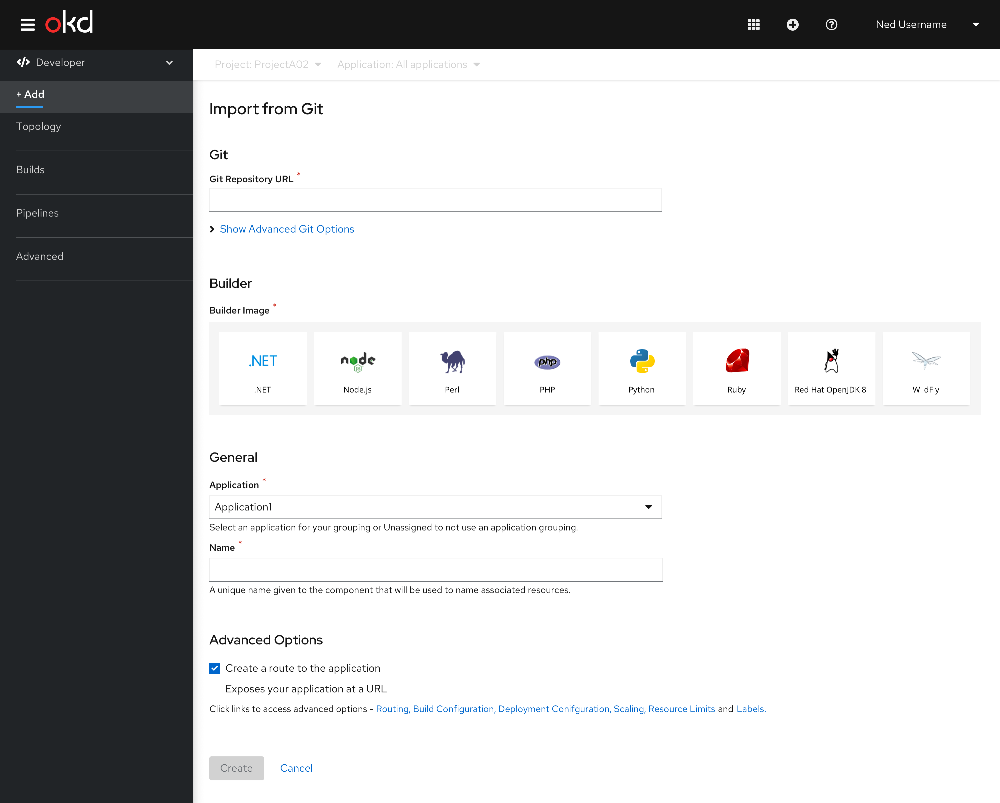
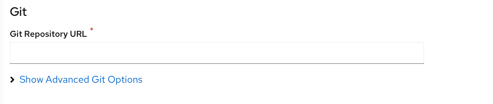
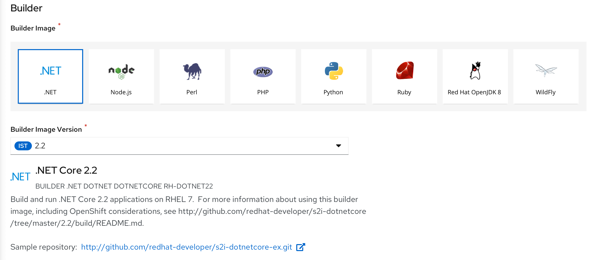
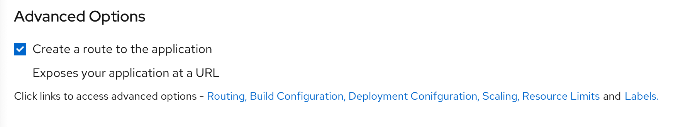

# Import from Git
The user lands on the **Import from Git** form by selecting the **From Git** card from the **Add** page.

The **Import from git** form has the following sub sections:
## Git
This section is where the users enter the Git repository URL for the codebase they want to use to create an application. It also has an advanced options section associated with the **Git repository URL** field.

User can click **Show Advanced Git Options** to add details such as:
* **Git Reference** to point to code in a specific branch, tag, or commit to be used to build the application.
* **Context Dir** to specify the subdirectory for the application source code you want to use to build the application.
* **Source Secret** to create a Secret Name with credentials for pulling your source code from a private repository.
  
## Builder
This section is where the list of builder images are shown.
User has to select the required builder image from the cards.Once a builder image is selected, the details of the builder image is shown below.The user can change the **Builder Image Version** if required.

## General
The General section has ‘Application’ and Name’ fields.

This is a common section available in all the add flows.You can find the detailed documentation of General section  [here](https://openshift.github.io/openshift-origin-design/designs/developer/add/Container-Image/Deploy-Image)

## Advanced Options
The Advanced section has the‘Create Route’ checkbox checked by default. It also has various links to access advanced options.

This is a common section available in all the add flows.Based on the form some of the options available under Advanced section varies.You can find the detailed documentation about Advanced section **here**
