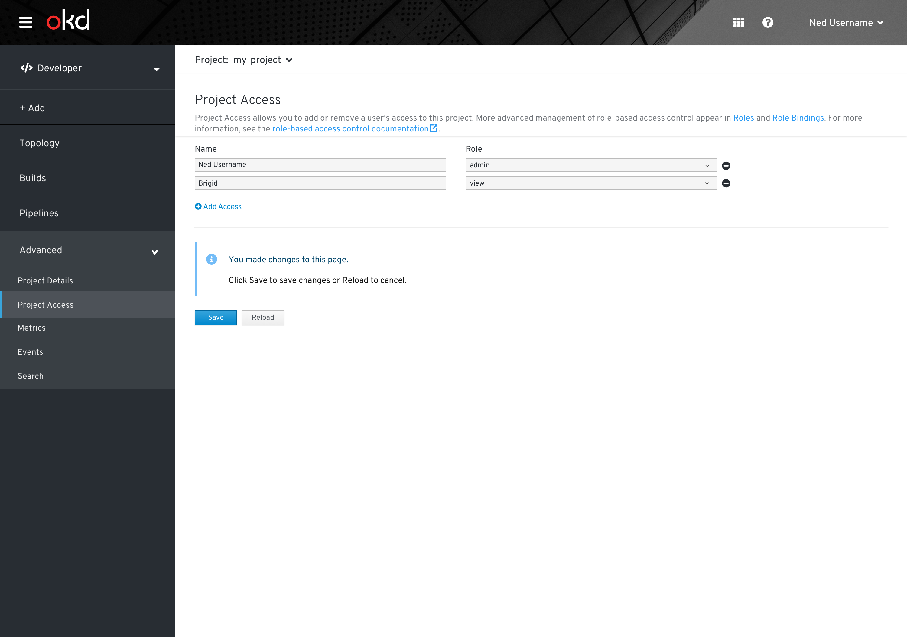
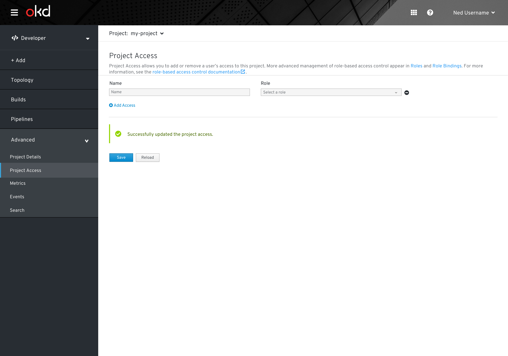
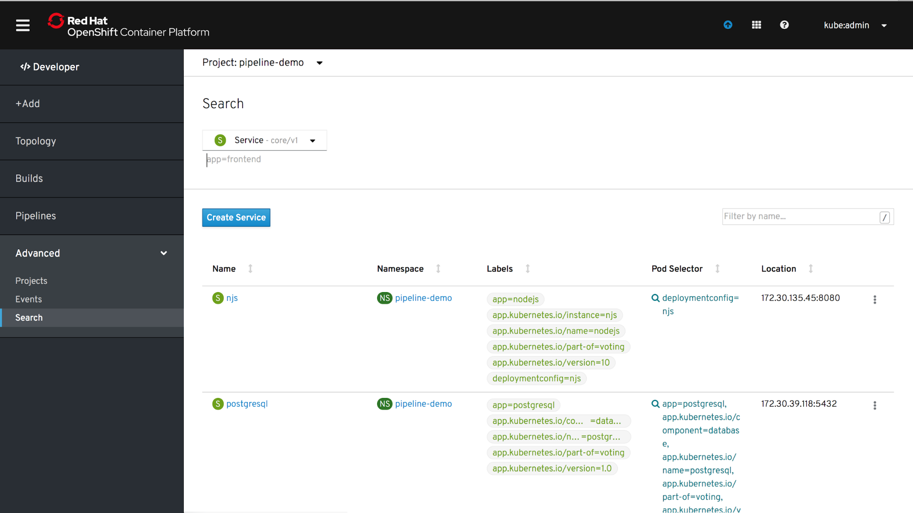

# Advanced
Advanced is a primary navigation item in the OpenShift Developer perspective.

Clicking “Advanced” will open/close the advanced secondary navigation items

## Projects
The Projects page is the same page as displayed in the Administrator perspective.

When clicking on a specific project, Projects remains selected in the navigation under Advanced. The project details of the selected project are displayed.

## Project Access
The Project Access page allows users to add or remove access to a project.

### Add and Remove Values
* Clicking add access will add a row at the bottom of the list.
* Clicking the remove icon on the right side of a row will remove the row.
* After adding or removing access, users must click save at the bottom of the page to apply changes.
* In the first section, users will be prompted to enter a name for the user.
* In the second section, there are three options will chose from for selecting a role: admin, view, or edit.

Users are able to add access to the project.

This is the updated Project Access page after one user has been assigned project access.

Users can remove user access from this project.

This is the updated Project Access page after removing user access from this project.

Users can remove access of all users from this project.

This is the updated Project Acces page after removing access of all users from this project.

If "all projects" is selected, users can chose a project from the list or create a project.

## Events
The Events page is the same page as displayed in the Administrator perspective.

## Search 
The Search page is the same page as displayed in the Administrator perspective.

