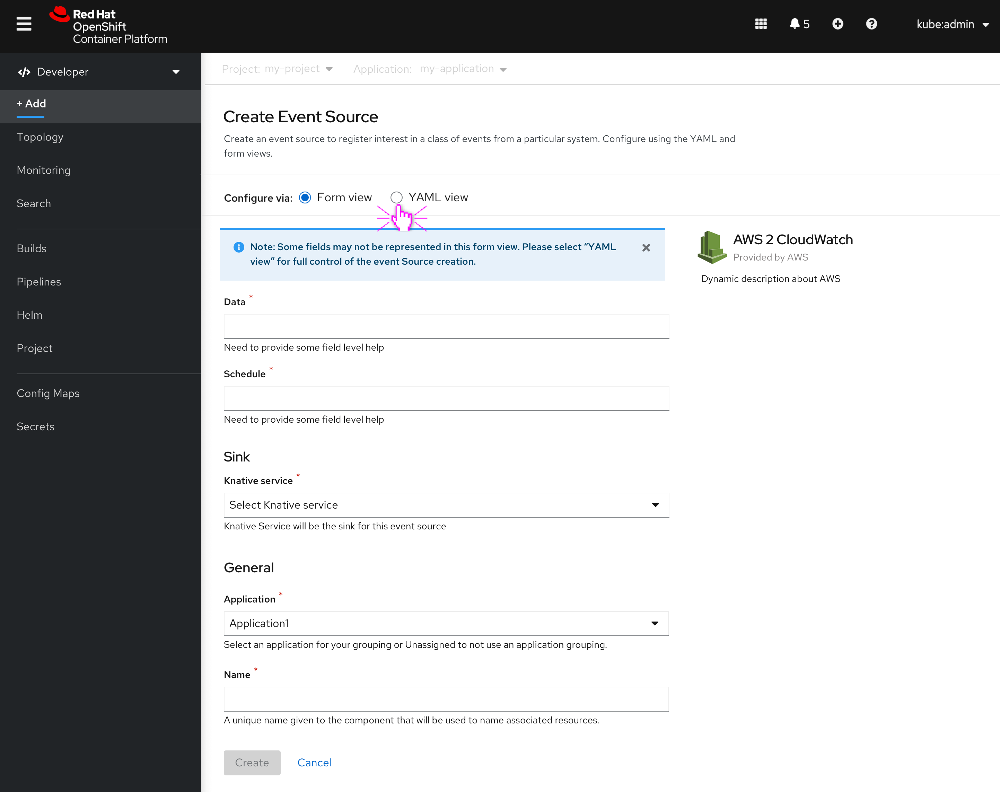
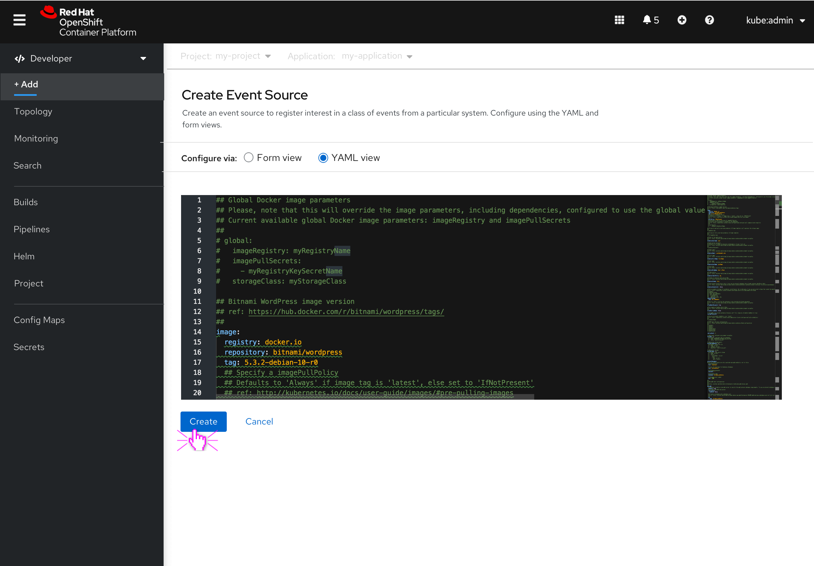
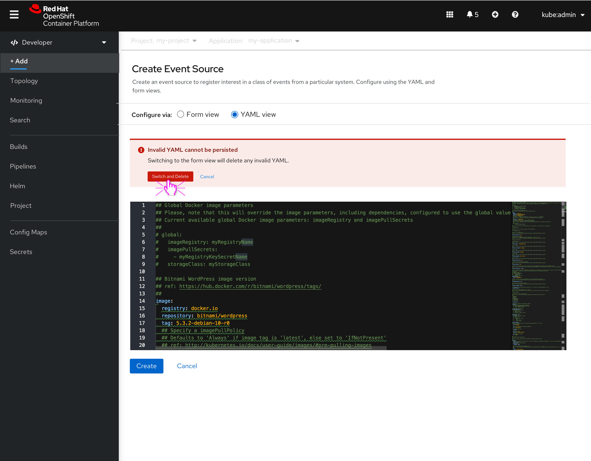
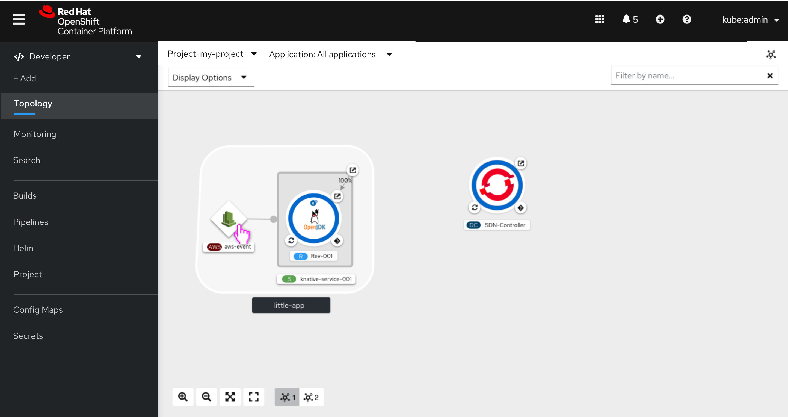

# Form/YAML switcher

## Adding event source
Taking inspiration from the Admin console and installing via YAML/Form with Helm charts, in this design the user can switch between the form view and the YAML view. The form below is an template; the form fields will be dynamic in nature.

## YAML view (best case scenario)
The user has selected YAML.

## YAML view (Invalid YAML cannot be persisted)
In this use case the user has selected YAML and has typed in invalid YAML.

## The event source has been created
On the topology view the user can view the event source that they just created.

