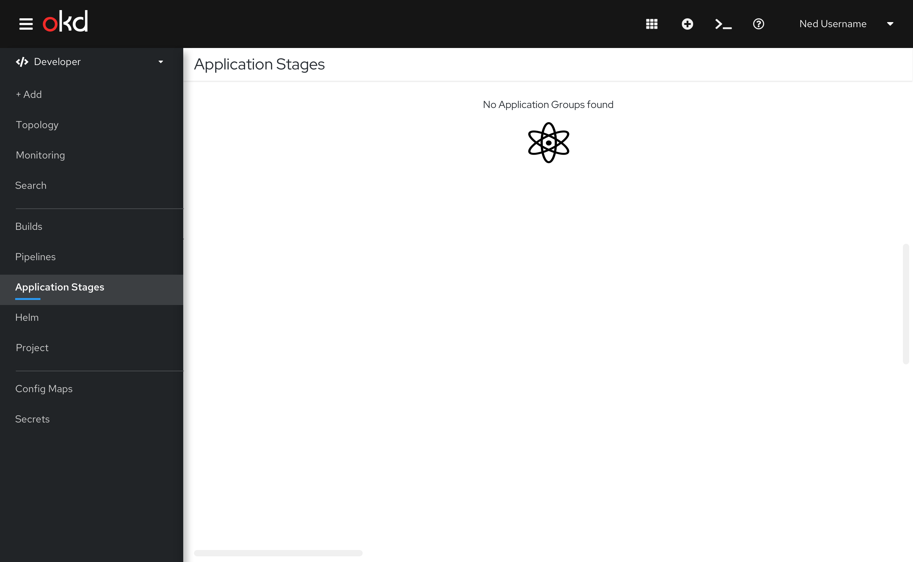

# GitOps for Apps View 

Application Stages is a feature in the OpenShift Developer perspective.

It is featured in the nav bar, providing easy access to this view.  

Application Stages provides detailed information of the application in each of the environments. When the user first opens this page, all details are hidden so as not to overwhelm users. They can then choose to select "Show Application Details", which reveals all application details. 

Hidden view 

Details visible view 

Empty State 

