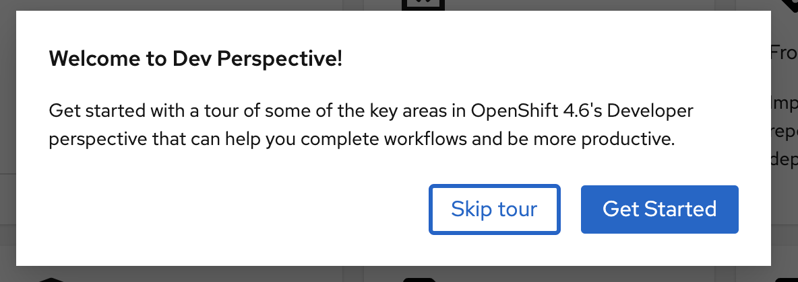

# Guided Tour

The Guided Tour is a feature in the OpenShift Developer perspective for version 4.6.

It appears when users log into the Developer perspective for the first time after the new version is released. However, the Guided Tour lives in the Help menu and is available to users at any time.  

The Guided Tour explores various features of OpenShift 4.6. This includes the Perspective Switcher, Monitoring, Help, and the ability to leave the tour. 

This message welcomes users to the Guided Tour for OpenShift 4.6 and gives them the option to  start or skip the tour. 

The first aspect of OpenShift 4.6 that is featured in the Guided Tour is the Perspective Switcher, which enables users to switch between the Developer and Admin perspectives with ease. 

Another aspect of OpenShift featured in the Guided Tour is Monitoring. 

If users click on the 'x' in the top right corner of the popups, this message will appear to confirm that users want to exit the tour. 

The Guided Tour is accessible in the Help menu dropdown at the top of the screen. Additionally, the Help menu allows users to access other features available in OpenShift. 

This final confirmation message informs users that the Guided Tour has concluded and they are ready to use the new features in OpenShift. 

