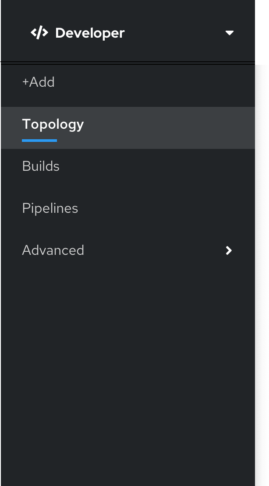

# Navigation

## Perspective name

When the current perspective is the developer perspective, the fa-code icon accompanies the Developer label.

## Navigation

There are 5 primary navigation items associated with the OpenShift Developer perspective:

1. Add
2. Topology
3. Builds
4. Pipelines
5. Advanced

Topology is the developer perspective default section.