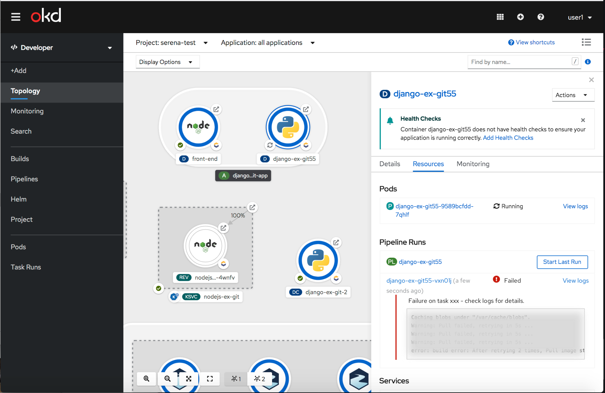
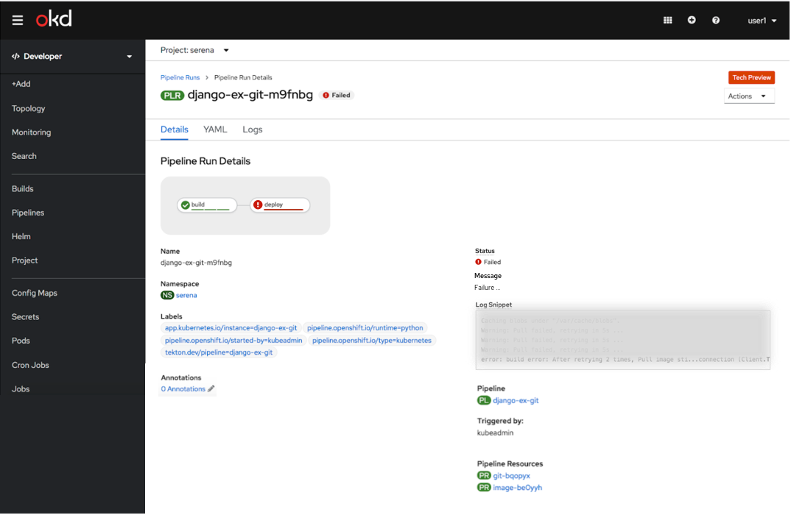

# Display PipelineRun failure details

## Description 

Displaying PipelineRun failure details will help users to easily understand why a PipelineRun has failed so that they can investigate the issues faster.

## Failure on task

The message above the log box states Failure on task "x" - check logs for details. The log box would show the last few lines of the failed TaskRun pod. The log box would be 5 lines with a horizontal scrollbar.

## Failure - no valid tasks, missing tasks

The message above the log box states Failure - check logs for details. The log box would show the error from the logs tab of the PipelineRun.

## Pipeline Run Details

The message and log snippet will only be shown on the Pipeline Run Details page if there is a failure.

