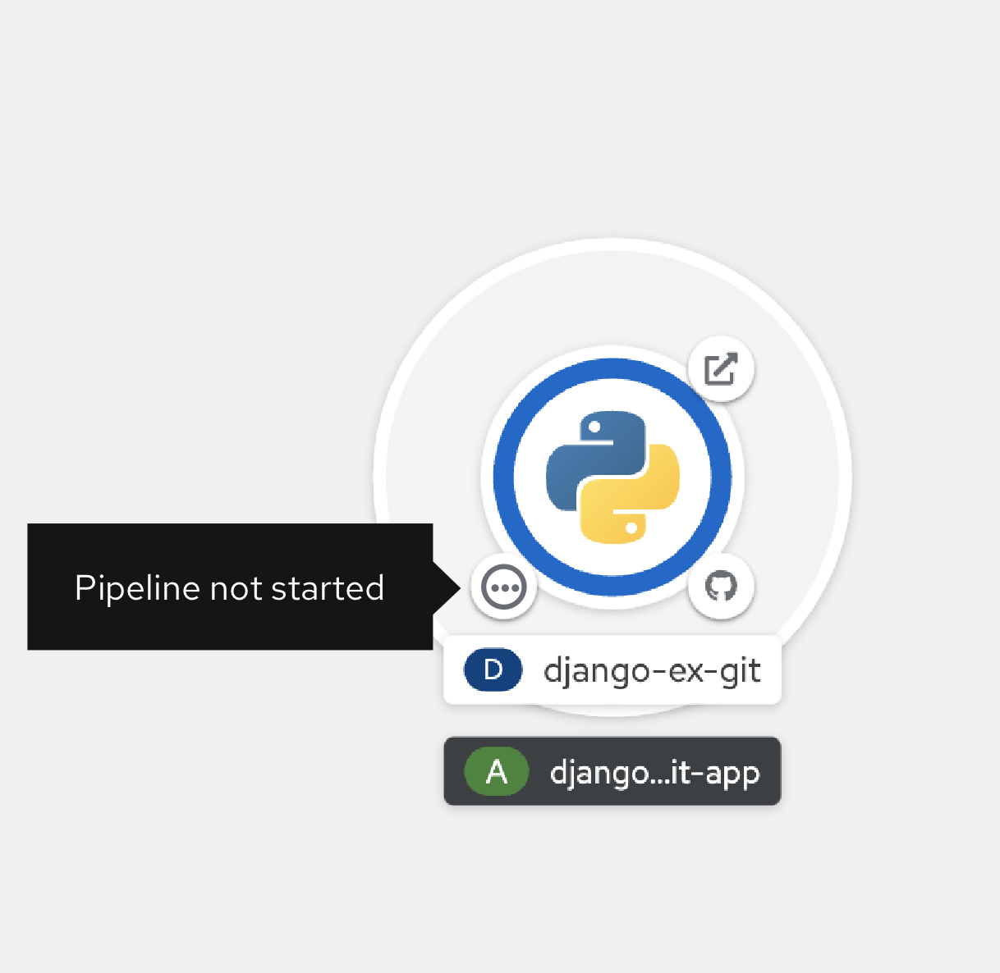
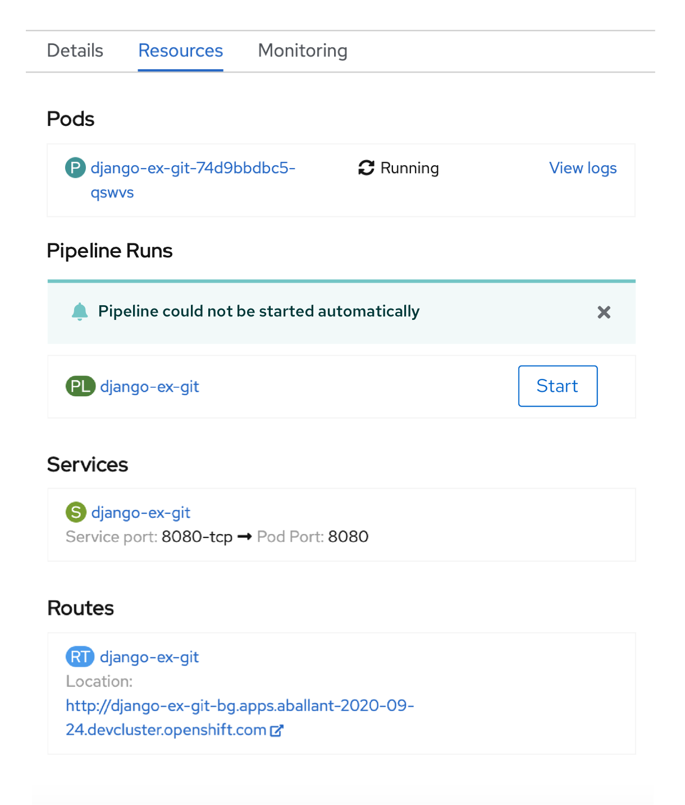

# Improve Pipeline Creation Process

## Description
When a Pipeline is added during the creation process, there will not be a Build Config associated with the Deployment, Deployment Config, or Knative Service. The Pipeline will be run during creation time unless it cannot be automatically started.

## Not started status
If a Pipeline has been created but the user has not started it, the Pipeline will have the status of not started. This will be shown on the bottom left decorator in Topology. When the user clicks the not started status decorator, the start modal will open in Topology.

## Side Panel
If a Pipeline cannot be automatically started, this message will be shown in the side panel and there will be a start button in the side panel for the user to start the Pipeline.

