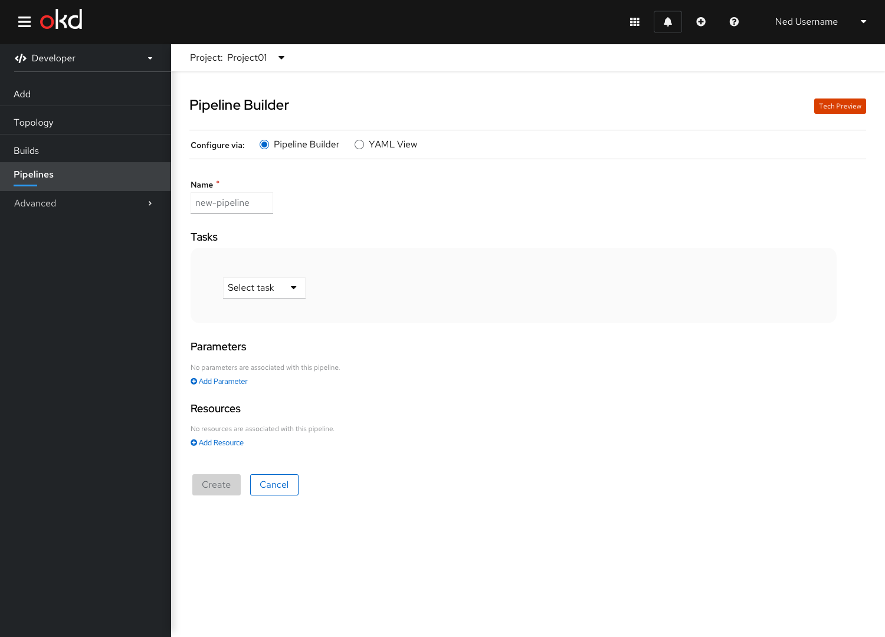
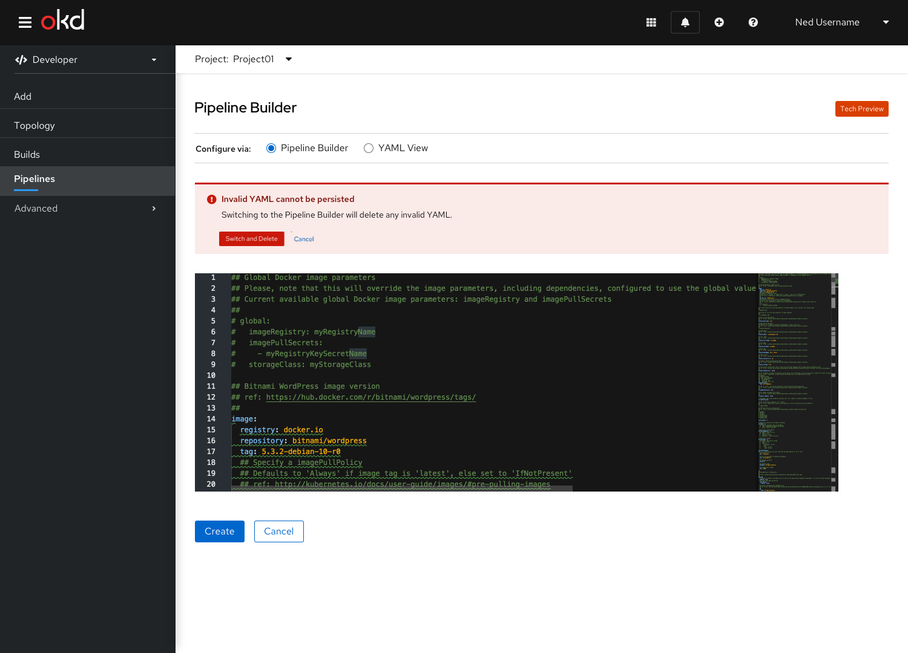

# Edit YAML in Pipeline Builder

## Description
Being consistent with other areas of the console that use radio buttons to switch between form fields and YAML, the user can switch between the Pipeline Builder and the YAML view using radio buttons. Unlike other areas in the console, the radio button label will specifically say Pipeline Builder. The user can freely switch between the two views without losing changes between them. Any data that was entered in the form would be reflected in the YAML view, as well as any data entered in the YAML would be reflected in the form if it is switched back to (as its fields support).

If the user enters malformed YAML that cannot be persisted to the form view, they will be warned on switching to the form view. An alert will appear confirming that they want to switch to the form view and lose any invalid YAML they may have entered in the YAML view.

