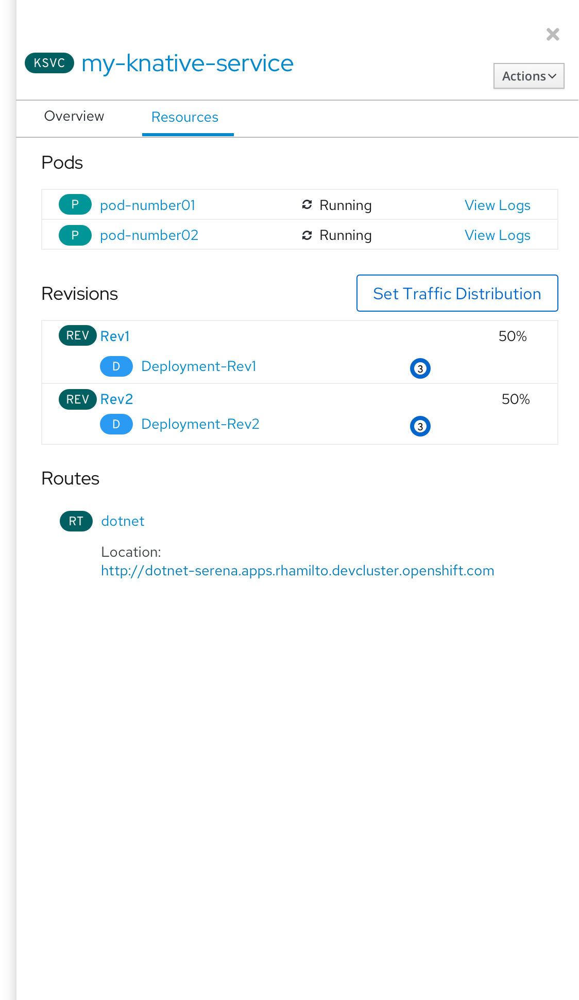
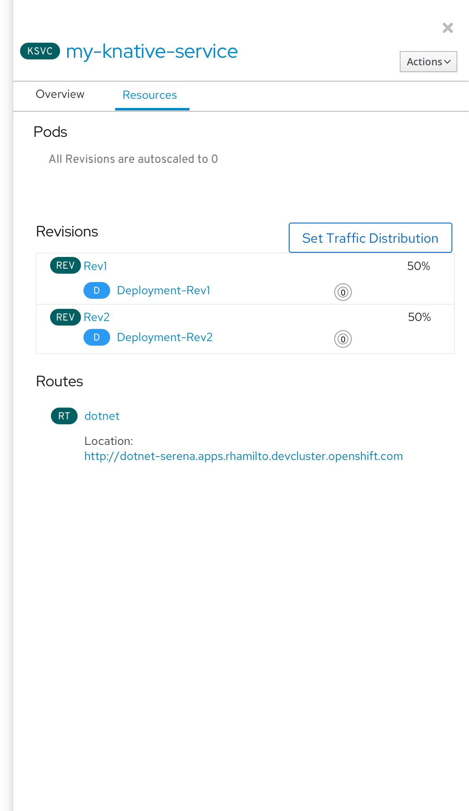

# KSVC - Resources tab in side panel
When a Knative Service is selected in topology, the side panel Resources tab shows Pods, Revisions and Routes.

If all of the revisions of a Knative Service are autoscaled to 0, the Pods section says "All Revisions are autoscaled to 0", and in the Revisions section, each deployment shows 0 pods.

