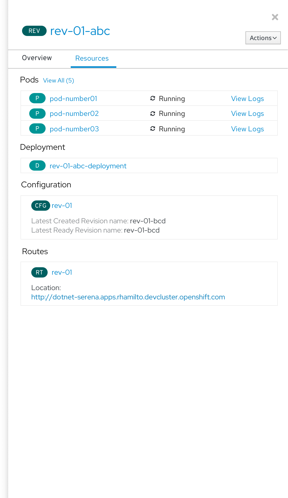
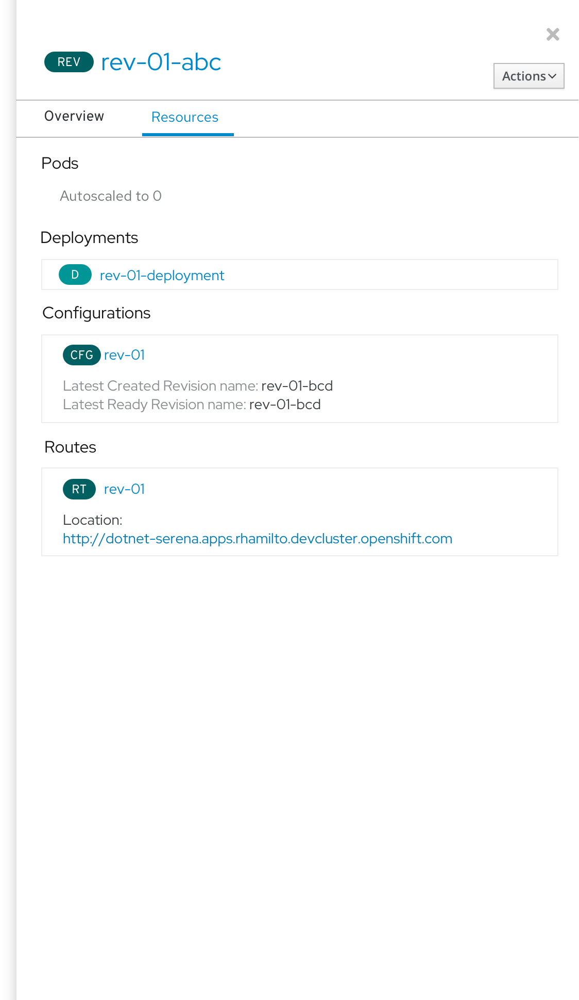

# REV - Resources tab in side panel
When a Knative Revision is selected in topology, the side panel Resources tab shows Pods, Deployments, Configurations and Routes.

If the Revision is autoscaled to 0,  the Pods section says "Autoscaled to 0".

