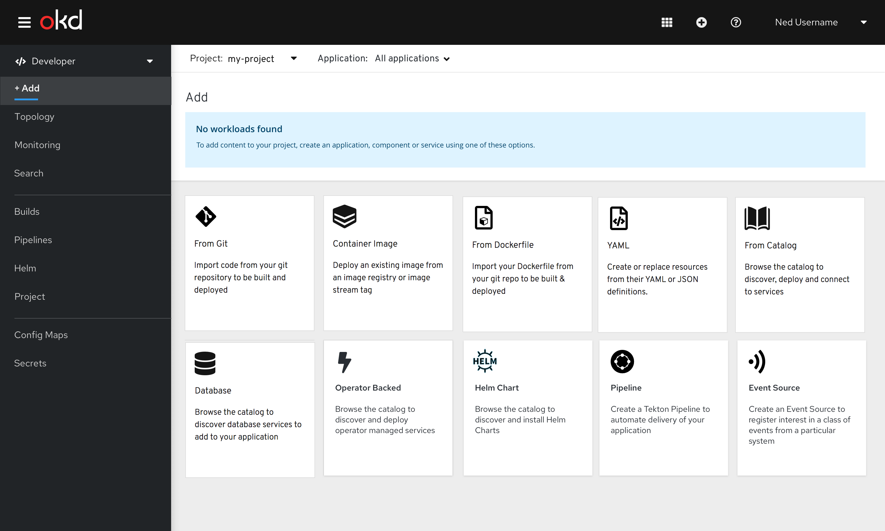
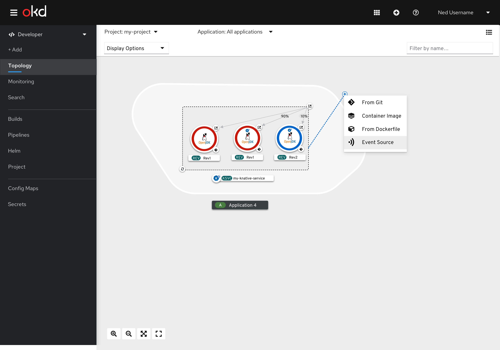
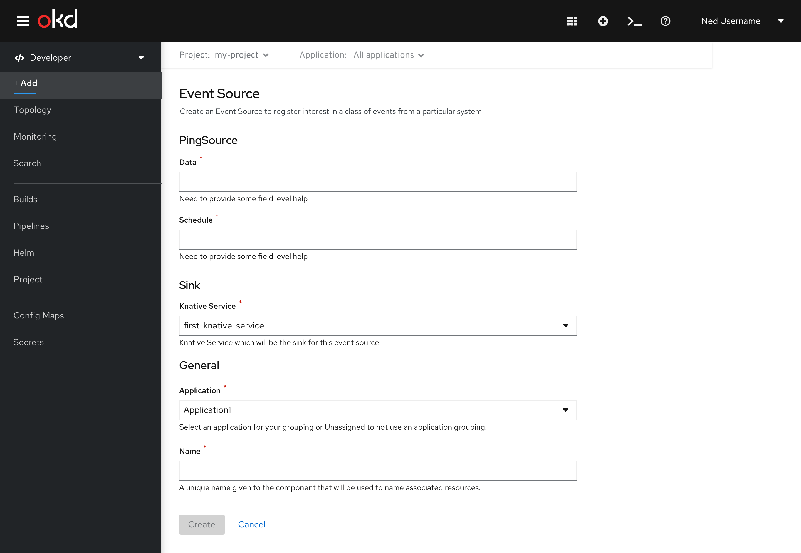
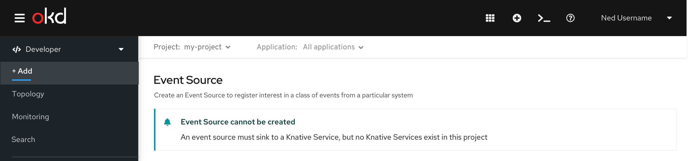
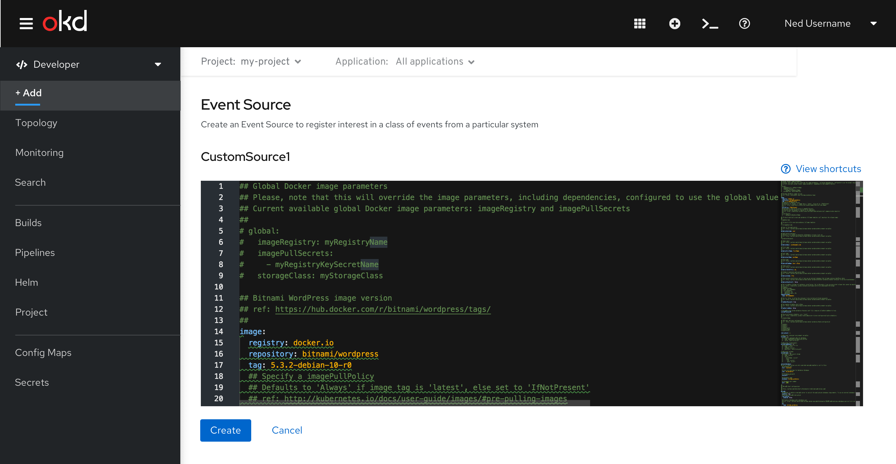
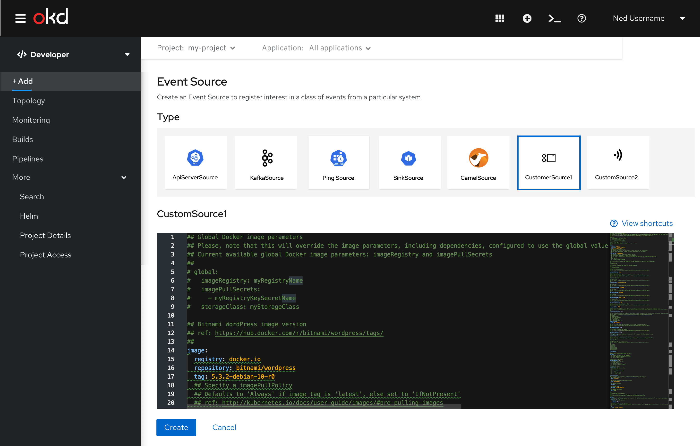
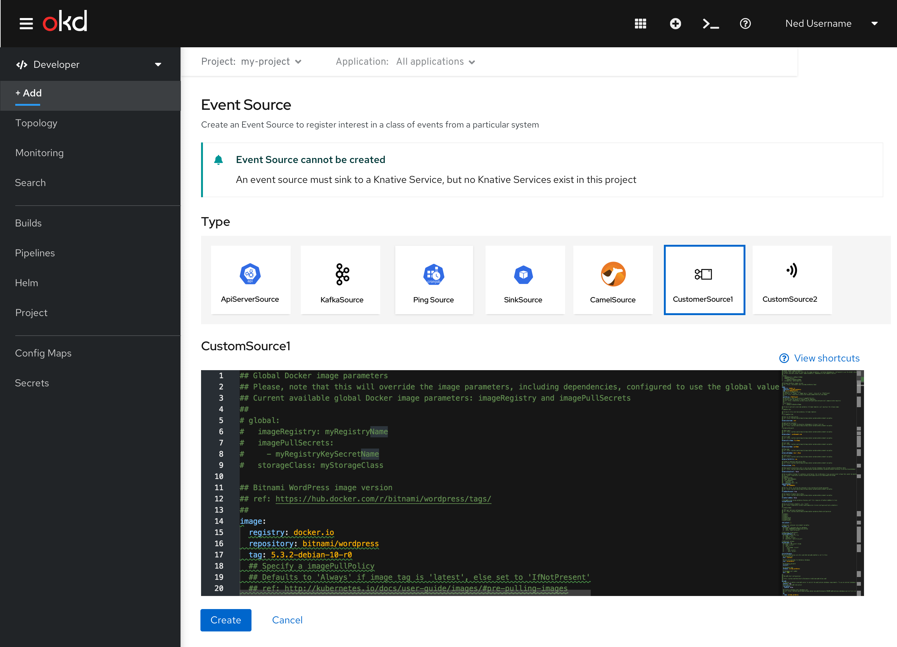

# Event Source Creation

## From the Add page
Clicking on the Event Source card in the Add page begins the create flow.

Figure 1 : Add page

## In context from topology
Event Source will be available from Knative Service in context menu.

Figure 2 : In context menu for Knative Service

## Overview
This flow will allow users to create event sources.  

### Type
Users need to select the type of event source to create.  A Type section is shown, as long as there is more than one event source type available.  Cards are shown to indicate the event source types.  By default, we provide ApiServerSource, KafkaSource, PingSource, SinkBinding and CamelSource.  

If there are 3rd party/dynamic event source types, they will follow the first 5, and should be shown in alphabetical order.  Multiple rows of cards are shown, as needed.  When there is only a single event source available, the Type section is not shown.  

Event Source supports form creation for the following types: ApiServerSource, KafkaSource, PingSource and
SinkBinding source.  Additional types will use the YAML Editor.  In the future, we will provide an experience where users can switch back and forth between a form and the YAML Editor.

## Form Creation
Selecting the Event Source tile will display an in-page form, with a sticky footer.   

Figure 3 : Event Source Creation Form

The following sections are displayed to collect information:  Type, Event Source Type, Sink, General and Advanced Options.

### Type
When only a single Event Source type is available, if  the event source type supports form creation, it would look like this:

Figure 4 - Single type available, which supports Form creation

## Event Source Type
The title of this section is the name of the Event Source type.  This section collects user input specific to the event source being created.

### Sink
The Sink section allows users to select the Knative Service which is the sink for this event source.  If no Knative Services exist in the current project, the user is informed immediately.  In this case, the user must cancel out of the flow.

Figure 9 - No Knative Services exist

### General
This section is similar to the rest of the Add flows in the Developer perspective, and gathers information about the Application as well as the name of the event source.  

This section is always shown.  When Event Source is invoked in context, the application name will try to retain the same context of the area where it was dropped (re: app name)
The default name of the event source should be based on the event source type

### Advanced Options
This section provides access to advanced options, when supported.  Advanced Options will match the conventions used in other Add flows.

Kafka Source is the only type which has Advanced Options.  Resource Limits is the available Advanced Option.

Figure 10 - Resource Limits

### Upon Creation
Once created, navigate to topology, display the event source which was created along with the Sink Connector.

## Creation by YAML Editor
### Type
When only a single Event Source type is available, if  the event source type supports creation by the YAML Editor, it would look like this:

Figure 11 - Single type available, which supports YAML creation

### Event Source Type
The title of this section is the name of the Event Source type.  The YAML Editor is shown in this section.  YAML will be pre-loaded, and users can edit it if desired.

Figure 12 - YAML creation

### Sink
If no Knative Services exist in the current project, the user is informed immediately.  In this case, the user must cancel out of the flow.

Figure 13 : No Knative Services exist

### Upon Creation
Once created, navigate to topology, display the event source which was created along with the Sink Connector.
