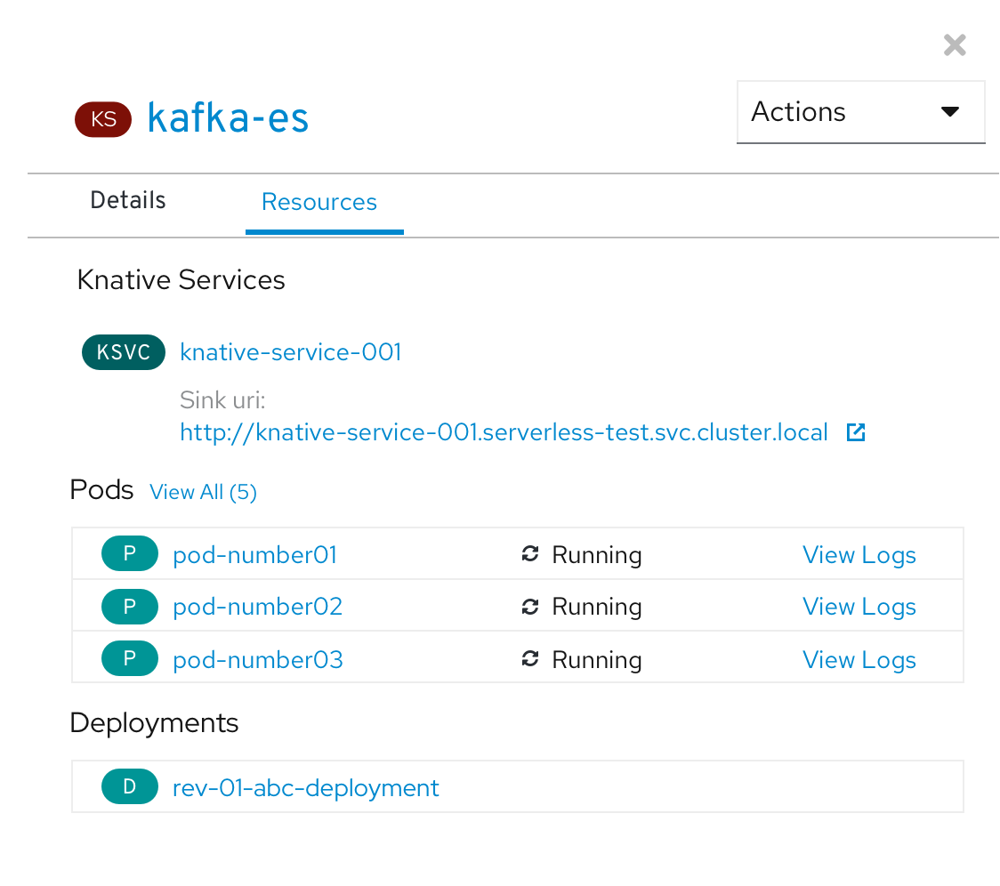

# Event Source - Resources tab in side panel
When an Event Source is selected in topology, the side panel Resources tab should :

* Always include a link to the Knative Service
* If there are pods, include the Pod section.  The Pods section should follow conventions we have in other areas For example, show a max of 3 and including a View All link
* If there are Deployments, include the Deployments section

