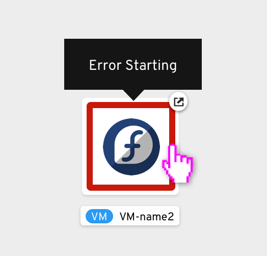

## Visualization of virtual machines resources in topology view

The VM-based resources on the topology view are represented with square shaped nodes. The status of the VM is represented through the color of a band that runs along the edge of the node and at the center is the icon for the associated operating system. On hovering over the band representing the VM status, users could see a tooltip showing information about the status.

### Showing and hiding virtual machines resources

Through the display options dropdown, users could access the toggle to show/hide virtual machines on the topology graph.

### Actions for virtual machines on topology view

On the topology view, the action menu for VMs could be accessed from the side panel and through right-click on the visualization of the resource on the topology canvas.

