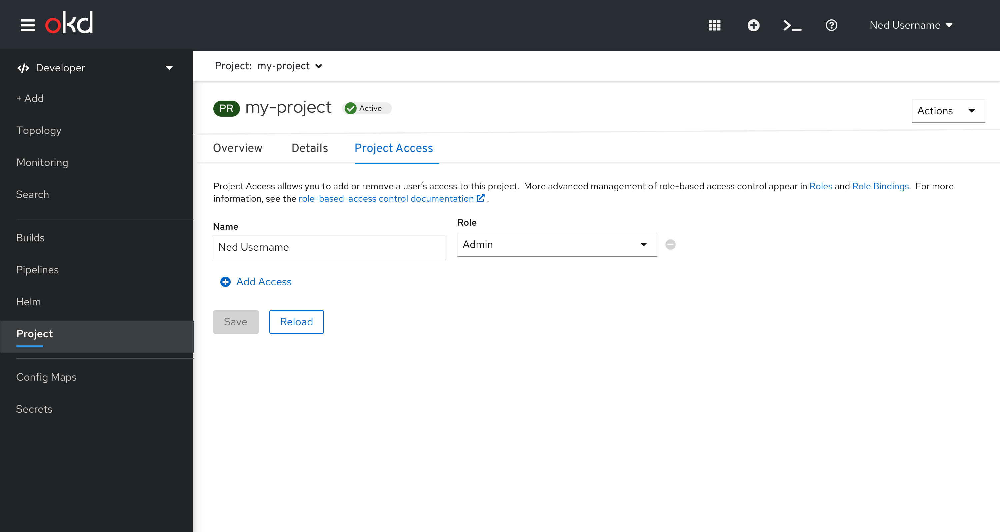
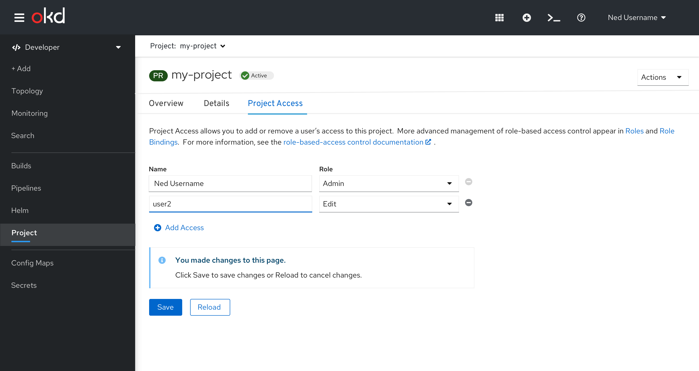
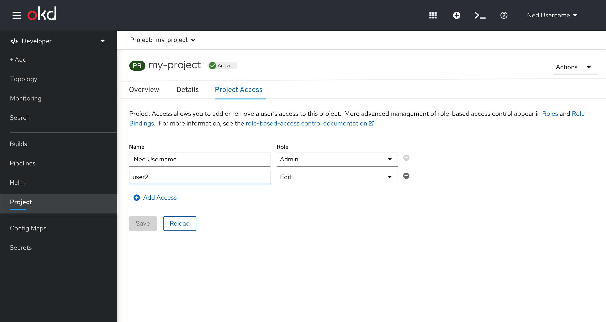
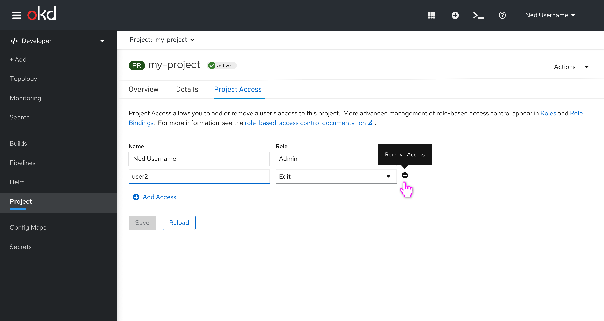
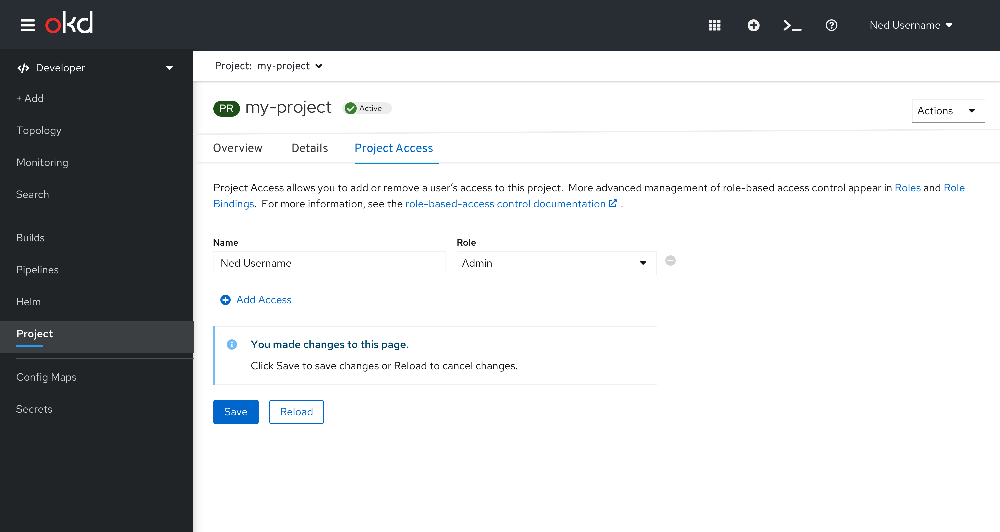
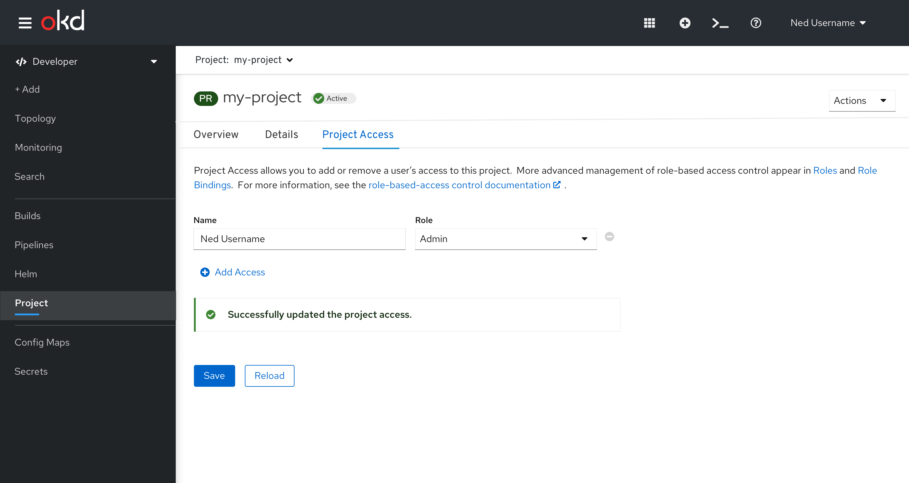

# Project

Project is a primary navigation item, only available in the Developer Perspective.  
The secondary masthead includes the project selector, but not the application selector.  

When **all projects** is selected, the list of projects is displayed.  When a project is selected, the project selector will be updated to have that project selected.

When a single project is selected in the project selector, the Project page is shown.

The page header is Project and the Actions menu is available, if the user has access to any actions.
This page has 3 tabs: Overview, Details and Project Access.  

## Project Actions

The only available action on a Project is Delete Project.

When the Delete Project action is clicked, a confirmation dialog will be issued.  Once the deletion begins, the Project selector will change to All Projects, so that the list of all projects is displayed.

## Overview

The Overview tab includes a dashboard with relevant information for the selected project, and is shared with the Administrator perspective.

## Details

The Details tab includes a dashboard with relevant information for the selected project, and is shared with the Administrator perspective.

## Project Access
The Project Access tab allows users to add or remove access to a project.

Figure 1 - Initial state

## Adding Access
* Clicking add access will add a row at the bottom of the list.  The Save button remains disabled until the user edits one of the fields.

Figure 2 - Access added

* As the user edits one of the fields, an inline information alert is posted above the buttons, and the Save button is enabled.

Figure 3 - Access with edits, before being saved

* Once the user Saves the changes, the inline alert is removed and the Save button is disabled.

Figure 4 - Access added and saved

## Removing Access
* Hovering over the remove icon shows a tooltip with Remove Access.

Figure 5 - Remove Access tooltip

* Clicking the remove icon on the right side of a row will remove the row.  An inline information alert is posted above the buttons, and the Save button is enabled.

Figure 6 - Access removed, before being saved

* Once the user Saves the changes, the inline alert is removed and the Save button is disabled.

Figure 7 - Access removed and saved
