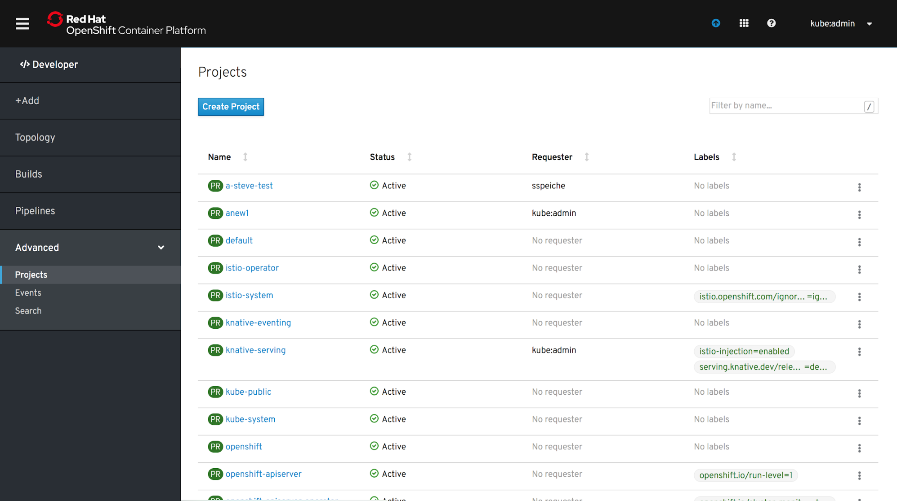
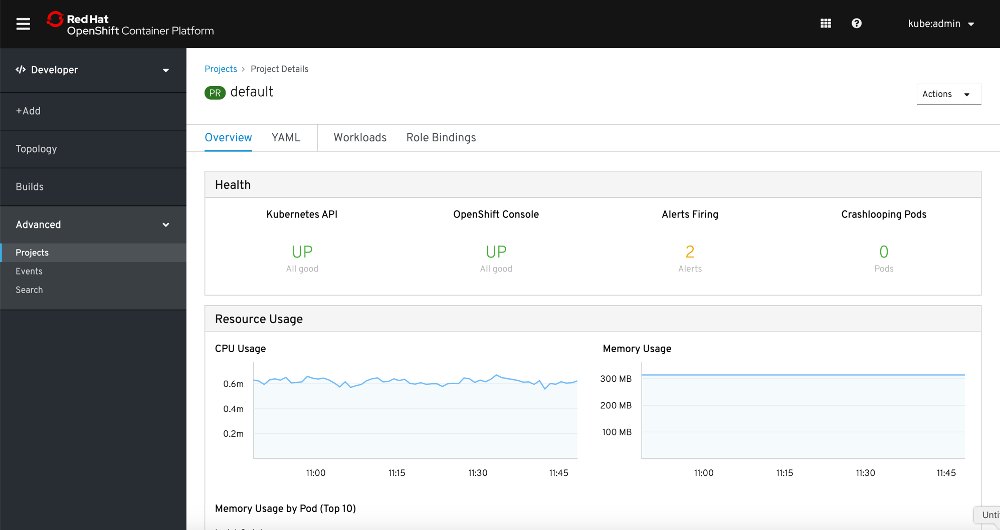

# Projects
The Projects page is the same page as displayed in the Administrator perspective.

When clicking on a specific project, Projects remains selected in the navigation under Advanced. The project details of the selected project are displayed.

