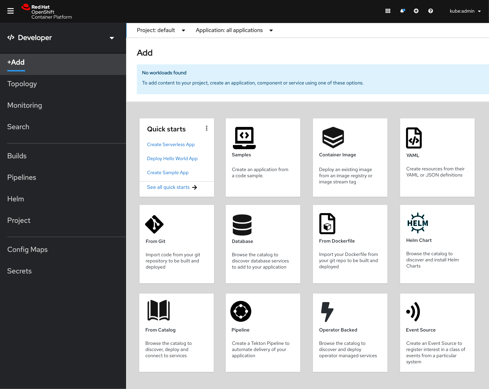
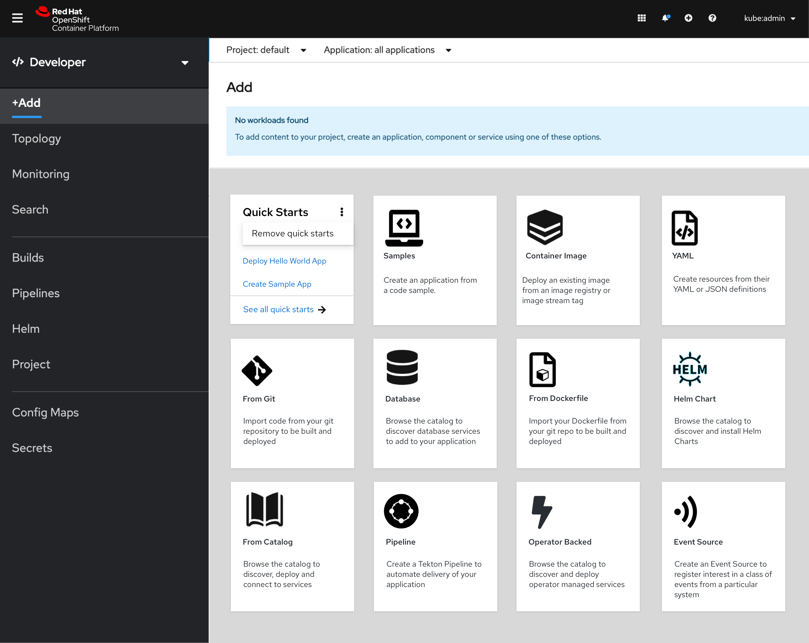

# Add page

Add is a primary navigation item in the OpenShift Developer perspective.

The Add page enables the user to create an application, component or service. Upon clicking a card, the user is brought to the appropriate flow to add the item to their project.

The basic visuals and behavior of this card view is consistent with that of the developer catalog and operator hub.

Accessible through the help menu

Kebab in the top right corner of the Quick Starts card reveals the option to hide the card from the Add page

Guided Tours and Quick Starts are both accessible through the Help menu 

