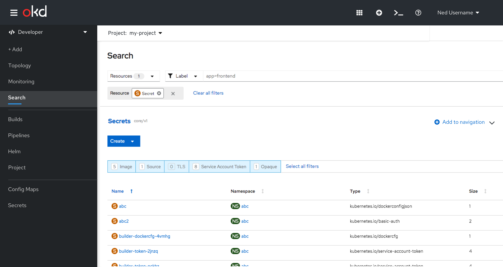

# Search - Add to Navigation in Dev Perspective

## Overview
This feature is enabled on the Search page in the Developer perspective, and is not available in the Administrator perspective.

* On the Search page, users will be able add and remove resources to the navigation menu in the Developer perspective.
* Added resources will be saved per user per machine.
* If there are resources added, a separator will be added below Search (the last navigation item) in the Dev Perspective navigation.  
* Added items will be displayed as primary nav items under the separator, in the order they were added.
* The user should be able to unpin directly from the navigation.
Config Maps & Secrets will be pre-pinned by default, but users can remove these items.
* There is no limit to the number of items the user can add to the navigation.

## Adding to navigation -from Search page
* On the Search page, a “Add to navigation” button link is available on the accordion title.
* Clicking on the Add to navigation button will add the Resource Type to the left navigation, under the separator.
* The Add to navigation link then changes to Remove from navigation, as shown in the next screen.

Figure 1 - Add to navigation

## Removing from navigation - from Search page
On the Search page, if a resource type is already added to nav, the button link label is changed to Remove from navigation.

Figure 2 - Remove from navigation

## Removing from navigation - from navigation

Hovering over an item on the navigation menu will display an selectable icon.  Clicking on this icon allows the user to remove the item from the Nvigation menu.
Figure 3 - Hover over nav item

## Confirmation
A confirmation dialog is displayed when removing an item from navigation.

Figure 4 - Confirmation  

## Mobile Considerations
In mobile, the Add to/Remove from navigation button link should be stacked under the resource name in the accordion.
