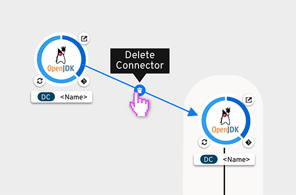
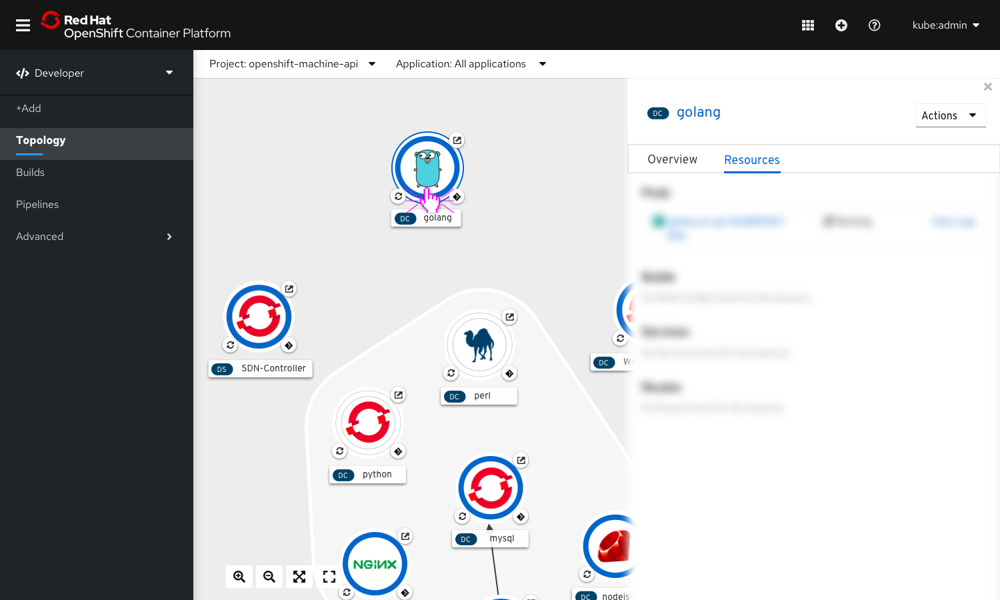
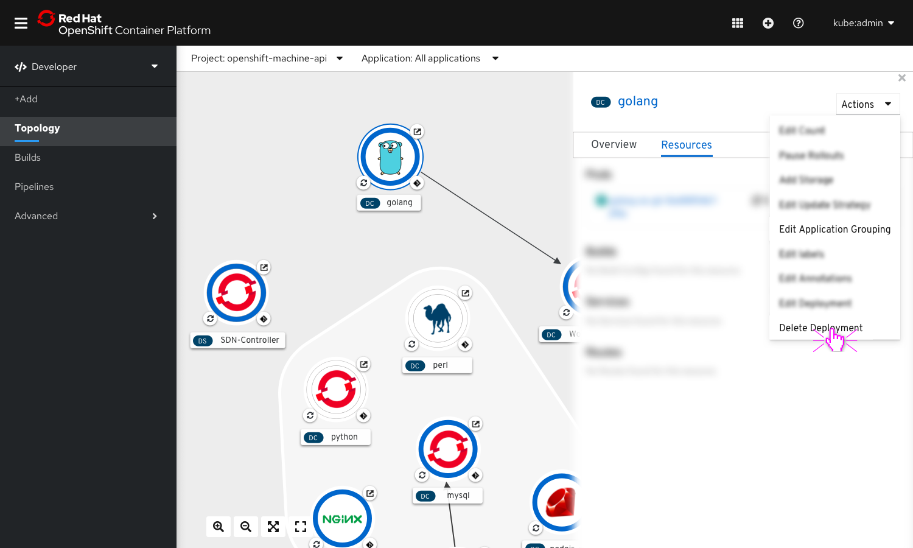
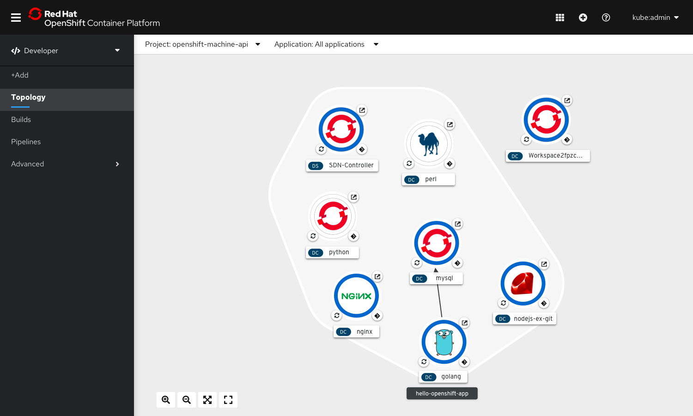
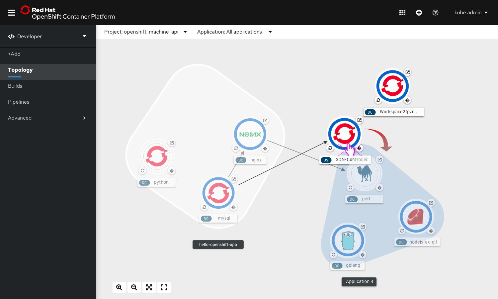
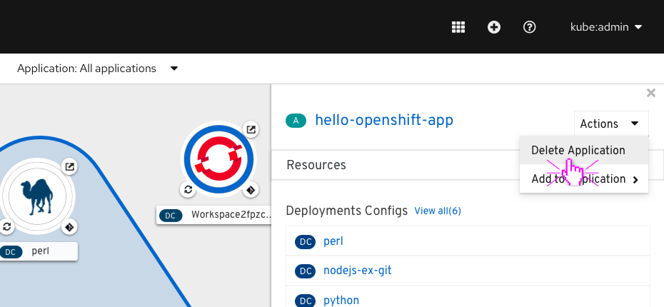

# Topology
The Topology page is a primary navigation item in the OpenShift Developer perspective.

## Topology
The Topology view would be used in OpenShift Dev-Console to show semantic aggregated metadata about related pods, deployments, builds of application components in a namespace.  

### No Project in Context
When no project is selected, Topology View will prompt users to select from a given list of projects.  

#### No Workload Exists
When no workload exists, the topology view redirects users to the add flows to start creating new workloads to be shown on the topology canvas.
  

### Application selector
Users could choose to select either one of the applications or all the applications from the application selector.

## Topology View

### 1. Navigation item:
'Topology' under the Developer perspective of OpenShift.

### 2. Masthead
The masthead in topology view includes the project and application selector.

### 3. Topology Canvas
This is the area where the workloads are visually placed in the Topology view.

### 4. Toolbar
The toolbar consists of the following controls:
Zoom-in
Zoom-out
Fit to Screen
Reset View

### 5. Side Panel
On selecting any workload, connectors or application group on Topology View, their respective details appear on a side panel on the right hand side.

### 6. Nodes

Resources of type Deployments, Deployment Configs & Image Streams & Stateful Sets are shown as circle nodes in the topology view.

The circle node can include a pod status indicator, an image,  decorators and a node label.  

#### Pod Donut

The pod donut represents the current status of the pods associated with the workload. If there are pods with different statuses, the pod donut is broken up into segments representing the status of the pods.

The pod donut is segmented by status. Between each segment there’s a space of 3px.

The name label contains a badge before the name, that denotes the type of resource.  

#### Node Image
The node image consists of the build image for the resource.  

#### Decorators

##### Route Decorator
Clicking on the decorator opens the application in a new browser tab.

##### Code Decorator
The code decorator is located on the bottom right quadrant of the node.
Go To GitHub or CHE Workspace  ** NEW IN 4.3

    If CHE workspace is available, CHE icon should be used

If not, determine	the git client associated and use that icon

  If git couldn’t be determined, use git-alt icon from font-awesome

##### Build Decorator
The build decorator in the topology view is located in the bottom left of the node.  The decorator has six options: new, pending, running, completed, failed, and cancelled. When the decorator is hovered on, the status of the build will appear. The build decorator provides a one click action to view the build logs.

  

##### Pipeline Decorator ** NEW IN 4.3
The pipeline decorator in the topology view is located in the bottom left of the node.  The decorator has four options: running, completed, failed, and pending.  When the decorator is hovered on, the status of the pipeline will appear. The pipeline decorator provides a one click action to view the pipeline run logs.

  

##### Node Label
The label would consist of a resource badge followed by the name of the component.

  

### 7. Application group
#### Unselected State
Application Group - hello-openshift-app

  

#### Hover State
  

#### Selected State
  

#### Side panel content for Application Groups
  

#### Name Label
Name of the app label on the basis of which the grouping has been done would appear as group name.

### 8.connectors
#### Unselected State

#### Selected State

#### Hover State

#### Hover on Delete Button

#### Hover on Arrow

#### On Selection

**Not sure if this will be a real resource or just an element in the graph**

Click on a connector to select it.
Side panel opens with the details of the connector.

## Actions
### 1. Actions for nodes
##### User wants to edit Application grouping

Select the component to be added to a new application group.  

The side panel opens with the details of the selected node. From the Actions dropdown in the side panel, select ‘Edit Application Grouping’.

A modal opens up allowing the user to select an application from a dropdown menu.

Users get an option to select from a list of pre-existing application, or create a new one to add the component to.
To create a new application, select the option ‘Create Application Group’

A new field appear to allow users to enter a name for the new application group to be created.  

On clicking on ‘Save’’ the component gets added to the newly created application group.  

##### User wants to delete a component

Delete using action menu on the side panel

On selecting a node, the side panel appears with information about the node. The actions dropdown on the side panel include node specific actions.  

Select Delete Component
Or, hit ‘Delete’ key after selection.  

A delete confirmation is displayed.  

Upon confirming, the node and any associated connectors disappear  

##### User wants to add a component node to an application group using drag and drop

Click and drag the node to the desired application.  

While dragging, the other components become faded in appearance and the App group in contact with the moving node gets a hover state.

On release the component gets added to the application group.

##### User wants to move a component node from one app to another

Click and drag the node to the desired application.

Drop the component node inside another app by releasing the click.

On dropping the node, a dialogue box appears to confirm the action of moving Node1 from App1 to App2.

Once confirmed, the component node becomes a part of the new application group and the group elements rearrange themselves to accommodate the change.Exception: Moving from inside an application group to no group.  

### 2. Actions For Application Groups
#### Delete Application Group

From the actions dropdown on the right top corner of the details panel, select ‘Delete Application group’  

A confirmation message appears warning the user of the various resource types that would be deleted along with the application group.

On confirming the action, the Application Group gets deleted and disappears from the view.  

### 3. Actions For Connectors

#### User wants to create a new connection

On Hover, a dangling arrow appears around the node.

Click and drag on the arrow towards another node with which connection has to be created. On hovering over any other node while dragging the arrow, they would appear in hover state.

On release, new connection shows.

#### User wants to move the connections - origin of the connection being the same

On hover, the arrow of the connector gets highlighted.

Drop the arrow of the connector over the desired node to move the connection to.

On release a connection is created to the new node.

#### User wants to delete a connection

When user hovers over or selects a connection, delete button appears.

On clicking the icon, a delete confirmation is displayed. Or, select the connector and hit ‘Delete’ key.

Topology is enhanced when the OpenShift Serverless operator is installed.
